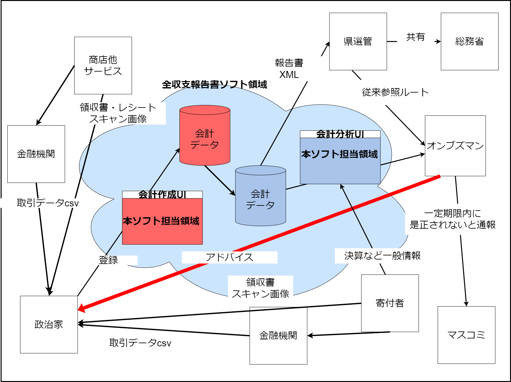
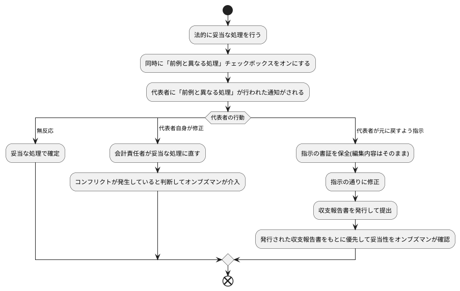

# 政治資金収支報告書・作成側ソフトウェア

## 1.目的

政治資金収支報告書の作成

## 2.概念図

## 3.範囲

1. 政治資金収支報告書
a. 作成
b. XML形式提出

2. データ連携予定
a. 政党交付金使途報告書
b. 各店舗レシート読取り関連
c. 各金融機関(pay系含む)CSV経由データ取り込み
d. 各金融機関(pay系含む)API経由データ取り込み
e. 全銀フォーマットCSV入出金明細

## 3.1 法的に妥当な処理に寄せるための有効な使い方

1. 政治家の会計責任者の勉強会または研修会で習得した、法的に妥当な処理を行う
2. その際に「前例と異なる処理」チェックボックスを有効にする
3. 「前例と異なる処理」チェックボックスが押されたことで代表者に自動で通知がされる
4. 代表者の反応
  a. 無反応の場合…そのまま(なし崩し的に)法的な妥当な処理を続ける
  b. 代表者自身が処理の変更処理を行う…5へ
  c. 代表者が会計責任者など従来処理に戻すように指示する…7へ
5. 再度、元の妥当と思われる処理を行う
6. 前例と異なる処理チェックと編集が3回なされた場合は、事務所内でコンフリクトが起きていると判断し、調査側に内容が通知され、調査側オンブズマンが意見付記という形で介入する
7. 代表者が指示したという書証を保全する
8. 代表者の指示の通りに修正する
9. そのまま政治資金収支報告書を発行・提出する
10. 「前例と異なる処理」チェックボックスが押された時の仕訳内容と、異なる結果で収支報告書が提出された場合は「仕訳内容について議論が難しい」状態と判断し、調査側に通知がされ、優先してその項目の妥当性が調査される。代表者側が正しく元の処理に戻すべき場合は会計責任者に個別に通知する。会計責任者が正しい場合は会計責任者の意見と無関係という体で改善指摘がされる。

## 3.2 データ登録方法の統一の必要性

政治資金収支報告書は、文書として提出されるデータが集計データと内訳データとばらばらになっており、一旦すべてを内訳で登録し、必要な項目(様式)だけで提出用に集計をする必要がある。
すべてを登録して、必要に応じて集計していない(**個別ユーザさんがそのデータを毎回毎回集計するかどうか考えなければならない)だけの事で、会計の状況が混乱した魔窟状態になりやすい**ことは火を見るよりも明らか。

|   様式番号   |            提出データ            |    集計    |                                           ユーザ要求                                            |
| ------------ | -------------------------------- | ---------- | ----------------------------------------------------------------------------------------------- |
| その1        | 表紙                             | 集計       | -                                                                                               |
| その2        | 収入部分の集計                   | 集計       | -                                                                                               |
| その3        | 事業収入                         | 集計       | ※同一の事業収入は一行に計上してください                                                        |
| その4        | 借入金(入金／収入)               | 内訳       | (特に記載はないが内訳を要求していると解するのが自然)                                            |
| その5        | 本部／支部からの交付金           | 内訳       | (特に記載はないが内訳を要求していると解するのが自然)                                            |
| その6        | その他の収入                     | 内訳／集計 | ※10万円以上の収入は個別に明細を記載し、1件10万円未満の収入は一括して合計金額を記載してください |
| その7-1,2,3  | 寄付の収入                       | 内訳／集計 | ※5万円以上の寄付は個別に明細を記載し、1件10万円未満の収入は一括して合計金額を記載してください  |
| その8-1,2,3  | あっせんによる寄付の収入         | 集計       | (あっせんをしている＝集計されることが前提という考え方)                                          |
| その9        | 政党匿名寄付                     | 内訳／集計 | ※演説会場でうけた1,000円以上の寄付が対象となります                                             |
| その10       | 特定パーティーによる収入         | 集計       | ※対価の支払いをしたものの人数を記載してください→集計前提                                       |
| その11-1,2,3 | 特定パーティの収入               | (内訳)     | ※20万円以上の対価の支払いは個別に明細を記載し、                                              |
| その12-1,2,3 | あっせんによる特定パーティの収入 | 内訳／集計 | (あっせんをしている＝集計されることが前提という考え方)                                          |
| その13       | 支出集計用紙                     | 集計       | -                                                                                               |
| その14       | 経常経費支出                     | 内訳／集計 | ※5万円未満(国会議員は1万円未満)の支出は明細を記載し、それ以下の支出は一括して記入              |
| その15       | 政治活動費支出                   | 内訳／集計 | ※5万円未満(国会議員は1万円未満)の支出は明細を記載し、それ以下の支出は一括して記入              |
| その16       | 交付金に係る支出                 | 内訳       | (特に記載はないが内訳を要求していると解するのが自然)                                            |
| その17       | 資産集計用紙                     | 集計       | -                                                                                               |
| その18       | 資産状況提出                     | 内訳       | -                                                                                               |
| その19       | 不動産利用詳細                   | 内訳       | -                                                                                               |
| その20       | 宣誓書                           | (集計)     | -                                                                                               |

### 3.3 利用開始シナリオ

詳細は[(簡易版)スタートアップガイド](./docs/startup_guide.md)を参照のこと

## 4.開発環境

### 1. front側

1. Vue+Vite
a. vitejs/plugin-vue:5.0.4
d. vite:5.2.0
b. eslint:9.4.0
c. typesceipt:5.2.2
d. vitest:1.6.0

### 2. back側

1. spring boot
2. spring batch

### 3. Database

1. MySQL

### 4. Upgrade

a.back側

pom.xml内のspring-boot-starter-parentのVersion番号を通知があり次第修正

b.front側

1. vite-vue導入 'npm create vite@latest --save-dev  . -- --template vue-ts'

2. axios 'npm install axios --save-dev'

3. vue-router導入 'npm install vue-router --save-dev'

4. eslint導入 'npm install eslint --save-dev'

5. vitest導入 'npm i -D vitest'

## 4.起動

### 1. front

viteを起動 `npm run dev`

### 2. back

mvnからspring起動 `mvnw spring-boot:run`

## 5.テスト

### a. front

vitestを起動`npm run test`
VsCodeを使用している場合はJUnit感覚でテスト駆動できる[Vitestプラグイン](https://marketplace.visualstudio.com/items?itemName=vitest.explorer)の利用をお勧めする

### b. back

EclipseからJUnit起動

## 6. その他

- ソフトウェアの規模想定については[同一識別コード値のサイズ妥当性検証](https://github.com/chiwa2023/investigate-politician-balance-report/blob/main/docs/validatie_code_value.md)を参照
- システムで使用する定数値は[定数設計書](https://github.com/chiwa2023/investigate-politician-balance-report/blob/main/docs/constants.md)を参照
