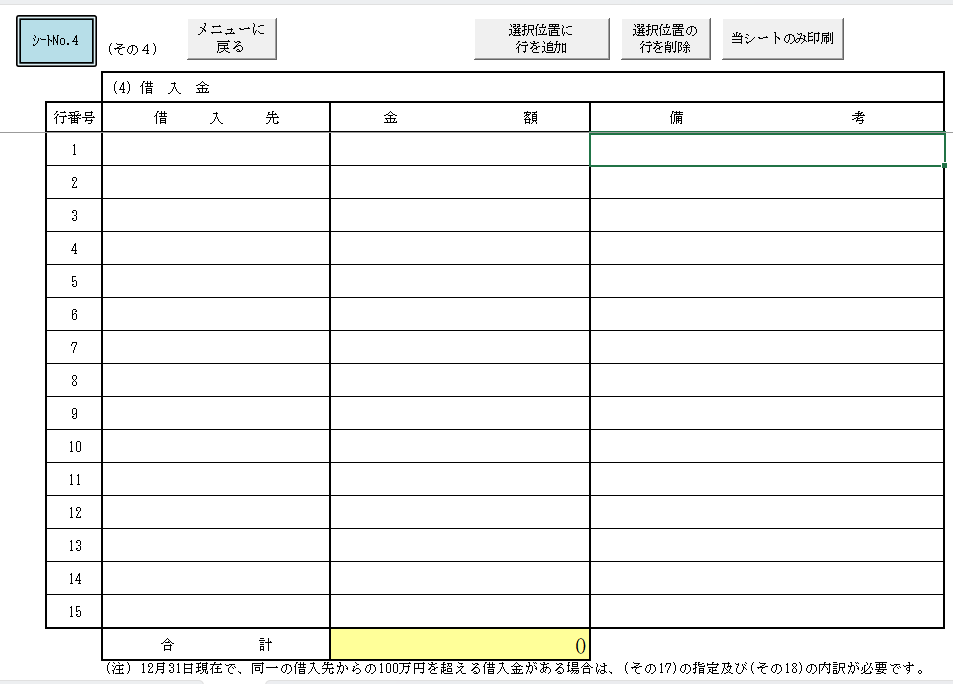
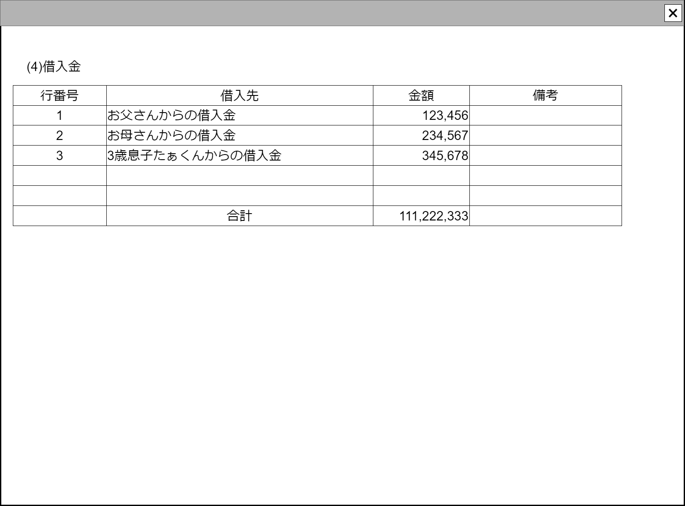

# 現在公式：様式7その4【コンポーネント】設計書

## 状態：実装可能

## 1.目的

現在公式として配布されているソフトウェアとのユーザインターフェイスとの互換も保つ
ただし照会のみとする。現行のように1件づつデータを手入力編集することは許容しない。
むしろ統計を取って、渋々作成した別画面で、手入力を行っている事務所にデジタル化が不足であると指導を入れるスタンスで臨む

## 2. 構成コンポーネント

1. なし

## 3. 画面イメージ

### 3.1 画面イメージ(現行)

引用:収支報告書作成ソフト（単独使用）Ver5.0その4シート

### 3.2 画面イメージ(作成)

## 4. フィールド要素一覧

| 番号 | 論理名 | タイプ | 活性／表示 |            内容            |
| ---: | ------ | ------ | ---------- | -------------------------- |
|    1 | 連番   | ラベル | 表示       | 連番を表示すること。       |
|    1 | 借入先 | ラベル | 表示       | 借入先を表示すること。     |
|    1 | 金額   | ラベル | 表示       | 金額を表示すること。       |
|    1 | 備考   | ラベル | 表示       | 備考を表示すること。       |
|    1 | 合計   | ラベル | 表示       | 金額の合計を表示すること。 |

## 5.アクション一覧

画面表示時に金額を合計し、合計に設定し表示する

## 6. 「様式7その4」Dto

AllSheet0704BorrowedMoneyDto

 |  論理名(兼説明)  |           論理名            |             型              | 公式XML名前空間 |
 | ---------------- | --------------------------- | --------------------------- | --------------- |
 | 【収入】借入金to | Sheet070400BorrowedMoneyDto | Sheet070400BorrowedMoneyDto | SHEET           |

Sheet070400BorrowedMoneyDto

 | 論理名(兼説明) | 論理名 |                型                 | 公式XML名前空間 |
 | -------------- | ------ | --------------------------------- | --------------- |
 | 項目リスト     | list   | List\<Row070400BorrowedMoneyDto\> | ROW             |

Row070400BorrowedMoneyDto

 | 論理名(兼説明) |    論理名     |   型    | 公式XML名前空間 |
 | -------------- | ------------- | ------- | --------------- |
 | 連番           | ichirenNo     | Integer | ICHIREN_NO      |
 | 借り先         | jigyoNoShurui | String  | KARIIRESAKI     |
 | 金額           | kingaku       | Long    | KINGAKU         |
 | 備考           | biko          | String  | BIKOU           |

## 7. 連携

親画面から`props{allSheet0704BorrowedMoneyDto:AllSheet0704BorrowedMoneyDto}`を受け取り、`computed`を設定し、親画面との連携を保つこと
