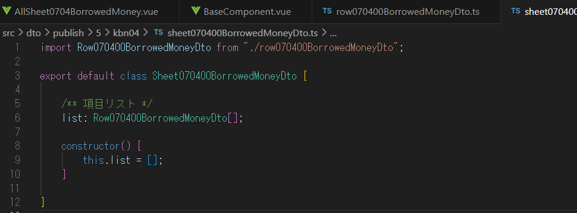
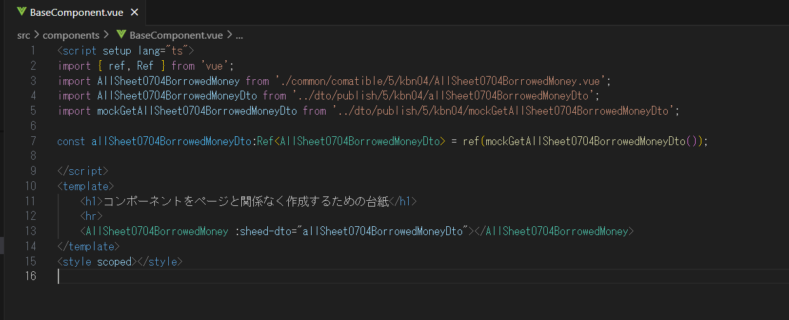

# 設計書からの実装手順

## 1. 実装前の確認

### 1.1 実装用ブランチへ移動

実装用のブランチを作るためのベースとなるブランチcompatible5に移ります。

a. ローカルにブランチcompatible5が存在しないときはリモートのcompatible5からチェックアウトします

b. ローカルにブランチcompatible5が存在するときはローカルのcompatible5をダブルクリックして移動します

### 1.2 実装前の起動確認

正しく実装されていれば、間違いなく起動することを、すでに実装されているサンプル機能で確認しましょう

a. VsCodeで「CTRL+SHIFT+@」を入力します
b. TERMINALのtabに移ります
c. TERMINALで「npm run dev」を入力し(ENTERを押し)ます

d. `VITE v5.2.13  ready in 237 ms  ➜  Local:  http://localhost:5173/`」と出力されます

e. ブラウザで[http://localhost:5173/](http://localhost:5173/)にアクセスします
f. トップページが表示されたら「コンポーネント作成台紙」のリンクをクリックします

g. 設計書に微妙に似ている(苦笑)表が表示されました!

h. 表示をやめる(表示するためのプログラムを走らせ続けるのを中断する)ときはTERMINALで「CTRL+C」と入力すると、バッチジョブを終了しますか？と聞かれますのでyと返事します

### 1.3 作業用のブランチを作成して移動

1. compatible5ブランチからcompatible5-kbn04を作成します。

2.compatible5-kbn04で上記の動作確認a-gを繰り返してみましょう。全く同じことが再現できましたね!

## 2. 実装

ここでは区分04借入金表示コンポーネントを実装します。[借入金表示コンポーネント設計書](./その04/AllSheet0703JournalAndOtherDto.md)

### 2.1 表示ページ(.vue)の準備

- a. /src/components/common/comatible/5の配下にkbn04フォルダを作成します

- b.  作成したkbn04フォルダ/src/components/BlankPage.vueをコピーします

- c. コピーしたファイルを設計書の名前(AllSheet0704BorrowedMoney).vueに変更します

- d. ドキュメントタイトル`<h1>ブランク</h1>`を`<h1>(4)借入金</h1>`に変更します

- e. このページを表示できるようにするために/src/components/BaseComponent.vueを編集します

  - BaseComponent.vueを開きます
  - kbn03と書いてある場所をkbn04に、AllSheet0703JournalAndOtherと書いてある箇所をAllSheet0704BorrowedMoneyに変更します
  - :sheet-dto="sheetDto"も削除します。
  - 黄色波線が出た行を上のコメントもろとも削除します
  - 新たに黄色波線が３か所出るのでそれもすべて削除します
  

- f. 動作確認a-gを行います。今作成した (4)借入金が表示されていますね!

### 2.2 表示ページ(dto)の実装

- a. /src/components/dto/comatible/5の配下にkbn04フォルダを作成します

- b. 作成したkbn04フォルダ配下に設計書6で一番下に書いたRow070400BorrowedMoneyDtoの最初の１文字だけ小文字で拡張子が.tsであるファイルを作ります

- c. 作成したファイルの中にexport default class Row070400BorrowedMoneyDto{}として入力します(クラスの宣言)

- d. back側のRow070400BorrowedMoneyDto(app/back/src/main/java/mitei/mitei/create/report/balance/politician/dto/publish/Row070400BorrowedMoneyDtojava)を開きます

- e. @JacksonXmlPropertyと記載があるブロックを赤い波線が出るのも一回無視して貼り付けます

- f.赤波線がなくなるように編集します
  - /**で始まる行はそのままにします
  - @JacksonXmlPropertyで始まる行を削除します
  - private で始まる行のprivateを削除します
  - 次にIntegerまたはLongと書いてある場合　そのあとの語の;(セミコロン)との間に「:number」として、その後Integer,Longを削除します
  - 次にStringと書いてある場合　そのあとの語の;(セミコロン)との間に「:string」として、その後Stringを削除します
  - constructor(){}と下部に追加します(コンストラクタの定義)
  - {}の間にthis.ほにゃらら=初期値のようにして初期化処理をするとすべての赤波線が消えます
    

- zz. このプロジェクトにおけるJava型,Typescript型,初期値の関係

|  Java型   | Typescript型 |      この初期値      |
| --------- | ------------ | -------------------- |
| String    | string       | = ""(空文字)         |
| Integer   | number       | = 0                  |
| Long      | number       | = 0                  |
| Date      | Date         | = new Date(1980,1,1) |
| LocalDate | Date         | = new Date(1980,1,1) |
| List\<\>  | \[\](配列)   | = \[\](空配列)       |

- g. 作成したkbn04フォルダ配下に設計書6で真ん中に書いたSheet070400BorrowedMoneyDtoの最初の１文字だけ小文字で拡張子が.tsであるファイルを作ります

- h. 作成したファイルの中にexport default class Sheet070400BorrowedMoneyDto{}として入力します(クラスの宣言)

- i. back側のSheet070400BorrowedMoneyDto(app/back/src/main/java/mitei/mitei/create/report/balance/politician/dto/publish/Sheet070400BorrowedMoneyDto.java)を開きます

- j.@JacksonXmlPropertyと記載があるブロックを赤い波線が出るのも一回無視して貼り付けます

- k.赤波線がなくなるように編集します(fと同じ作業)
  - /**で始まる行はそのままにします
  - @JacksonXmlElementWrapperと書いてある行は削除します
  - @JacksonXmlPropertyと書いてある行は削除します
  - List\<Row070400BorrowedMoneyDto\>は「:Row070400BorrowedMoneyDto[]」とします。
  - constructor(){}と下部に追加します(コンストラクタの定義)
  - {}の間にthis.ほにゃらら=初期値([])のようにして初期化処理をするとすべての赤波線が消えます
    

- l. 作成したkbn04フォルダ配下に設計書6で一番上に書いたAllSheet0704BorrowedMoneyDtoの最初の１文字だけ小文字で拡張子が.tsであるファイルを作ります

- m. 作成したファイルの中にexport default class AllSheet0704BorrowedMoneyDto{}として入力します(クラスの宣言)

- n. back側のAllSheet0704BorrowedMoneyDto(app/back/src/main/java/mitei/mitei/create/report/balance/politician/dto/publish/AllSheet0704BorrowedMoneyDto.java)を開きます

- o. @JacksonXmlPropertyと記載があるブロックを赤い波線が出るのも一回無視して貼り付けます

- p.赤波線がなくなるように編集します(kと同じ作業)
  - /**で始まる行はそのままにします
    -　@JacksonXmlPropertyと書いてある行は削除します
  - List\<Row070400BorrowedMoneyDto\>は「:Row070400BorrowedMoneyDto[]」とします。
  - constructor(){}と下部に追加します(コンストラクタの定義)
  - {}の間にthis.ほにゃらら=初期値([])のようにして初期化処理をするとすべての赤波線が消えます
    

- q. 同じフォルダにmockGetAllSheet0704BorrowedMoneyDto.tsというファイルを作成します

- r. export default function  mockGetAllSheet0704BorrowedMoneyDto():AllSheet0704BorrowedMoneyDto{}と記載します

- s. Row070400BorrowedMoneyDto,Sheet070400BorrowedMoneyDto,AllSheet0704BorrowedMoneyDtoのインスタンスをrow(数字),Sheet070400BorrowedMoneyDto,AllSheet0704BorrowedMoneyDtoで作成します

- ｔ. allSheet0704BorrowedMoneyDtoをreturnします

- u. rowのフィールドに値を設定します(設計書と同じ値にすると設計書に合わせて作業している気分が味わえます)

- v. rowインスタンスをsheet070400BorrowedMoneyDto.listにpush(配列に追加)します

- w. allSheet0704BorrowedMoneyDto.sheet070400BorrowedMoneyDtoにsheet070400BorrowedMoneyDtoを代入します

### 2.3 dtoを使ってページの実装

AllSheet0703JournalAndOther.vueのパーツを使いながら作業を進めます

- a. styleを丸コピします

- b. 表示するデータをmockを使って呼び出します`const allSheet0704BorrowedMoneyDto:Ref<AllSheet0704BorrowedMoneyDto> = ref(mockGetAllSheet0704BorrowedMoneyDto());`

- c. テーブルをコピーします。赤波線がでてもこのタイミングでは気にしないでください

- d. allSheet0703JournalAndOther.sheet070300JournalAndOtherDto.listをallSheet0704BorrowedMoneyDto.sheet070400BorrowedMoneyDto.listとします

- e. row.jigyoNoShuruiをrow.karisakiとします※一番最初に作成したRow…Dtoに記載した必要なフィールドがすべて所定の位置に表示されるようにします

- f.合計金額部分をコピーします

- g. allSheet0703JournalAndOther.value.sheet070300JournalAndOtherDto.listをallSheet0704BorrowedMoneyDto.value.sheet070400BorrowedMoneyDto.listと変更する

- h. computedをimportします( computeと一字消した状態で「CTRL+SPACE」をすると、いくつか選択できる候補がピックアップされるのでcomputedを選択するとimportできる)

- i. 起動確認(お馴染み手順a-g)をすると借入金コンポーネントが表示されていますね!

### 2.4 台紙(親)ページとデータ受け渡しの実装

AllSheet0703JournalAndOther.vueのパーツを使いながら作業を進めます

- a. BascComponent.vueにAllSheet0704BorrowedMoney.vueのconst allSheet0704BorrowedMoneyDto:Ref\<AllSheet0704BorrowedMoneyDto\> = ref(mockGetAllSheet0704BorrowedMoneyDto());をBaseComponent.vueにコピーします

- b.黄色波線だけになるよう必要項目をimportします

- c. AllSheet0704BorrowedMoneyDto.vueにAllSheet0703JournalAndOther.vueの//props　const props = defineProps<{ sheedDto: AllSheet0703JournalAndOtherDto }>();をコピーします

- d.const allSheet0704BorrowedMoneyDto:Ref\<AllSheet0704BorrowedMoneyDto\>を、AllSheet0703JournalAndOther.vueを参考にしてcomputedとpropsを使って他ページからデータをもらう形式に変更する(ここまででAllSheet0704BorrowedMoney.vueの編集は終了です)

- e. BaseComponent.vueを再度開くとAllSheet0704BorrowedMoneyの部分が赤い波線が引かれていると思います。先ほどの編集で他(親)ページからデータをもらうようにしたにもかかわらずデータを渡していないためです。 :sheed-dto="allSheet0704BorrowedMoneyDto"とデータをわたすようにします。ここまでで実装作業は終了となります

- f. 起動確認(お馴染み手順a-g)をすると借入金コンポーネントが表示されていますね!さっきと内容は変わっていませんが、親からデータをもらってデータを表示しています。完成!!

あとは設計書の時と同じくpushしてpullRequestすれば終了です。

おつかれさま＆ご協力ありがとうございました!!
