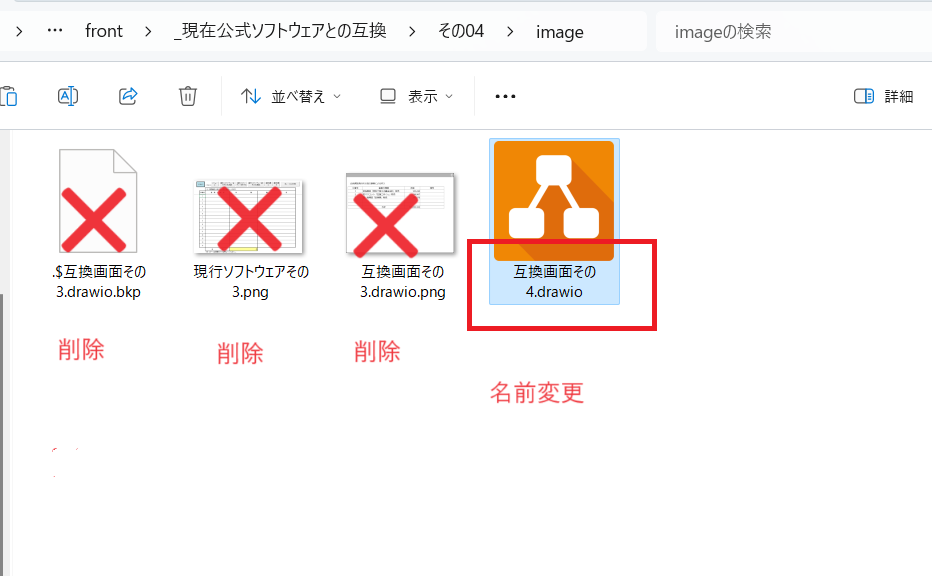

# 設計書作成手順(この文書は作成不要。あくまでも設計書を作る手順書)

## 1.環境構築(作成推奨ツール)

1. 総務省配布　政治資金収支報告書作成ソフト（単独使用）Ver5.0　マクロが必要なので**office365では動かない(はず**。少なくとも公式マニュアルの対応バージョンに記載はない)
    - [総務省ダウンロードページ](https://kyoudou.soumu.go.jp/kyoudou/GK020101#syushihokoku01)

2. VsCode
    - [Microsoftダウンロードページ](https://code.visualstudio.com/download)
    - [markdownlint(VsCode plugin)](https://marketplace.visualstudio.com/items?itemName=DavidAnson.vscode-markdownlint)
    - [Markdown Preview Enhanced(VsCode plugin)](https://marketplace.visualstudio.com/items?itemName=shd101wyy.markdown-preview-enhanced)
    - [Table Formatter(VsCode plugin)](https://marketplace.visualstudio.com/items?itemName=shuworks.vscode-table-formatter)

3. drawio
    - [drawioダウンロードページ](https://www.drawio.com/)

4. Git
    - [Gitダウンロードページ](https://git-scm.com/downloads)

5. SourceTree(Git関連ツール)
    - [SourceTreeダウンロードページ](https://www.sourcetreeapp.com/)

## 2. 実際の作成

## 2.1 事前準備

1. このリポジトリをフォーク(自身のgithubに枝分かれコピー)
    - [フォークに関する公式ドキュメント](https://docs.github.com/ja/get-started/exploring-projects-on-github/contributing-to-a-project)
    - [フォークするgit(このリポジトリ)](https://github.com/chiwa2023/create-politician-balance-report)

2. 作成プロジェクトをご自身のＰＣにダウンロード(クローン)
    - [SourceTreeを使ったクローン](https://pasomaki.com/sourcetree-clone-remote-repository/)

3. 政治資金収支報告書作成ソフト（単独使用）Ver5.0における、作成する機能(エクセルのワークシート)を決める。**今回は仮にその4**とする

4. docブランチにチェックアウト(リモートから特定のブランチをコピーして編集対象にする作業を同時に)する

5. docブランチから決定した機能専用のブランチを切る

6. 「その03」をフォルダごとコピーして「その04」とリネームする

7. 配下のimageフォルダに入る

8. 互換画面その3.drawio**以外**のファイルをすべて削除する

9. 互換画面その3.drawioを互換画面その4.drawioにリネームする 

10. 政治資金収支報告書作成ソフトを開き、ワークシートその4をShippingツールでスクリーンショットする

11. 先ほど作成したdrawioファイルを置いたimageフォルダに「現行ソフトウェアその4.png」とリネームしてコピーする  

12. 互換画面その4.drawioを開く  

13. 現行ソフトウェアその4.pngを参照しながら互換画面その4.drawioを編集する。列(名)は全く同じにするが、行数については全く同じにする必要はない。なんとなくどんな値が入るか想像できる適当なサンプルも併せて入力する  

14. 「ファイル」－「形式を指定してエクスポート」－「PNG」でPNG形式で(drowio形式とは別ファイルになるよう)エクスポートする  

X. その04にあるAllSheet0703JournalAndOtherDto.mdは今回は何もしない(後で編集してリネームする)  

## 2.2 編集作業

### 2.1 見出し１から3まで

1. その04にあるAllSheet0703JournalAndOtherDto.mdをVsCodeで開く
*最初はできうる限りそのファイルだけを開こうとするのではなく、一番親のディレクトリを「フォルダを開く」で開くこと。その作業を1回はしないと[コード実行を伴うプラグインが使えない](https://zenn.dev/yhatt/scraps/e48249d08e3664)  

2. 文書タイトル(#)の「その3」を「その4」に変更する  

3. 状態(##)はそのまま  

4. 目的(## 1)はそのまま  

5. 構成コンポーネント(##2)はそのまま  

6. 画面イメージ(##3)の「その3」を「その4」に変更する

作業部分は下記の通り

作業後の仕上がり。VsCodeでプレビュー表示すると、自分が作成した画像が表示されていますね!!

### 2.2 見出し４から5まで

1. 画面イメージ(##4)drawioで編集した部分かつ変数の部分を一覧として抜き出す。借入金というタイトルは固定値。

    - 論理値は編集した語をそのまま入力してください
    - タイプは「ラベル」のみで問題ありません。編集機能がある場合はいろいろ替わります
    - 活性／表示は「表示」のみで問題ありません。編集機能がある場合は活性／非活性を使う可能性があります。条件によって表示しない場合は非表示を使うことがありますが、今回は存在しません
    - 内容も上記の編集しないという制限から「`論理値`を表示すること」という、定型句で問題ありません

2.アクション(##5)につきましては、ご自身で作成いただければと思います。基本的には編集なしで問題ありませんが、一部のワークシート(機能)では、追加アクションを必要としています(個別に確認の上、ご相談となります)

作業部分は下記の通り

作業後の仕上がり。VsCodeでプレビュー表示すると編集されてが表示されていますね!!

### 2.3 見出し6

1. `ご自身のgitを置いたフォルダ`/app/back/src/main/java/mitei/mitei/create/report/balance/politician/dto/publishに移動します。
githubなら[git上の発行Dtoがおいてあるブランチのフォルダ](https://github.com/chiwa2023/create-politician-balance-report/tree/develop-back/app/back/src/main/java/mitei/mitei/create/report/balance/politician/dto/publish)

2. 作りたい機能のDtoを(エクスプローラーなどの)検索機能を使って抽出します。その４の場合は`*0704`その6のばあいは`*0706`で検索できます。4件検索された場合はすべて記載します。公式のデータ構造上、1機能につき2～4テーブルになります。その7(1)のように()がついている番号は、どのファイルを使うのか探すのがほんのちょっとだけを難しいです。

3. javaのクラス名をテーブルタイトルとします。

4. それぞれのテーブルをjavaの中身に合わせて変更していきます
    - クラスの中のフィールド(private ほにゃららら abcd)のabcdの部分を**物理名**に記載します
    - クラスの中のフィールド(private ほにゃららら abcd)のほにゃららの部分を**型**に記載します
    - 先ほどのフィールドの一番の上にある`/**　ほにゃらら  */`のほにゃららの部分を**論理名**に記載します
    - private～と/** */の間に`@JacksonXmlProperty～`との記載がありますが、その行のlocalName = "ほにゃらら"のほにゃららの部分を**公式XML名前空間**に記載します
    frontの実装では使用しませんが、省略できない変数であることを示すため、大変重要な情報となります

テーブル1行分作業部分は下記の通り

作業後の仕上がり。VsCodeでプレビュー表示すると編集内容が表示されていますね!!

### 2.4 見出し7

1. 連携(## 7)は`allSheet0704BorrowedMoneyDto`をご自身が記載した一番上のテーブル名の最初の1文字だけを小文字だけに変更した文字に、`AllSheet0704BorrowedMoneyDto`をテーブル名に変更します

作業後の仕上がり。VsCodeでプレビュー表示すると編集内容が表示されていますね!!

X. ファイル名`AllSheet0703JournalAndOtherDto.md`を`テーブル名.md`に変更します

## 2.3 作業内容をGitHubにあげて(push)、このプロジェクトに追加してね!と依頼します(pull request)

[【入門】SourcetreeからGitHubへ初push](https://qiita.com/nkojima/items/370b4f5587f6c4613f52)

特に問題がなければ、プロジェクトへの追加作業(merge)が行われます。

[余力があったら実装もしてみましょう!](./参考ー設計書から実装手順.md)
