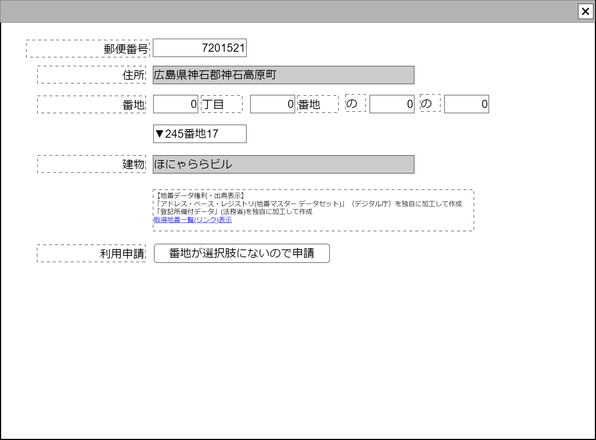

# 番地入力補助概念実証実装2【コンポーネント】設計書

## 状態：テスト実装1(branch:develop-back)

機能拡張・プロジェクト移行(ex.データ作成部分を調査側、データアクセス部分は新設共通機能プロジェクトなど)の可能性あり

## 1.目的

住所入力で、番地の手入力を禁止するため入力補助を行う

※個人・法人・政治団体の完全な統一コード化がされないと考えられ、その場合は名前(名称)と住所がひきつづき識別条件となる可能性が高い。
この場合、現行総務省配布ソフトウェアで注意喚起を行っているように、最も表記ゆれが発生しやすい番地表記部分表記を制御制限する必要があり、このような機能を提供するコンポーネントが必要となる。
実装者としては「住所表記は基本わかれば好きに書けばいいのに」と、思いながら、必要性に駆られて渋々実装しているので、
「今まであんまり見たこのない(ヘンテコな)機能を作っているからブラッシュアップして自作アプリに追加してしまえ」などのように濫用するのは全くお薦めしない。

## 2. 構成コンポーネント

1. 独自フィールド

### 2.1 繰り返し項目

なし

## 3. 画面イメージ

### 3.1 画面イメージ

### 3.2 画面イメージ(項番)

## 4. フィールド要素一覧

| 番号 |             論理名             |       タイプ       | 活性／表示 |                                                                  内容                                                                  |
| ---- | ------------------------------ | ------------------ | ---------- | -------------------------------------------------------------------------------------------------------------------------------------- |
| 1    | 郵便番号入力                   | インプットテキスト | 活性       | 郵便番号の入力を受け付けること                                                                                                         |
| 1    | 住所                           | インプットテキスト | 非活性     | 郵便番号に紐づく住所を表示すること                                                                                                     |
| 1    | 丁目フィルタ条件               | インプットテキスト | 活性       | XX丁目のXXをフィルタする条件の入力(数字)を受け付けること                                                                               |
| 1    | 番地フィルタ条件               | インプットテキスト | 活性       | XX番地のXXをフィルタする条件の入力(数字)を受け付けること                                                                               |
| 1    | 号フィルタ条件                 | インプットテキスト | 活性       | XX号のXXをフィルタする条件の入力(数字)を受け付けること                                                                                 |
| 1    | (場所3)フィルタ条件            | インプットテキスト | 活性       | (場所3)のXXをフィルタする条件の入力(数字)を受け付けること                                                                              |
| 1    | 選択可能な番地                 | セレクトボタン     | 活性       | 郵便番号に紐づく番地リストをフィルタ条件を考慮して選択できること                                                                       |
| 1    | 建物                           | インプットテキスト | 活性       | 建物の入力を受け付けること                                                                                                             |
| 1    | 地番データ出典表示(デジタル庁) | ラベル             | 表示       | 地番データがレジストリカタログであるという出典と、実装者がデータ加工を行っていることを明記すること                                     |
| 1    | 地番データ出典表示(法務省)     | ラベル             | 表示       | 地番データのもとととなるレジストリカタログデータが登記所備付データであるという出典と、実装者がデータ加工を行っていることを明記すること |
| 1    | 出典・取得状況リストリンク     | リンク             | 表示       | 地番データの取得状況と取得URLと取得時期を一覧表示するページへのリンクを設置すること                                                    |

※地番マスターは「登記所備付地図データ」（法務省）を加工してデジタル庁で配布しており、このため出典明記がデジタル庁、法務省の2か所から求められている。
詳細はデジタル庁[アドレス・ベース・レジストリの利用規約](https://www.digital.go.jp/policies/base_registry_address_tos)を参照の事

## 5.アクション一覧

### 5.1 郵便番号入力

a.7文字の数字が入力された場合

- 郵便番号に紐づく番地リストを取得すること
- 丁目フィルタ条件を初期化`0`とすること
- 番地フィルタ条件を初期化`0`とすること
- 号フィルタ条件を初期化`0`とすること
- (場所3)フィルタ条件を初期化`0`とすること

### 5.2 フィルタ条件入力

a.丁目フィルタ条件

- `0`が入力された場合、丁目フィルタを無効にすること
- `数字(ex.3)`が入力された場合、数字(3)丁目を含んだ番地のみで番地のリストをフィルタすること

b.番地フィルタ条件

- `0`が入力された場合、番地フィルタを無効にすること
- `数字(ex.3)`が入力された場合、数字(3)番地を含んだ番地のみで番地のリストをフィルタすること

c.号フィルタ条件

- `0`が入力された場合、号フィルタを無効にすること
- `数字(ex.3)`が入力された場合、数字(3)号を含んだ番地のみで番地のリストをフィルタすること

d.(場所3)フィルタ条件

- `0`が入力された場合、(場所3)フィルタを無効にすること
- `数字(ex.3)`が入力された場合、(場所3)(3)を含んだ番地のみで番地のリストをフィルタすること

## 6. 郵便番号・番地リストインターフェイス

PostalAddressBlockDtoInterface

 |     論理名     |     論理名     |                 型                 |    説明(例)    |
 | -------------- | -------------- | ---------------------------------- | -------------- |
 | 郵便番号リスト | listPostalcode | List\<AddressPostalcodeInterface\> | 郵便番号リスト |
 | 番地リスト     | listBlock      | List\<AddressBlockInterface\>      | 番地リスト     |

AddressPostalcodeInterface

 |     論理名      |   論理名    |   型    |                                   説明(例)                                   |
 | --------------- | ----------- | ------- | ---------------------------------------------------------------------------- |
 | 郵便番号        | postalcode  | String  | 郵便番号                                                                     |
 | 郵便番号住所    | addressName | String  | 郵便番号に紐づく郵便番号名称                                                 |
 | 丁目表記有無    | isChoume    | boolean | 郵便番号に紐づく番地リストに丁目表記が一切ない場合は`false`で入力制御する    |
 | 番地表記有無    | isPrc1      | boolean | 郵便番号に紐づく番地リストに番地表記が一切ない場合は`false`で入力制御する    |
 | 号表記有無      | isPrc2      | boolean | 郵便番号に紐づく番地リストに号表記が一切ない場合は`false`で入力制御する      |
 | (場所3)表記有無 | isPrc3      | boolean | 郵便番号に紐づく番地リストに(場所3)表記が一切ない場合は`false`で入力制御する |

AddressBlockInterface

 |        論理名        | 論理名 |   型    |                 説明(例)                  |
 | -------------------- | ------ | ------- | ----------------------------------------- |
 | 丁目番号             | choume | Integer | 丁目。3丁目なら3                          |
 | 番地番号             | prc1   | Integer | 番地。123番地なら123                      |
 | 号番号               | prc2   | Integer | 号。123番地4号なら4                       |
 | (場所3)番号          | prc3   | Integer | (場所3)。123番地の4の987なら987           |
 | 番地選択の値         | value  | String  | 番地。地域Id,町字Id,場所Idを`-`で連結する |
 | 番地選択表示テキスト | text   | String  | 番地表示テキスト。例示「5丁目33番地」     |

## 7. 連携

TODO 親画面に最低限住所(郵便番号呼び出し)、住所(番地)、住所(建物)を通知すること
