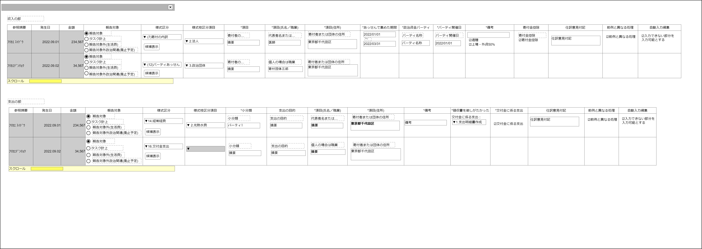

# 政治資金収支報告書仕様入力コンポーネント設計書

## 状態：手戻り上等！の姿勢で実装中(一次実装完了)

## 1. 目的

各種データを収支報告書データ形式として、実際のデータとして入力できるようにする

## 2. 構成コンポーネント

なし

## 3.画面イメージ

### 3.1 画面イメージ

### 3.2 画面イメージ(項番)

## 4. フィールド要素一覧

### 4.1 独自フィールド(収入テーブル)

| 番号 |           論理名           |        タイプ        |      活性／表示      |                                             内容                                             |
| ---- | -------------------------- | -------------------- | -------------------- | -------------------------------------------------------------------------------------------- |
| 1    | 参照摘要                   | インプットテキスト   | 非活性               | 入力補助できる情報を呼び出すキーであること                                                   |
| 2    | 発生日                     | インプット日付       | 非活性／活性         | このデータが発生した日付                                                                     |
| 3    | 金額                       | インプット数字       | 非活性／活性         | このデータで取引を行った金額                                                                 |
| 4    | 報告区分(報告対象)         | ラジオボタン         | 活性                 | 収支報告書に記載するデータであることを指定すること                                           |
| 5    | 報告区分(生活費)           | ラジオボタン         | 活性                 | 生活費であるため収支報告書に記載しないことを指定すること                                     |
| 6    | 報告区分(非報告)           | ラジオボタン         | 活性                 | 政治活動費ではあるが、収支報告書に記載しないデータであることを指定すること                   |
| 7    | 収支収入仕訳大項目         | セレクトボタン       | 活性                 | 収入の仕訳大項目を指定すること                                                               |
| 7    | 収支収入仕訳小項目         | セレクトボタン       | 活性                 | 収入の仕訳小項目を指定すること                                                               |
| 1    | 入力項目                   | インプットテキスト   | 活性 表示／非表示 | 選択された項目が氏名・名称入力を必要とする場合に表示 名称を表示すること                   |
| 1    | 氏名／職業                 | インプットテキスト   | 活性 表示／非表示 | 選択された項目が団体の名称または個人の場合は職業を必要とする場合に表示 氏名を表示すること |
| 1    | 住所                       | テキストエリア       | 活性 表示／非表示 | 選択された項目が住所入力を必要とする場合に表示 団体の住所を表示すること                   |
| 1    | あっせんで集めた期間開始日 | インプットカレンダー | 活性 表示／非表示 | あっせんを伴い、期間入力を必要とする場合に表示 期間の開始日を表示すること                 |
| 1    | あっせんで集めた期間終了日 | インプットカレンダー | 活性 表示／非表示 | あっせんを伴い、期間入力を必要とする場合に表示 期間の終了日を表示すること                 |
| 8    | パーティ名称               | インプットテキスト   | 活性 表示／非表示 | パーティごとに記載が必要な場合に個別のパーティ名称を入力できること                           |
| 9    | パーティ開催日             | インプットカレンダー | 活性 表示／非表示 | パーティ開催日の指定の入力を供すること                                                       |
| 1    | 備考                       | テキストエリア       | 活性 表示／非表示 | 備考を表示すること                                                                           |
| 1    | 遺贈有無                   | チェックボックス     | 活性 表示／非表示 | 値が`1:有`の場合には備考に『「遺贈」』と記入され、記入チェックがされること                   |
| 1    | 上場・外資50%以上チェック  | チェックボックス     | 活性 表示／非表示 | 値が`1:有`の場合には備考に『「上場・外資50%以上」』と記入され、記入チェックがされること      |
| 1    | 寄付金控除有無             | チェックボックス     | 活性 表示／非表示 | 寄付金控除の有無入力を受け付けること                                                         |
| 1    | 意見付記                   | チェックボックス     | 活性                 | 最新の意見付記の入力を受け付けること                                                         |
| 1    | 前例と異なる処理チェック   | チェックボックス     | 活性                 | この処理が前例と異なっていることの入力を受け付けること                                       |
| 1    | 自動入力編集チェック       | チェックボックス     | 活性                 | 自動入力部分を変更しようとしていることの入力を受け付けること                                 |

### 4.2 独自フィールド(支出テーブル)

| 番号 |           論理名           |       タイプ       |          活性／表示          |                                                              内容                                                              |
| ---- | -------------------------- | ------------------ | ---------------------------- | ------------------------------------------------------------------------------------------------------------------------------ |
| 1    | 参照摘要                   | インプットテキスト | 非活性                       | 入力補助できる情報を呼び出すキーであること                                                                                     |
| 2    | 発生日                     | インプット日付     | 非活性／活性                 | このデータが発生した日付                                                                                                       |
| 3    | 金額                       | インプット数字     | 非活性／活性                 | このデータで取引を行った金額                                                                                                   |
| 4    | 報告区分(報告対象)         | ラジオボタン       | 活性                         | 収支報告書に記載するデータであることを指定すること                                                                             |
| 5    | 報告区分(生活費)           | ラジオボタン       | 活性                         | 生活費であるため収支報告書に記載しないことを指定すること                                                                       |
| 6    | 報告区分(非報告)           | ラジオボタン       | 活性                         | 政治活動費ではあるが、収支報告書に記載しないデータであることを指定すること                                                     |
| 7    | 収支支出仕訳大項目         | セレクトボタン     | 活性                         | 支出の仕訳大項目を指定すること                                                                                                 |
| 7    | 収支支出仕訳小項目         | セレクトボタン     | 活性                         | 支出の仕訳小項目を指定すること                                                                                                 |
| 1    | 小分類                     | インプットテキスト | 活性 表示／非表示         | パーティ名称など小分類ごとでの記載を要求されている場合の分類名                                                                 |
| 1    | 支出の目的                 | インプットテキスト | 活性 表示／非表示         | 選択された仕訳項目が支出の目的を必要とする場合に表示 摘要の入力を受け付けること                                             |
| 1    | 支出を受けたものの名称     | インプットテキスト | 活性／非活性 表示／非表示 | 選択された項目が支出を受けたものの名称入力を必要とする場合に表示 支出を受けたものの名称を表示すること                       |
| 1    | 支出を受けたものの住所     | テキストエリア     | 活性／非活性 表示／非表示 | 選択された項目が支出を受けたものの住所入力を必要とする場合に表示 支出を受けたものの名称を表示すること                       |
| 1    | 備考                       | テキストエリア     | 活性 表示／非表示         | 備考を表示すること                                                                                                             |
| 1    | 領収書を徴しがたかった支出 | セレクトボックス   | 活性 表示／非表示         | `0:選択なし`、`1:領収書を徴しがたかった支出の明細書を作成する`、`2:振込明細書に係る支出目的書を作成する`の選択を受け付けること |
| 1    | 交付金に係る支出有無       | チェックボックス   | 活性 表示／非表示         | 交付金に係る支出であるかの有無入力を受け付けること                                                                             |
| 1    | 意見付記                   | チェックボックス   | 活性                         | 最新の意見付記の入力を受け付けること                                                                                           |
| 1    | 前例と異なる処理チェック   | チェックボックス   | 活性                         | この処理が前例と異なっていることの入力を受け付けること                                                                         |
| 1    | 自動入力編集チェック       | チェックボックス   | 活性                         | 自動入力部分を変更しようとしていることの入力を受け付けること                                                                   |

## 5. アクション要素一覧

なし

## 6. インターフェイス

### 6.1 収支報告書収入データBalancesheetIncomeInterface

### 6.2 収支報告書支出データBalancesheetOutcomeInterface

## 7. 連携

送信ボタンを押下時、親画面にBack側で解析された政治資金収支報告書収入データクラスを通知する`emit[sendBalancesheetIncomeDto(data,errorInfo)]`
送信ボタンを押下時、親画面にBack側で解析された政治資金収支報告書支出データクラスを通知する`emit[sendBalancesheetOutcomeDto(data,errorInfo)]`
