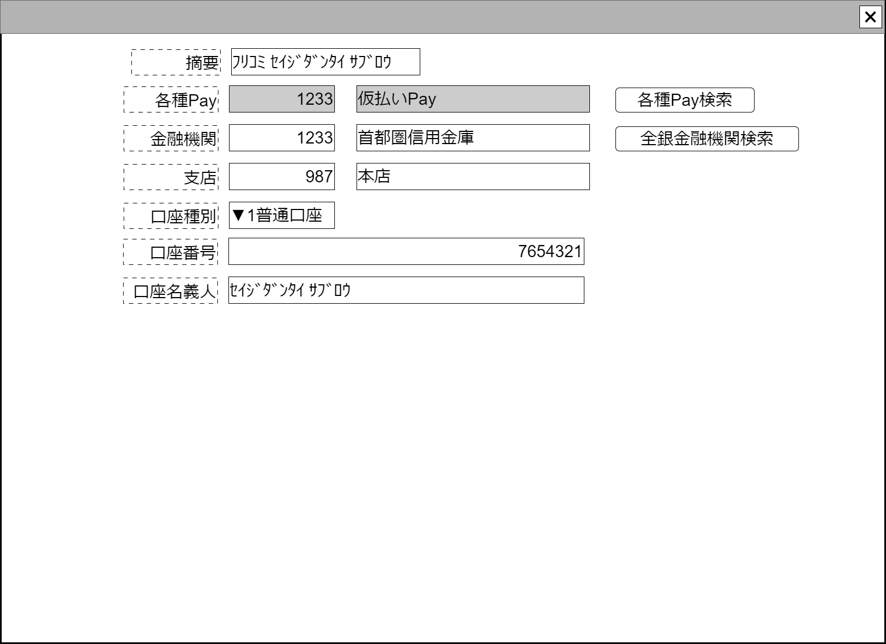

# 項目呼び出し金融情報入力【コンポーネント】設計書

## 状態：仕様未確定(実装不可)

## 1.目的

共通となる金融情報の入力を受け付ける

## 2. 構成コンポーネント

1. 独自フィールド
2. [各種Pay検索コンポーネント](../search_various_pay/search_various_pay.md)
3. [全銀金融機関検索コンポーネント](../search_zengin/search_zengin.md)

### 2.1 繰り返し項目

なし

## 3. 画面イメージ

### 3.1 画面イメージ

### 3.2 画面イメージ(項番)

## 4. フィールド要素一覧

| 番号 |         論理名         |       タイプ       | 活性／表示 |                           内容                            |
| ---- | ---------------------- | ------------------ | ---------- | --------------------------------------------------------- |
| 1    | 項目名称               | インプットテキスト | 活性       | 項目名称の入力を受け付けること                            |
| 1    | 摘要                   | インプットテキスト | 活性       | 摘要の入力を受け付けること                                |
| 1    | 各種Payコード          | インプットテキスト | 非活性     | (このシステム固有で全銀以外の)各種Payコードを表示すること |
| 1    | 各種Pay名称            | インプットテキスト | 非活性     | (このシステム固有で全銀以外の)各種Payコードを表示すること |
| 1    | 各種Pay検索ボタン      | ボタン             | 活性       | 押下時：各種Pay検索コンポーネントを表示すること           |
| 1    | 全銀金融機関コード     | インプットテキスト | 活性       | 金融機関コードの入力を受け付けること                      |
| 1    | 全銀金融機関名称       | インプットテキスト | 活性       | 金融機関名称の入力を受け付けること                        |
| 1    | 全銀金融機関検索ボタン | ボタン             | 活性       | 押下時：全銀金融機関検索コンポーネントを表示すること      |
| 1    | 全銀金融機関支店コード | インプットテキスト | 活性       | 金融機関支店コードの入力を受け付けること                  |
| 1    | 全銀金融機関支店名称   | インプットテキスト | 活性       | 金融機関支店名称の入力を受け付けること                    |
| 1    | 口座区分               | セレクトボックス   | 活性       | 口座区分の入力を受け付けること                            |
| 1    | 口座番号               | インプットテキスト | 活性       | 口座番号の入力を受け付けること                            |
| 1    | 口座名義人             | インプットテキスト | 活性       | 口座名義人の入力を受け付けること                          |

## 5.アクション一覧

| 番号 |         論理名         | タイプ | 活性／表示 |                         内容                         |
| ---- | ---------------------- | ------ | ---------- | ---------------------------------------------------- |
| 1    | 各種Pay検索ボタン      | ボタン | 活性       | 押下時：各種Pay検索コンポーネントを表示すること      |
| 1    | 全銀金融機関検索ボタン | ボタン | 活性       | 押下時：全銀金融機関検索コンポーネントを表示すること |

## 6. 項目呼び出し金融情報インターフェイス

FinacialTradingInfoForCallingItemInterface

 |             論理名             |           物理名            |   型    |                                                                  説明(例)                                                                  |
 | ------------------------------ | --------------------------- | ------- | ------------------------------------------------------------------------------------------------------------------------------------------ |
 | 項目呼び出し条件摘要           | callingItemFinancialDigest  | String  | 取引内容などを記した汎用の摘要。例示：「ﾌﾘｺﾐ ｾｲｼﾞﾀﾞﾝﾀｲ ｻﾌﾞﾛｳ」                                                                             |
 | 項目呼び出し条件各種PayId      | callingItemFinancialPayId   | Long    | このシステムで固有に割り当てられた全銀金融機関以外の金融機関を識別するId。例示：「123456」                                                 |
 | 項目呼び出し条件各種Payコード  | callingItemFinancialPayCode | Integer | このシステムで固有に割り当てられた全銀金融機関以外の金融機関を、変更にかかわらず同一としきべつする、同一識別コード。例示：「1234」         |
 | 項目呼び出し条件各種Pay名称    | callingItemFinancialPayName | String  | このシステムで固有に割り当てられた全銀金融機関以外の金融機関名称。例示：「2次元コード専用Pay」                                             |
 | 項目呼び出し条件金融機関コード | callingItemFinancialOrgCode | String  | 全銀加盟金融機関統一コード。例示：「0002」※TODO 金融機関コードから名称を取得出来るAPIが利用できれば取得する(該当フィールド非活性)         |
 | 項目呼び出し条件金融機関名称   | callingItemFinancialOrgName | String  | 全銀加盟金融機関名称。例示：「首都圏市民銀行」※TODO 金融機関コードから名称を取得出来るAPIが利用できれば取得する(該当フィールド非活性)     |
 | 項目呼び出し条件支店コード     | callingItemBranchCode       | String  | 全銀加盟金融機関支店コード。例示：「123」                                                                                                  |
 | 項目呼び出し条件支店名称       | callingItemBranchName       | String  | 全銀加盟金融機関支店名称。例示：「番町皿屋敷支店」※TODO 金融機関コードから名称を取得出来るAPIが利用できれば取得する(該当フィールド非活性) |
 | 項目呼び出し条件口座種別区分   | callingItemAccountType      | String  | 全銀統一使用口座区分。下記参照                                                                                                             |
 | 項目呼び出し条件口座番号       | callingItemAccountNo        | String  | 口座番号。例示：「1233」                                                                                                                   |
 | 項目呼び出し条件口座名義人     | callingItemAccountHas       | String  | 口座名義人。例示：「ｾｲｼﾞﾀﾞﾝﾀｲ ｻﾌﾞﾛｳ」                                                                                                      |

## 7. 連携

入力内容が変更された都度、全銀金融機関入力チェックを行い、既存のデータ以外が指定されている場合はエラーメッセージ出す。
入力チェックの結果、全銀金融機関入力が既存の組み合わせであれば、正常に親画面に変更内容を通知する`emit[sendFinacialTradingInfoForCallingItemInterface(data)]`

## 8. エラー

### 8.1 全銀金融機関入力チェック

全銀金融機関の金融機関コード、金融機関コード名称、金融機関支店コード、金融機関支店名をリストと比較し、異なる場合は判明した原因のテキストを返却すること。一致した場合は`空文字`を返却すること
