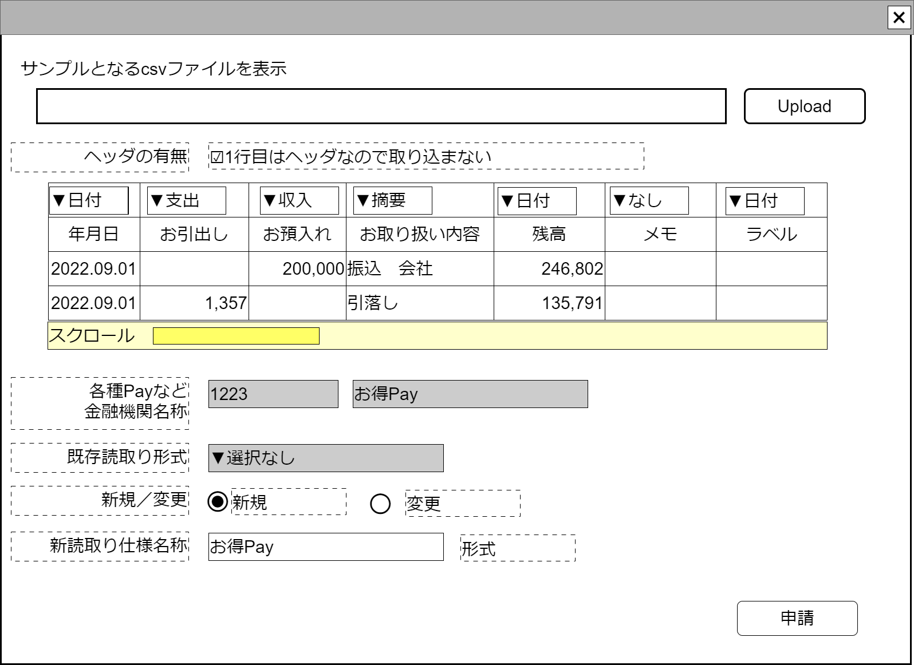

# csv読取り仕様申請入力【コンポーネント】設計書

## 状態：手戻り大歓迎!の姿勢で実装中

上記の手戻り大歓迎!のスタンスで実装している、「各種金融機関(個人用銀行独自フォーマット／Pay系含む)CSVファイルから収支項目データ作成」の使用パーツ

## 1.目的

- CSVを設定された読み取り形式(仕様)で読み取りしたデータを親画面に渡す
- 新しいcsv読取り形式である場合は次回以降共通して使えるように調査側(運営側に)申請する

## 2. 構成コンポーネント

1. [一般CSVファイルアップロードコンポーネント](../read_csv/read_csv.md)
2. 独自フィールド

### 2.1 繰り返し項目

なし

## 3. 画面イメージ

### 3.1 画面イメージ

### 3.2 画面イメージ(項番)

## 4. フィールド要素一覧

| 番号 |                  論理名                   |       タイプ       |         活性／表示         |                                                  内容                                                   |
| ---- | ----------------------------------------- | ------------------ | -------------------------- | ------------------------------------------------------------------------------------------------------- |
| 1    | 一般CSVファイルアップロードコンポーネント | コンポーネント     | 表示                       | 一般CSVファイルアップロードコンポーネントを表示すること。                                               |
| 1    | ヘッダの有無                              | チェックボックス   | 活性                       | ヘッダがあり、一行目を読みとりしないか、ヘッダがなく1業務もデータとして読みとるかの入力を受け付けること |
| 1    | 読み取りCSV項目紐づけ一覧                 | テーブル           | 表示                       | csvを読みとり、各列がどの意味づけして読みとりするかの入力を受け付けること                               |
| 1    | 金融機関コード                            | インプットテキスト | 非活性                     | 各種Payまたは全銀金融機関コードコードを表示すること                                                     |
| 1    | 金融機関名称                              | インプットテキスト | 非活性 表示／表示       | 各種Payまたは全銀金融機関名称を表示すること                                                             |
| 1    | 読取り形式選択ボックス                    | セレクトボックス   | 活性／非活性 表示／表示 | 既存の読み取り形式を選択する入力を受け付けること                                                        |
| 1    | 新規選択ボタン                            | ラジオボタン       | 活性                       | 入力されたデータが新規に設定された仕様であることの入力を受け付けること                                  |
| 1    | 変更選択ボタン                            | ラジオボタン       | 活性                       | 入力されたデータが既存データの編集であることの入力を受け付けること                                      |
| 1    | 新読取り形式名称                          | インプットテキスト | 活性 ／非活性              | 新規の場合新たな名称の入力を受け付けること                                                              |

## 4.1 csv読み取り列指定セレクトボックス

|      論理名      |                         値                         |       表示       |
| ---------------- | -------------------------------------------------- | ---------------- |
| 指定なし         | 指定なしを表す定数値`0`                            | (空白)           |
| 取引金額支出     | 支出取引金額が入っていることを表す定数値`1`        | 取引金額支出     |
| 取引金額収入     | 収入取引金額が入っていることを表す定数値`2`        | 取引金額収入     |
| 取引金額増減兼用 | 取引金額増減兼用が入っていることを表す定数値`3`    | 取引金額増減兼用 |
| 発生日           | 発生日が入っていることを表す定数値`15`             | 発生日           |
| 摘要             | 摘要が入っていることを表す定数値`16`               | 摘要             |
| 取引相手名称     | 取引の相手方データが入っていることを表す定数値`17` | 取引相手名称     |

## 4.2 csv読み取りデータテーブル

列項目は読み取られるcsvによって変動する。10項目が存在するcsvなら10列。この設計書で確定することはできない。
解析するcsvによってはヘッダがないこともありうる。
数字でないデータ列を、数字で指定した場合は例外で落とす必要がある

|     論理名     |   型   |        表示        |
| -------------- | ------ | ------------------ |
| 読み取りデータ | String | 振込　サンプル会社 |

## 5.アクション一覧

| 番号 |     論理名     |    タイプ    | 活性／表示 |                              内容                              |
| ---- | -------------- | ------------ | ---------- | -------------------------------------------------------------- |
| 1    | 新規選択ボタン | ラジオボタン | 活性       | 下記参照                                                       |
| 1    | 変更選択ボタン | ラジオボタン | 活性       | 下記参照                                                       |
| 1    | 申請ボタン     | ボタン       | 活性       | 入力されたデータが調査側で申請できるよう入力内容を保存すること |

### 5.1 新規選択ボタン

- 新読取り形式名称を活性にすること
- 読取り形式選択ボックスを非活性にすること

### 5.2 変更選択ボタン

- 新読取り形式名称を非活性にすること
- 読取り形式選択ボックスを活性にすること

## 6. CSV読取り形式インターフェイス

ReadCsvPatternInterface

 |            論理名             |       論理名       |    型    |                        説明(例)                         |
 | ----------------------------- | ------------------ | -------- | ------------------------------------------------------- |
 | CSV読取り形式Id               | readCsvPatternId   | Long     | csv読み取り形式を識別する一意のId                       |
 | CSV読取り形式同一識別コード   | readCsvPatternCode | Integer  | 変更にかかわらず、csv読み取り形式を同一とする識別コード |
 | CSV読取り形式名称             | readCsvPatternName | String   | csv読み取り形式を識別する一意のId                       |
 | 各種PayId                     | readCsvPatternId   | Long     | csv読み取り形式を識別する一意のId                       |
 | 各種Pay同一識別コード         | readCsvPatternCode | Integer  | 変更にかかわらず、csv読み取り形式を同一とする識別コード |
 | 各種Pay名称                   | readCsvPatternName | String   | csv読み取り形式を識別する一意のId                       |
 | 全銀金融機関コード            | readCsvPatternCode | Integer  | 変更にかかわらず、csv読み取り形式を同一とする識別コード |
 | 全銀金融期間名称              | readCsvPatternName | String   | csv読み取り形式を識別する一意のId                       |
 | 1行目ヘッダデータの該当非該当 | hasHeader          | boolean  | ヘッダの有無                                            |
 | 読み取り配列                  | listReadingPattern | List\<\> | 項目数分、読み取りする列指定データを格納したもの                                                |

## 7. 連携

TODO 親画面から`props{personManagerDto:PersonManagerInterface}`を受け取り、`computed`を設定することで変更状態を常に親画面に通知すること
