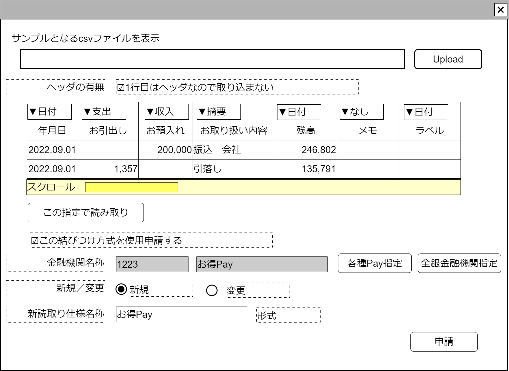

# csv読取り仕様申請入力【コンポーネント】設計書

## 状態：手戻り大歓迎!の姿勢で実装中

上記の手戻り大歓迎!のスタンスで実装している、「各種金融機関(個人用銀行独自フォーマット／Pay系含む)CSVファイルから収支項目データ作成」の使用部品で、一部を除き実装完了

## 1.目的

- CSVを設定された読み取り形式(仕様)で読み取りしたデータを親画面に渡す
- 新しいcsv読取り形式である場合は次回以降共通して使えるように調査側(運営側に)申請する

## 2. 構成コンポーネント

1. [一般CSVファイルアップロードコンポーネント](../read_csv/read_csv.md)
2. 独自フィールド
3. [各種Pay検索コンポーネント](../search_various_pay/search_various_pay.md)
4. [全銀金融機関検索コンポーネント](../search_zengin_org/search_zengin_org.md)

### 2.1 繰り返し項目

なし

## 3. 画面イメージ

### 3.1 画面イメージ

### 3.2 画面イメージ(項番)

## 4. フィールド要素一覧

| 番号 |                  論理名                   |       タイプ       |          活性／表示           |                                                  内容                                                   |
| ---- | ----------------------------------------- | ------------------ | ----------------------------- | ------------------------------------------------------------------------------------------------------- |
| 1    | 一般CSVファイルアップロードコンポーネント | コンポーネント     | 表示                          | 一般CSVファイルアップロードコンポーネントを表示すること。                                               |
| 1    | csv読取りテンプレート指定                 | セレクトボックス   | 活性                          | 押下時：csvの列をどの項目に読ませるかの設定を指定できること。                                           |
| 1    | ヘッダの有無                              | チェックボックス   | 活性                          | ヘッダがあり、一行目を読みとりしないか、ヘッダがなく1業務もデータとして読みとるかの入力を受け付けること |
| 1    | 読み取りCSV項目紐づけ一覧                 | テーブル           | 表示                          | csvを読みとり、各列がどの意味づけして読みとりするかの入力を受け付けること                               |
| 1    | この指定で読み取りボタン                  | ボタン             | 活性                          | 押下時：csv読みとりから収支報告書データへの変換処理を行うこと                                           |
| 1    | 結びつけ申請チェックボックス              | チェックボタン     | 活性                          | チェック時：変更または新規の申請ができる項目(金融機関コードから新読み取り形式名称まで)を表示すること    |
| 1    | 金融機関コード                            | インプットテキスト | 非活性                        | 各種Payまたは全銀金融機関コードコードを表示すること                                                     |
| 1    | 金融機関名称                              | インプットテキスト | 非活性                        | 各種Payまたは全銀金融機関名称を表示すること                                                             |
| 1    | 各種Pay検索ボタン                         | ボタン             | 活性 ／非活性 表示／非表示 | 押下時：各種Pay検索コンポーネントが表示されること                                                       |
| 1    | 全銀金融機関検索ボタン                    | ボタン             | 活性 ／非活性 表示／非表示 | 押下時：全銀金融機関検索コンポーネントが表示されること                                                  |
| 1    | 新規選択ボタン                            | ラジオボタン       | 活性 表示／非表示          | 入力されたデータが新規に設定された仕様であることの入力を受け付けること                                  |
| 1    | 変更選択ボタン                            | ラジオボタン       | 活性 表示／非表示          | 入力されたデータが既存データの編集であることの入力を受け付けること                                      |
| 1    | 新読取り形式名称                          | インプットテキスト | 活性／非活性 表示／非表示  | 新規の場合新たな名称の入力を受け付けること                                                              |

## 4.1 csv読み取り列指定セレクトボックス

|      論理名      |                         値                         |       表示       |
| ---------------- | -------------------------------------------------- | ---------------- |
| 指定なし         | 指定なしを表す定数値`0`                            | (空白)           |
| 取引金額支出     | 支出取引金額が入っていることを表す定数値`1`        | 取引金額支出     |
| 取引金額収入     | 収入取引金額が入っていることを表す定数値`2`        | 取引金額収入     |
| 取引金額増減兼用 | 取引金額増減兼用が入っていることを表す定数値`3`    | 取引金額増減兼用 |
| 発生日           | 発生日が入っていることを表す定数値`15`             | 発生日           |
| 摘要             | 摘要が入っていることを表す定数値`16`               | 摘要             |
| 取引相手名称     | 取引の相手方データが入っていることを表す定数値`17` | 取引相手名称     |

## 4.2 csv読み取りデータテーブル

- 列項目は読み取られるcsvによって変動する。10項目が存在するcsvなら10列。この設計書で確定することはできない。
- 解析するcsvによってはヘッダがないこともありうる。
- 数字でないデータ列を、数字で指定した場合は例外をthrowし、処理中断をする必要がある
- 最低限、1.発生日、2.取引金額(支出・収入・増減兼用)の2件を含む必要がある。ない場合は例外をthrowし、処理中断をする必要がある

|     論理名     |   型   |        表示        |
| -------------- | ------ | ------------------ |
| 読み取りデータ | String | 振込　サンプル会社 |

## 5.アクション一覧

| 番号 |          論理名           |      タイプ      | 活性／表示 |                                              内容                                              |
| ---- | ------------------------- | ---------------- | ---------- | ---------------------------------------------------------------------------------------------- |
| 1    | csv読取りテンプレート指定 | セレクトボックス | 活性       | 下記参照                                                                                       |
| 1    | この指定で読み取りボタン  | ボタン           | 活性       | 押下時：csv読みとりから、csv読取りテンプレート指定と同じ収支報告書データへの変換処理を行うこと |
| 1    | 新規選択ボタン            | ラジオボタン     | 活性       | 下記参照                                                                                       |
| 1    | 変更選択ボタン            | ラジオボタン     | 活性       | 下記参照                                                                                       |
| 1    | 申請ボタン                | ボタン           | 活性       | 入力されたデータが調査側で申請できるよう入力内容を保存すること                                 |

### 5.1 csv読取りテンプレート指定

a. 選択された項目に紐づくcsv読み取り指定を適用すること

b. 選択された項目が`選択解除:0`である場合

- 各種Pay検索ボタンを活性とすること
- 全銀金融機関検索ボタンを活性とすること
- 金融機関コードを`初期化：0`とすること
- 金融機関名称を`初期化：空文字`とすること

c. 選択された項目が`選択解除:0`でない場合

- 各種Pay検索ボタンを非活性とすること
- 全銀金融機関検索ボタンを非活性とすること
- 金融機関コードに選択された読み取り仕様を保持する金融機関コードを複写すること
- 金融機関名称に選択された読み取り仕様を保持する金融機関名称を複写すること

### 5.2 結びつけ申請チェックボックス

a. チェック該当時

- 金融機関コードを表示すること
- 金融機関名称を表示すること
- 各種Pay検索ボタンを表示すること
- 全銀金融機関検索ボタンを表示すること
- 読み取りテンプレート名称を表示すること
- 読み取り申請ボタンを表示すること

b. チェック非該当時

- 金融機関コードを表示しないこと
- 金融機関名称を表示しないこと
- 各種Pay検索ボタンを表示しないこと
- 全銀金融機関検索ボタンを表示しないこと
- 読み取りテンプレート名称を表示しないこと
- 読み取り申請ボタンを表示しないこと

### 5.3 新規選択ボタン

- 新読取り形式名称を活性にすること

### 5.4 変更選択ボタン

- 新読取り形式名称を非活性にし、値をcsv読取りテンプレート指定の表示テキストとすること

## 6. CSV読取り形式インターフェイス

ProposeCsvReadTemplateInterface

 |           論理名            |       論理名        |   型    |                            説明(例)                             |
 | --------------------------- | ------------------- | ------- | --------------------------------------------------------------- |
 | CSV読取り形式Id             | readCsvTemplateId   | Long    | csv読み取り形式を識別する一意のId                               |
 | CSV読取り形式同一識別コード | readCsvTemplateCode | Integer | 変更にかかわらず、csv読み取り形式を同一とする識別コード         |
 | CSV読取り形式名称           | readCsvTemplateName | String  | csv読み取り形式を識別する一意のId                               |
 | 最新区分                    | saishinKbn          | Integer | 最新データかどうか区分する値                                    |
 | 金融機関区分                | financialOrgKbn     | Integer | 仕様保持者が各種Payか全銀金融機関かを区分する値                 |
 | 金融機関Id                  | financialOrgId      | Long    | csv読み取り仕様保持者を一意に識別する一意のId                   |
 | 金融機関同一識別コード      | financialOrgCode    | Integer | 変更にかかわらず、cscsv読み取り仕様保持者を同一とする識別コード |
 | 金融機関名称                | financialOrgName    | String  | csv読み取り仕様保持者名称                                       |
 | 1行目ヘッダデータのフラグ   | hasHeader           | boolean | ヘッダの有無                                                    |
 | 配列項目数                  | arrayNumber         | Integer | 読み取り配列の項目数                                            |
 | 読み取り配列                | arrayTumber         | String  | 項目数分、読み取りする列指定データを格納したもの                |

### 6.1 CSV読取り形式インターフェイス

※TODO 現在はこの設計書で表示するが、ストレージ保存の方法が決まった時点でその設計書に記述を移動する

SendCsvAndStragedShoshouInterface

 |   論理名    |        論理名        |                型                |           説明(例)            |
 | ----------- | -------------------- | -------------------------------- | ----------------------------- |
 | CSVデータ   | listAllCsv           | List\<List\<CsvCellInterface\>\> | csvデータ                     |
 | CSV保存結果 | saveStorageResultDto | SaveStorageResultDto             | csvを読み取りした保存結果内容 |

### 6.2 ファイルストレージ保存結果インターフェイス

※TODO 現在はこの設計書で表示するが、ストレージ保存の方法が決まった時点でその設計書に記述を移動する

SaveStorageResultInterface

 |       論理名       |   論理名    |   型    |      説明(例)      |
 | ------------------ | ----------- | ------- | ------------------ |
 | 書証区分           | shoshouKbn  | Integer | 書証区分           |
 | 書証Id             | shoshouId   | String  | 書証Id             |
 | 書証同一識別コード | shoshouCode | Long    | 書証同一識別コード |

## 7. 連携

### 7.1 汎用CSV読み取りコンポーネント

- コンポーネントからの送付データを`recieveGeneralCsvDataInterface(sendDto: SendCsvAndStragedShoshouDto)`で受信し読み取りCSV項目紐づけ一覧テーブルに展開すること
- csvの項目数と一致するcsv読み取り仕様リストを取得し、csv読取りテンプレート指定セレクトボタンに設定すること

### 7.2 各種Pay検索コンポーネント

- コンポーネントからのキャンセルイベント受信を`recieveCancelSearchVariousFinancialPay()`ですること
- コンポーネントからの選択イベント受信を`recieveVariousFinancialPayInterface(selectedDto)`ですること
- コンポーネントに編集許可フラグ`isEditavble`に`false`を設定し、検索コンポーネントでの編集を禁止すること

### 7.3 全銀金融機関検索コンポーネント

- コンポーネントからのキャンセルイベント受信を`recieveCancelSearchZenginFinancialOrg()`ですること
- コンポーネントからの選択イベント受信を`recieveZenginFinancialOrgInterface(selectedDto)`ですること
- コンポーネントに編集許可フラグ`isEditavble`に`false`を設定し、検索コンポーネントでの編集を禁止すること

### 7.4 各種金融機関(個人用銀行独自フォーマット／Pay系含む)CSVファイルから収支項目データ作成表示画面

またはこの指定内容で読み取りボタンが押下された場合、書証保存内容(csvデータ)と読み取り指定方法を`emit(sendSelectOptionsArrayInterface,listPointArray: string[], saveStorageResultDto: SaveStorageResultDto)`で送信すること
