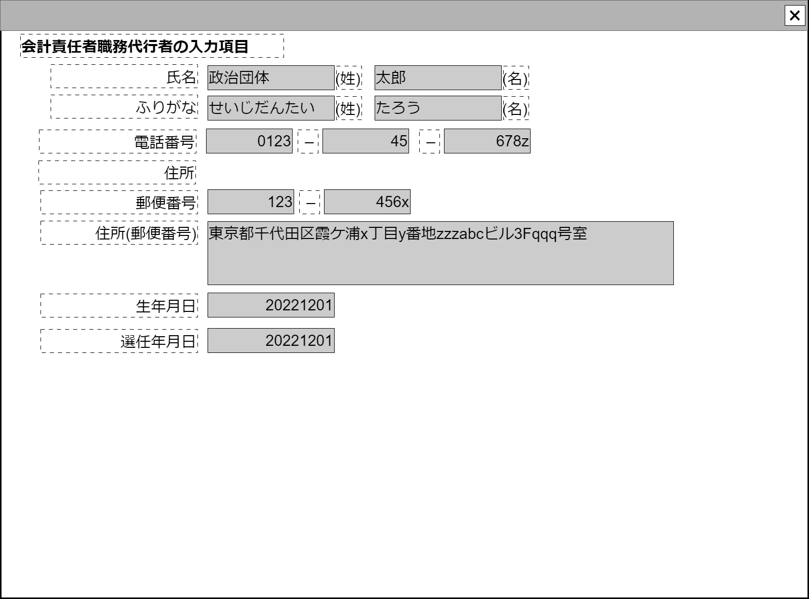

# 責任者編集【コンポーネント】

## 状態：微修正があれば適宜修正

## 1. 目的

会計責任者などの住所、生年月日など詳細な責任者情報を入力できること

## 2. 構成コンポーネント

なし

## 3.　画面イメージ

### 3.1 注釈なし

### 3.2 参照情報を含む

## 4.フィールド要素一覧

| 番号 |       論理名       |            タイプ            |          活性／表示          |                                            内容                                            |
| ---: | ------------------ | ---------------------------- | ---------------------------- | ------------------------------------------------------------------------------------------ |
|    1 | コンポーネント名称 | テキスト                     | 非活性                       | 親コンポーネントから渡された表示用の名称が表示されること                                   |
|    1 | 氏名－姓           | インプットテキスト           | 非活性／活性                 | 氏名の姓が表示されること                                                                   |
|    2 | 氏名－名           | インプットテキスト           | 非活性／活性                 | 氏名の名が表示されること                                                                   |
|    4 | 電話番号1          | インプットテキスト(半角数字) | 非活性／活性 表示／非表示 | 電話番号市外局番が表示されること                                                           |
|    5 | 電話番号2          | インプットテキスト(半角数字) | 非活性／活性 表示／非表示 | 電話番号の局番が表示されること                                                             |
|    6 | 電話番号3          | インプットテキスト(半角数字) | 非活性／活性 表示／非表示 | 電話番号の番号部分が表示されること                                                         |
|    2 | 郵便番号1          | インプットテキスト(半角数字) | 非活性／活性 表示／非表示 | 郵便番号前3ケタが表示されること  用途フラグが「政治資金収支報告書参照」の場合は非表示   |
|    3 | 郵便番号2          | インプットテキスト(半角数字) | 非活性／活性 表示／非表示 | 郵便番号後4桁が表示されること 用途フラグが「政治資金収支報告書参照」の場合は非表示      |
|    5 | 住所               | テキストエリア               | 非活性／活性 表示／非表示 | 住所が表示されること 用途フラグが「政治資金収支報告書参照」の場合は非表示               |
|    7 | 生年月日           | インプットカレンダー         | 非活性／活性 表示／非表示 | 政治団体組織の年月が表示されること 用途フラグが「政治資金収支報告書参照」の場合は非表示 |
|    7 | 選任年月日         | インプットカレンダー         | 非活性／活性 表示／非表示 | 政治団体組織の年月が表示されること 用途フラグが「政治資金収支報告書参照」の場合は非表示 |

## 5.アクション

- 渡された用途区分がシステム登録編集
  - 電話番号1が表示であること
  - 電話番号2が表示であること
  - 電話番号3が表示であること
  - 郵便番号1が表示であること
  - 郵便番号2が表示であること
  - 住所が表示であること
  - 生年月日が表示であること
  - 選任年月日表示であること

- 渡された用途区分が団体設立届
  - 電話番号1が表示であること
  - 電話番号2が表示であること
  - 電話番号3が表示であること
  - 郵便番号1が表示であること
  - 郵便番号2が表示であること
  - 住所が表示であること
  - 生年月日が表示であること
  - 選任年月日表示であること

- 渡された用途区分が政治資金収支報告書
  - 電話番号1が非表示であること
  - 電話番号2が非表示であること
  - 電話番号3が非表示であること
  - 郵便番号1が非表示であること
  - 郵便番号2が非表示であること
  - 住所が非表示であること
  - 生年月日が非表示であること
  - 選任年月日非表示であること

## 6.責任者編集インターフェース

収支報告書解析表示一覧するときに表示する満たすべき要素。

PersonManagerInterface

|         論理名         |         物理名         |    型     |                                 説明(例)                                 |
| ---------------------- | ---------------------- | --------- | ------------------------------------------------------------------------ |
| 用途区分               | perposeKbn             | Integer   | 用途によって表示が異なることを制御する変数                               |
| コンポーネント番号     | componentNo            | Integer   | 親画面で子画面を識別するための任意のコンポーネント番号。例示：「2」      |
| コンポーネント入力項目 | componentName          | String    | この画面の入力項目を表示。例示：「会計責任者(の情報を入力してください)」 |
| 氏名－姓               | managerNameLast        | String    | 例示：「政治団体」                                                       |
| 氏名－名               | managerNameFirst       | String    | 例示：「太郎」                                                           |
| 電話番号－市外局番     | managerTel1            | String    | 例示：「0123」                                                           |
| 電話番号－局番         | managerTel2            | String    | 例示：「45」                                                             |
| 電話番号－番号         | managerTel3            | String    | 例示：「9999」                                                           |
| 郵便番号1              | managerPostalcode1     | String    | 例示：「123」                                                            |
| 郵便番号2              | managerPostalcode2     | String    | 例示：「456」                                                            |
| 住所番地まで           | managerAddress         | String    | 例示：「東京都千代田区霞が関999番地」                                    |
| 住所建物               | managerAddressBuilding | String    | 例示：「マンション政治資金406棟301号室」                                 |
| 生年月日               | managerBirthDate       | LocalDate | 例示：「2022/12/01」                                                     |
| 選任年月日             | managerAppointDate     | LocalDate | 例示：「2022/12/01」                                                     |
| 入力受付可能有無       | canInput               | Boolean   | 入力を受け付ける場合は`true`(そのケースは現在ないと想定)                 |

## 6.1 用途区分

※**TODO** 変更があれば適宜修正する

|       論理名       | 値  |
| ------------------ | --- |
| システム登録編集   | 0   |
| 団体設立届         | 1   |
| 政治資金収支報告書 | 2   |

## 7. 連携

入力内容が変更された都度、入力チェックを行い変更内容を通知する`emit(sendPersonManagerInterface(data,errorInfo))`
