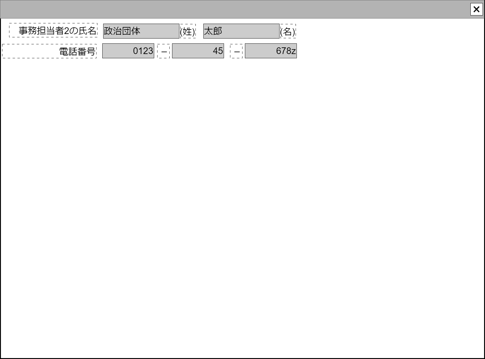

# 担当者(作業者)編集【コンポーネント】

## 状態：微修正があれば適宜修正

## 1. 目的

政治資金収支報告書で表示される事務担当者の電話番号と氏名を入力できること

## 2. 構成コンポーネント

なし

## 3. 画面イメージ

### 3.1 注釈なし

### 3.2 参照情報を含む

## 4.フィールド要素一覧

### 4.1 独自フィールド

| 番号 |       論理名       | 物理名 |       タイプ       | 活性／表示 |                            内容                            |
| ---: | ------------------ | ------ | ------------------ | ---------- | ---------------------------------------------------------- |
|    1 | コンポーネント名称 | 物理名 | テキスト           | 非活性     | 親コンポーネントから引き継いだ表示用の名称が表示されること |
|    1 | 氏名－姓           | 物理名 | テキスト           | 非活性     | 氏名の姓が入力されること                                   |
|    2 | 氏名－名           | 物理名 | テキスト           | 非活性     | 氏名の名が入力されること                                   |
|    4 | 電話番号1          | 物理名 | テキスト(半角数字) | 非活性     | 電話番号市外局番が入力されること                           |
|    5 | 電話番号2          | 物理名 | テキスト(半角数字) | 非活性     | 電話番号の局番が入力されること                             |
|    6 | 電話番号3          | 物理名 | テキスト(半角数字) | 非活性     | 電話番号の番号部分が入力されること                         |

## 5.アクション

なし

## 6.担当者インターフェース

PersonWorkerInterface

 |         論理名         |     物理名      |   型    |                           説明(例)                            |
 | ---------------------- | --------------- | ------- | ------------------------------------------------------------- |
 | コンポーネント番号     | componentNo     | Integer | 親画面で子画面を識別するためのコンポーネント番号。例示：「2」 |
 | コンポーネント入力項目 | componentName   | String  | この画面の入力項目を表示。例示：「事務担当者2」               |
 | 氏名－姓               | workerNameLast  | String  | 例示：「政治団体」                                            |
 | 氏名－名               | workerNameFirst | String  | 例示：「太郎」                                                |
 | 電話番号－市外局番     | workerTel1      | String  | 例示：「0123」                                                |
 | 電話番号－局番         | workerTel2      | String  | 例示：「45」                                                  |
 | 電話番号－番号         | workerTel3      | String  | 例示：「9999」                                                |
 | 入力受付可能有無       | canInput        | Boolean | 入力を受け付ける場合は`true`(そのケースは現在ないと想定)      |

## 7. 連携

親画面から`props{personWorkerDto:PersonWorkerInterface}`を受け取り、`computed`を設定することで変更状態を常に親画面に通知すること
