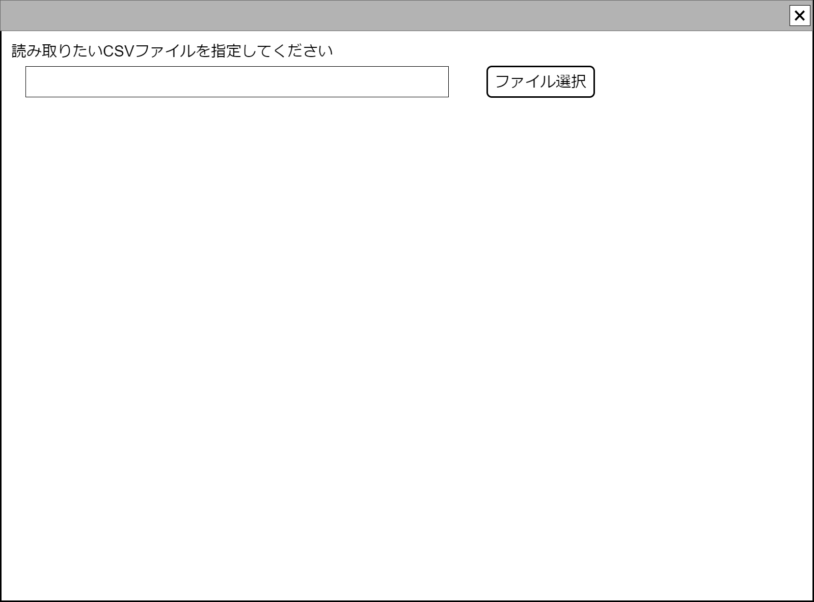

# 一般CSVファイルアップロードコンポーネント設計書

## 状態：一部仕様未確定だが実装可能

## 1. 目的

指定されたCsvをアップロードして、一般Csv形式で返却する

## 2. 構成コンポーネント

なし

## 3.画面イメージ

### 3.1 画面イメージ

### 3.2 画面イメージ(項番)

## 4. フィールド要素一覧

### 4.1 独自フィールド要素一覧

| 番号 |    論理名    |        タイプ        | 活性／表示 |                  内容                  |
| ---- | ------------ | -------------------- | ---------- | -------------------------------------- |
| 1    | ファイル指定 | インプット(ファイル) | 活性       | アップロードするファイルを指定すること |

※TODO ファイル名以外に必要な項目があれば表示する。読み取られたデータは即利用されるので、別途表示の必要はないと認識している

## 5. アクション要素一覧

| 番号 | 論理名 | タイプ | 活性／表示 |                                                 内容                                                 |
| ---- | ------ | ------ | ---------- | ---------------------------------------------------------------------------------------------------- |
| 1    | 送信   | ボタン | -          | 指定されたCSVファイルをContorllerに渡して保存、一般CSVデータクラスを受け取り、親画面に送信すること。 |

## 6. 一般CSVインターフェイス

CsvAllInterface

|    論理名     |   論理名   |              型              |    説明(例)    |
| ------------- | ---------- | ---------------------------- | -------------- |
| CSVデータ全体 | allCsvData | List<List<CsvCellInterface>> | 全データを表す |

※CsvAllInterfaceはわかりやすさという配慮からあえて設定している。機能だけならStringで十分代用可能

## 6.1 Csvセルデータインターフェイス

CsvCellInterface

|   論理名   | 論理名 |   型   |                                 説明(例)                                 |
| ---------- | ------ | ------ | ------------------------------------------------------------------------ |
| 格納データ | data   | String | Csvの1セルに格納されるデータ。空データはnullではなく`""空文字`であること |

## 7. 連携

送信ボタンを押下時、親画面にBack側で解析された一般CSVデータクラスを通知する`emit[sendGeneralCsvData(List<List<CsvCell>>,errorInfo)]`
