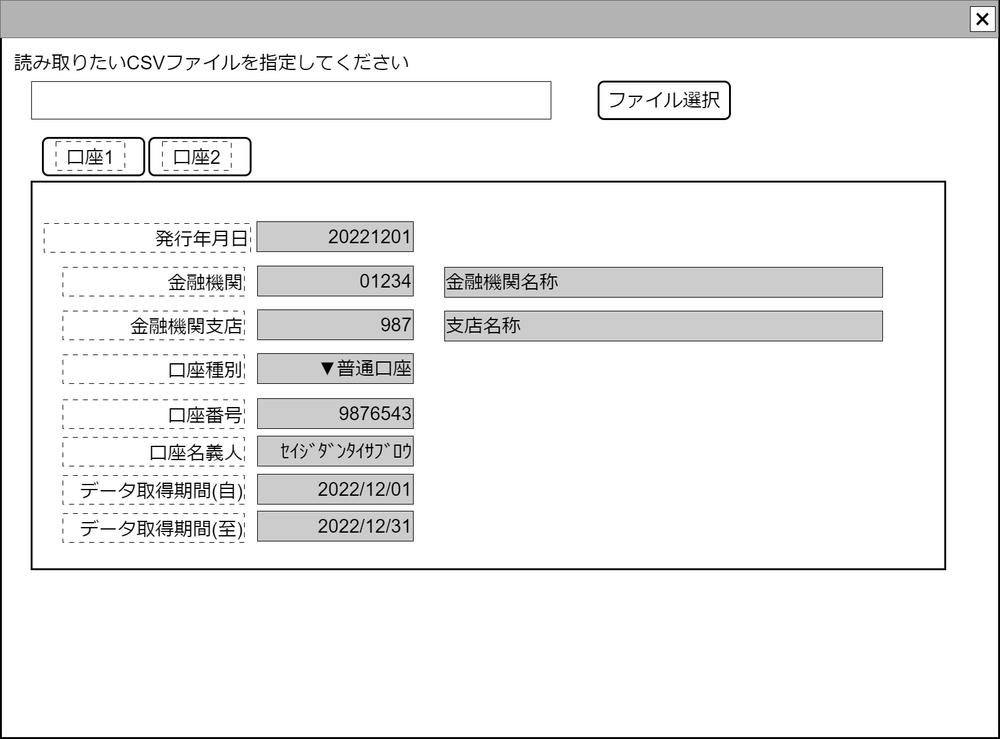

# 全銀フォーマット入出金明細CSVファイルアップロードコンポーネント設計書

## 状態：フィールド要素はほぼ確定しているので実装可能

## 1. 目的

指定された全銀フォーマット入出金明細Csvをアップロードして、同形式Dtoで返却する

## 2. 構成コンポーネント

なし

## 2.1 繰り返し項目

実際の数は少ないと思うが、仕様として複数口座情報を取得することができるため、対応をとる

## 3.画面イメージ

### 3.1 画面イメージ

### 3.2 画面イメージ(項番)

## 4. フィールド要素一覧

### 4.1 独自フィールド要素一覧

| 番号 |       論理名       |        タイプ        | 活性／表示 |                  内容                  |
| ---- | ------------------ | -------------------- | ---------- | -------------------------------------- |
| 1    | ファイル指定       | インプット(ファイル) | 活性       | アップロードするファイルを指定すること |
| 1    | 口座切り替えタブ   | ボタン               | 活性       | 表示する金融機関口座を切り替えること   |
| 1    | 集計日付           | インプットテキスト   | 非活性     | データを集計した日付を表示すること。   |
| 1    | 金融機関コード     | インプットテキスト   | 非活性     | 金融機関コードを表示すること。         |
| 1    | 金融機関名称       | インプットテキスト   | 非活性     | 金融機関名称を表示すること。           |
| 1    | 金融機関支店コード | インプットテキスト   | 非活性     | 金融機関コードを表示すること。         |
| 1    | 金融機関支店名称   | インプットテキスト   | 非活性     | 金融機関名称を表示すること。           |
| 1    | 口座種別区分       | セレクトボタン       | 非活性     | 口座種別を表示すること。               |
| 1    | 口座番号           | インプットテキスト   | 非活性     | 口座番号を表示すること。               |
| 1    | 口座名義人         | インプットテキスト   | 非活性     | 口座名義人を表示すること。             |
| 1    | 取得した期間(自)   | インプットカレンダー | 非活性     | データの集計期間開始日を表示すること。 |
| 1    | 取得した期間(至)   | インプットカレンダー | 非活性     | データの集計期間終了日を表示すること。 |

## 5. アクション要素一覧

| 番号 |      論理名      | タイプ | 活性／表示 |                                                 内容                                                 |
| ---- | ---------------- | ------ | ---------- | ---------------------------------------------------------------------------------------------------- |
| 1    | 送信             | ボタン | -          | 指定されたCSVファイルをContorllerに渡して保存、一般CSVデータクラスを受け取り、親画面に送信すること。 |
| 1    | 口座切り替えタブ | ボタン | -          | 渡されたデータデータを口座別に表示できるようにタブ切り替えする                                       |

## 6. 全銀フォーマット入出金明細配列

TODO インターフェイス名未決定

|      論理名       | 物理名 |           型            |       説明(例)        |
| ----------------- | ------ | ----------------------- | --------------------- |
| 口座別取引明細Dto | 物理名 | List<同口座取引明細Dto> | ある口座の取引明細Dto |

### 6.1 全銀フォーマット入出金明細ヘッダ(口座情報)インターフェイス

全銀フォーマット入出金明細ヘッダ`TradingZenginFormatTransactionDetailHeaderRecordDto`の部分拡張

TODO インターフェイス名未決定

 |      論理名      | 物理名 |      型      |                                            説明(例)                                            |
 | ---------------- | ------ | ------------ | ---------------------------------------------------------------------------------------------- |
 | 金融機関口座Id   | 物理名 | Long         | 例示：「111」                                                                                  |
 | 金融機関Id       | 物理名 | String／null | 例示：「0003」                                                                                 |
 | 金融機関名称     | 物理名 | String／null | 例示：「首都圏市民銀行」                                                                       |
 | 金融機関支店Id   | 物理名 | String／null | 例示：「014」                                                                                  |
 | 金融機関支店名称 | 物理名 | String／null | 例示：「番町皿屋敷支店」                                                                       |
 | 口座種別区分     | 物理名 | String／null | 例示：「1:普通預金」                                                                           |
 | 口座番号         | 物理名 | String／null | 例示：「003344」                                                                               |
 | 口座名義人       | 物理名 | String／null | 例示：「ｾｲｼﾞﾀﾞﾝﾀｲ ｻﾌﾞﾛｳ」                                                                      |
 | 口座情報編集有無 | 物理名 | boolean      | 口座編集ボタンが押された場合、読取り元情報から編集されているか確認して、編集されていれば`true` |
 | 取得勘定日(自)   | 物理名 | LocalDate    | 例示：「2022/03/03」                                                                           |
 | 取得勘定日(至)   | 物理名 | LocalDate    | 例示：「2022/05/05」                                                                           |

### 6.2 全銀フォーマット入出金明細データインターフェイス(普通口座タイプ)

TODO Back側の設計書またはインターフェイス詳細を記載

### 6.3 全銀フォーマット入出金明細データインターフェイス(積立貯金口座タイプ)

※積立金額、利率についての記述されている口座内で完結しているデータで、相手方の存在を前提とした金銭出入りの透明化という観点からあまり重要でないので省略。元Interfaceは[xxDTO](./#.md)を参照。

## 7. 連携

送信ボタンを押下時、親画面にBack側で解析された一般CSVデータクラスを通知する`emit[sendZenginFormatData(data,errorInfo)]`
