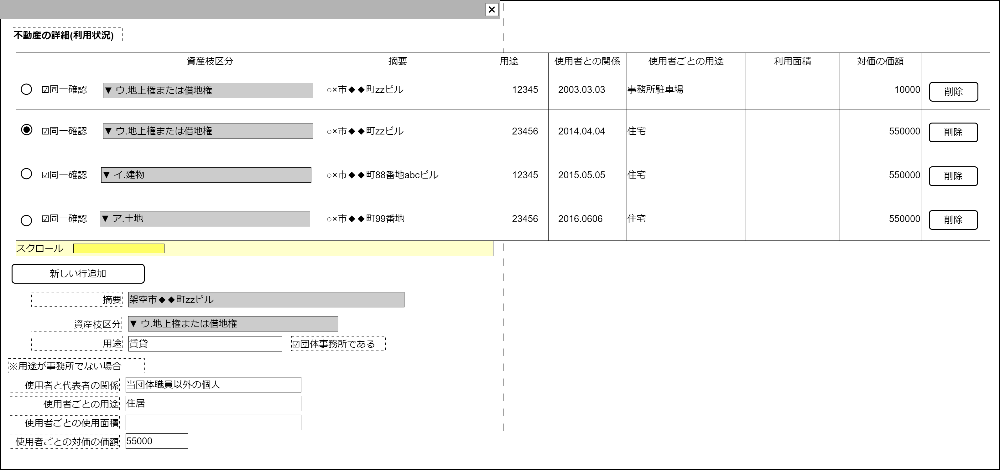

# 不動産詳細内訳編集【コンポーネント】設計書

## 状態：仕様未確定(実装不可)

## 1.目的

様式19不動産の使用状況など内訳詳細(利用状況)を編集する

## 2. 構成コンポーネント

1. 独自フィールド

### 2.1 繰り返し項目

なし

## 3. 画面イメージ

### 3.1 画面イメージ

### 3.2 画面イメージ(項番)

## 4. フィールド要素一覧

| 番号 |             論理名             |       タイプ       |  活性／表示  |                                              内容                                               |
| ---- | ------------------------------ | ------------------ | ------------ | ----------------------------------------------------------------------------------------------- |
| 1    | 不動産使用状況詳細表示テーブル | テーブル           | －           | 不動産詳細使用状況を表示すること。                                                              |
| 1    | 新規行追加ボタン               | ボタン             | 活性         | 不動産使用状況詳細表示テーブルに行を1行増やすこと                                               |
| 1    | 編集_摘要                      | インプットテキスト | 非活性       | 摘要(不動産の所在住所)を表示すること。様式18データに紐づいているので編集不可                    |
| 1    | 編集_資産枝区分                | セレクトボックス   | 非活性       | 不動産の区分(ア.土地、イ.建物、ウ.借地権)を表示すること。様式18データに紐づいているので編集不可 |
| 1    | 編集_用途                      | インプットテキスト | 活性／非活性 | 摘要(不動産の所在住所)を表示すること。様式18データに紐づいているので編集不可                    |
| 1    | 編集_団体事務所該当チェック    | チェックボックス   | 活性         | 不動産が団体の事務所であることの入力を受け付けること                                            |
| 1    | 「用途が事務所でない」エリア   | 領域(div)          | 表示／非表示 | 不動産詳細使用状況を表示すること。                                                              |

### 4.1 不動産使用状況詳細表示テーブル

| 番号 |           論理名           |     タイプ     | 活性／表示 |                               内容                               |
| ---- | -------------------------- | -------------- | ---------- | ---------------------------------------------------------------- |
| 1    | データ編集選択ラジオボタン | ラジオボタン   | 活性       | 下記アクションリスト参照                                         |
| 1    | 前年同一確認チェック       | チェックボタン | 活性       | 前年と同じデータを記載することを確認した入力を受け付けること     |
| 1    | 摘要                       | ラベル         | －         | 摘要(不動産の所在住所)を表示すること。                           |
| 1    | 用途                       | ラベル         | －         | 用途を示すこと。団体事務所だけは「事務所」と固定値で表現すること |
| 1    | 使用者との関係             | ラベル         | －         | 使用者の団体代表者との関係をを表示すること。                     |
| 1    | 使用者ごとの用途           | ラベル         | －         | 使用者ごとの不動産の用途を表示すること                           |
| 1    | 使用者ごとの利用面積       | ラベル         | －         | 使用者ごとの不動産の利用面積を表示すること。                     |
| 1    | 使用者ごとの対価の価額     | ラベル         | －         | 使用者ごとの不動産の1年間の利用対価を表示すること。              |
| 1    | 行削除ボタン               | ボタン         | 活性       | 下記アクションリスト参照                                         |

### 4.2 「用途が事務所でない」エリア

| 番号 |           論理名            |       タイプ       | 活性／表示 |                                                                       内容                                                                       |
| ---- | --------------------------- | ------------------ | ---------- | ------------------------------------------------------------------------------------------------------------------------------------------------ |
| 1    | 編集_使用者と代表者の関係   | インプットテキスト | 活性       | 団体(代表者)との関係性を示すこと。例示：「当該団体職員」、「当該団体と無関係の個人」」                                                           |
| 1    | 編集_使用者ごとの用途       | インプットテキスト | 活性       | 用途を示すこと。例示：「住居」、「事務所駐車場」                                                                                                 |
| 1    | 編集_使用者ごとの使用面積   | インプットテキスト | 活性       | 利用面積の入力を受け付けること。TODO 入力規則は詰めることが必要。専用の部屋、駐車スペースなどを賃借していないと面積を示すのは難しいと思われるが… |
| 1    | 編集_使用者ごとの対価の価額 | インプットテキスト | 活性       | 特に賃借の場合1年分の利用価額の入力を受け付けること。                                                                                            |

## 5.アクション一覧

| 番号 |           論理名            |      タイプ      | 活性／表示 |   内容   |
| ---- | --------------------------- | ---------------- | ---------- | -------- |
| 1    | 編集_団体事務所該当チェック | チェックボックス | 活性       | 下記参照 |

### 5.1 編集_団体事務所該当チェック

1. 団体事務所該当時`true`
  a. 編集_摘要を「事務所」と設定し、非活性とすること
  b. 「用途が事務所でない」エリア全体を非表示とすること

2. 団体事務所非該当時`false`
  a. 編集_摘要を活性とすること
  b. 「用途が事務所でない」エリア全体を表示とすること

## 6. 不動産詳細インターフェイス

BalancesheetRealEstateInterface

|         論理名         |           論理名           |   型   |                                                                     説明(例)                                                                     |     |
| ---------------------- | -------------------------- | ------ | ------------------------------------------------------------------------------------------------------------------------------------------------ | --- |
| 不動産Id               | balancesheetRealEstateId   | String | データを一意に識別するId                                                                                                                         |     |
| 不動産同一識別コード   | balancesheetRealEstateCode | String | 変更があっても同一データをまとめるコード                                                                                                                         |     |
| 摘要                   | itenName                   | String | 摘要(不動産の所在住所)を表示すること。様式18データに紐づいているので編集不可                                                                     |     |
| 資産枝区分             | yoshikiEdaKbn              | String | 不動産の区分(ア.土地、イ.建物、ウ.借地権)を表示すること。様式18データに紐づいているので編集不可                                                  |     |
| 用途                   | purposeAll                 | String | 摘要(不動産の所在住所)を表示すること。様式18データに紐づいているので編集不可                                                                     |     |
| 使用者と代表者の関係   | userRelation               | String | 団体(代表者)との関係性を示すこと。例示：「当該団体職員」、「当該団体と無関係の個人」」                                                           |     |
| 使用者ごとの用途       | userPerpose                | String | 用途を示すこと。例示：「住居」、「事務所駐車場」                                                                                                 |     |
| 使用者ごとの使用面積   | userArea                   | Double | 利用面積の入力を受け付けること。TODO 入力規則は詰めることが必要。専用の部屋、駐車スペースなどを賃借していないと面積を示すのは難しいと思われるが… |     |
| 使用者ごとの対価の価額 | userAmount                 | Long   | 特に賃借の場合1年分の利用価額の入力を受け付けること。                                                                                            |     |

## 7. 連携

親画面から`props{realEstateDto:BalancesheetRealEstateInterface}`を受け取り、`computed`を設定することで変更状態を常に親画面に通知すること
