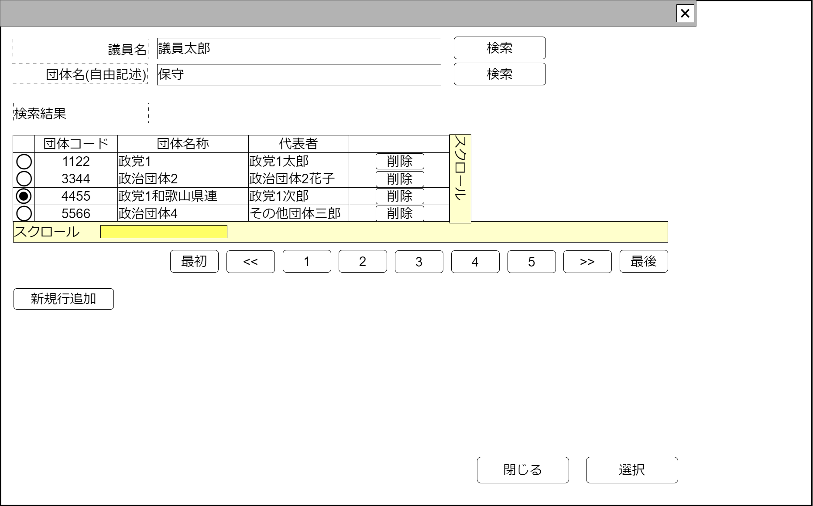

# 政治団体検索【コンポーネント】設計書

## 状態：仕様未確定(再利用可能なレベルまで実装可能)

※調査側と仕様が異なる(検索条件、結果表示項目)

## 1.目的

政治団体検索を検索し、選択された値を通知する
編集可能時には行追加、行削除を行えるようにする

## 2. 構成コンポーネント

1. 政治家表示コンポーネント
2. 独自フィールド

### 2.1 繰り返し項目

1. 独自フィールド

## 3. 画面イメージ

### 3.1 画面イメージ

### 3.2 画面イメージ(項番)

## 4. フィールド要素一覧

## 4. フィールド要素一覧

| 番号 |          論理名          |       タイプ       |      活性／表示      |                                         内容                                         |
| ---- | ------------------------ | ------------------ | -------------------- | ------------------------------------------------------------------------------------ |
| 1    | 検索条件代表者           | インプットテキスト | 活性                 | 議員名で政治団体の検索をする場合の検索条件の入力を受け付けること                     |
| 1    | 代表者による検索ボタン   | ボタン             | 活性                 | 議員名を検索条件として政治団体を検索した場合の結果の一覧を表示すること               |
| 1    | 検索条件団体名称         | インプットテキスト | 活性                 | 団体名称で政治団体の検索をする場合の検索条件の入力を受け付けること                   |
| 1    | 団体名による検索ボタン   | ボタン             | 活性                 | 団体名称を検索条件として政治団体を検索した場合の結果の一覧を表示すること             |
| 1    | 政治団体検索結果テーブル | テーブル           | 表示                 | 政治団体検索結果が表示されること                                                     |
| 1    | 検索ページングエリア     | エリア             | 表示                 | 政治団体検索結果のページング機能が提供されること                                     |
| 1    | 新規行追加               | ボタン             | 活性 表示／非表示 | 押下時：政治団体検索結果テーブルの最終に新しい行を追加し、その行を選択状態とすること |

### 4.1 政治資金収支報告書検索結果テーブル フィールド要素一覧

| 番号 |         論理名         |      タイプ      |      活性／表示      |                                                       内容                                                       |
| ---- | ---------------------- | ---------------- | -------------------- | ---------------------------------------------------------------------------------------------------------------- |
| 1    | 行選択ラジオボタン     | ラジオボタン     | 活性                 | 押下時：この行のデータが選択状態であることの入力を受け付けること 編集可能時には選択された値を即時送信すること |
| 1    | 政治団体同一識別コード | ラベル           | 表示                 | 変更にかかわらず政治団体が同一であることを識別するコードが表示されていること                                     |
| 1    | 政治団体名称           | ラベル           | 表示                 | 政治団体名称が表示されていること                                                                                 |
| 1    | 政治団体区分           | セレクトボックス | 非活性               | 政治団体区分が表示されていること                                                                                 |
| 1    | 代表者氏名             | ラベル           | 表示                 | 代表者氏名が表示されていること                                                                                   |
| 1    | 行削除                 | ボタン           | 活性 表示／非表示 | 押下時：押下された行を削除すること                                                                               |

### 5.X 編集許可フラグ

a. 編集許可フラグが`許可:true`のとき

- 新規行追加ボタンを表示すること
- 行削除ボタンを表示すること
- キャンセルボタンを非表示すること
- 選択ボタンを非表示すること

b. 編集許可フラグが`不許可:false`のとき

- 新規行追加ボタンを非表示にすること
- 行削除ボタンを非表示にすること
- キャンセルボタンを表示すること
- 選択ボタンを表示すること

## 6. 政治団体検索結果(最低限)インターフェイス

PoliticOrgnaizationLeastInterface

SelectOptionIntefaceを継承すること。*は継承している値

 |            論理名            |         論理名          |   型    |                         説明(例)                         |
 | ---------------------------- | ----------------------- | ------- | -------------------------------------------------------- |
 | 政治団体Id                   | politicOrgnaizationId   | Long    | 政治団体Id                                               |
 | 政治団体同一識別コード       | politicOrgnaizationCode | Long    | 変更にかかわらず政治団体が同一であることを識別するコード |
 | 政治団体名称                 | politicOrgnaizationName | String  | 政治団体名称                                             |
 | 政治団体区分                 | organizationDantaiKbn   | Integer | 政治団体区分                                             |
 | 代表者氏名                   | delegateName            | String  | 代表者氏名                                               |
 | セレクトボタンの値           | value                   | String  | *セレクトボタンの値。(政治団体Id)                        |
 | セレクトボタンの表示テキスト | text                    | String  | *セレクトボタンの表示テキスト(政治団体名称)              |

## 7. 連携

- キャンセルイベント送信を`emit(sendCancelSearchPoliticOrgnaization)`ですること
- 選択イベント送信を`emit(sendPoliticOrgnaizationLeastInterface,selectedDto)`ですること
- 親コンポーネントから編集許可フラグ`props{isEditavble:boolean}`を受け取り、編集できる場合と編集できない場合の状態が選択できること
