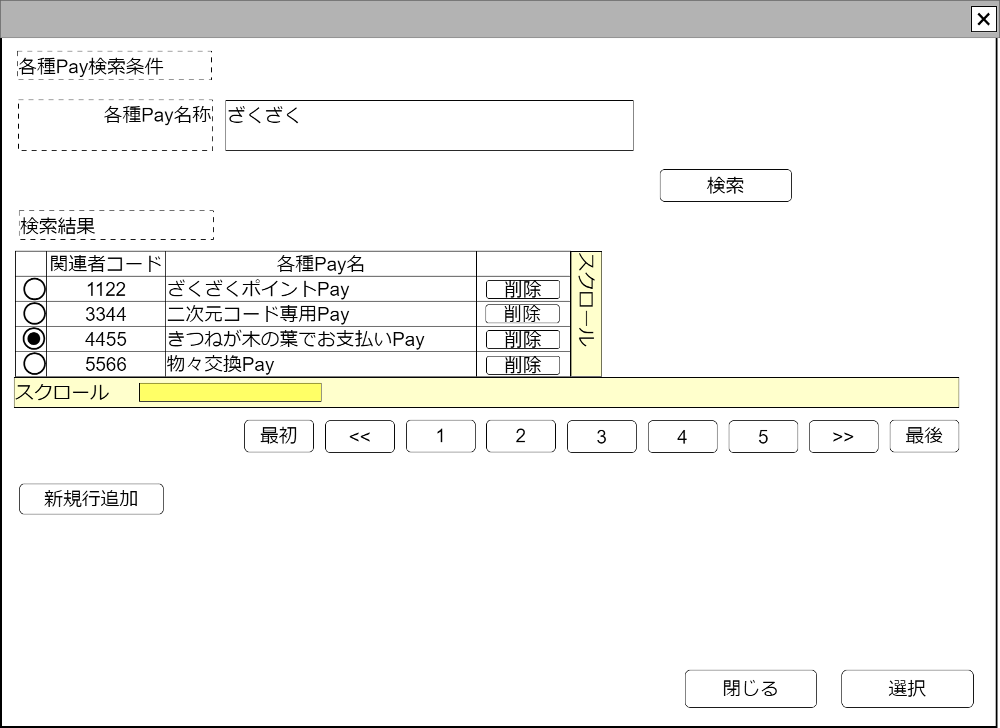

# 各種Pay検索コンポーネント【コンポーネント】設計書

## 状態：仕様未確定(実装不可)

## 1.目的

各種Payを検索して指定する

## 2. 構成コンポーネント

1. 独自フィールド

### 2.1 繰り返し項目

なし

## 3. 画面イメージ

### 3.1 画面イメージ

### 3.2 画面イメージ(項番)

## 4. フィールド要素一覧

| 番号 |       論理名        |       タイプ       | 活性／表示 |                     内容                      |
| ---- | ------------------- | ------------------ | ---------- | --------------------------------------------- |
| 1    | 各種Pay名称検索条件 | インプットテキスト | 活性       | 各種Payの検索条件の入力を受け付けること       |
| 1    | 検索条件実行ボタン  | ボタン             | 活性       | 押下時：検索処理を実行すること                |
| 1    | 各種Pay検索結果一覧 | テーブル           | 表示       | 各種Payを検索条件で検索した結果を表示すること |

### 4.1 各種Pay検索結果一覧テーブル

| 番号 |        論理名         |    タイプ    | 活性／表示 |                   内容                   |
| ---- | --------------------- | ------------ | ---------- | ---------------------------------------- |
| 1    | 行選択ラジオボタン    | ラジオボタン | 活性       | 押下時：押下された行が選択状態になること |
| 1    | 各種Pay同一識別コード | ラベル       | 表示       | 各種Pay同一識別コードを表示すること      |
| 1    | 各種Pay名称           | ラベル       | 表示       | 各種Pay名称を表示すること                |

## 5.アクション一覧

| 番号 |                     論理名                      |    タイプ    | 活性／表示 |                   内容                   |
| ---- | ----------------------------------------------- | ------------ | ---------- | ---------------------------------------- |
| 1    | 検索条件実行ボタン                              | ボタン       | 活性       | 押下時：検索処理を実行すること           |
| 1    | 行選択ラジオボタン(各種Pay検索結果一覧テーブル) | ラジオボタン | 活性       | 押下時：押下された行が選択状態になること |

## 6. サンプルテンプレートインターフェイス

VariousPayInterface

 |        論理名         |     論理名     |   型    |                             説明(例)                              |
 | --------------------- | -------------- | ------- | ----------------------------------------------------------------- |
 | 各種PayId             | variousPayId   | Long    | 各種Payを識別する一意のId                                         |
 | 各種Pay同一識別コード | variousPayCode | Integer | 変更にかかわらず、各種Payが同一であることを識別する同一識別コード |
 | 各種Pay名称           | variousPayCode | String  | 各種Pay名称                                                       |

## 7. 連携

行選択ボタンが押下された都度、親画面に変更内容を通知する`emit[sendVariousPayInterface(data)]`
