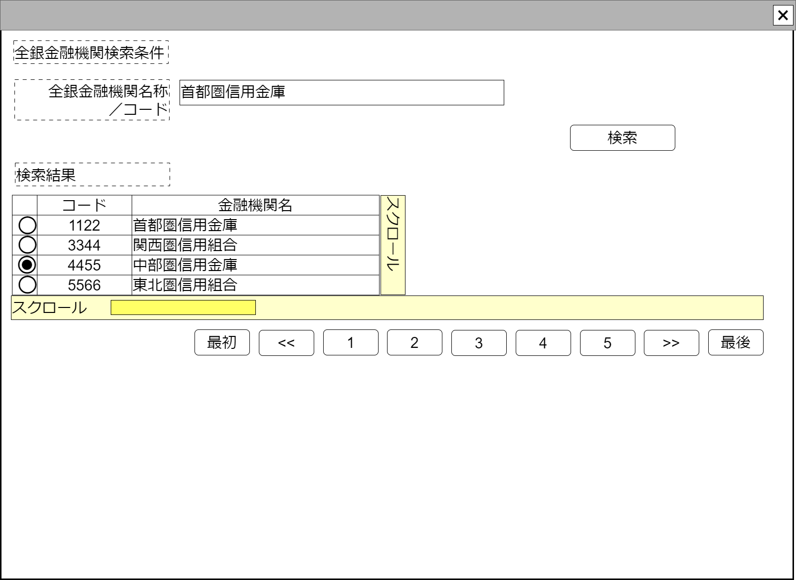

# 全銀金融機関のみ検索【コンポーネント】設計書

## 状態：残作業：ページング修正／機能追加時の修正／単体テスト

## 1.目的

全銀金融機関のみ(支店を含まなない)を検索し、必要に応じ指定する

## 2. 構成コンポーネント

1. 独自フィールド

### 2.1 繰り返し項目

なし

## 3. 画面イメージ

### 3.1 画面イメージ

### 3.2 画面イメージ(項番)

## 4. フィールド要素一覧

| 番号 |                 論理名                 |       タイプ       |      活性／表示      |                                           内容                                           |
| ---- | -------------------------------------- | ------------------ | -------------------- | ---------------------------------------------------------------------------------------- |
| 1    | 全銀金融機関名称／コード検索条件       | インプットテキスト | 活性                 | 全銀金融機関の検索条件の入力を受け付けること                                             |
| 1    | 検索条件実行ボタン                     | ボタン             | 活性                 | 押下時：検索処理を実行すること                                                           |
| 1    | 全銀金融機関・支店情報なし検索結果一覧 | テーブル           | 表示                 | 全銀金融機関支店情報なしを検索した結果を一覧で表示すること                               |
| 1    | 検索ページングエリア                   | エリア             | 表示                 | 全銀金融機関検索結果のページング機能が提供されること                                     |
| 1    | 新規行追加                             | ボタン             | 活性 表示／非表示 | 押下時：全銀金融機関検索結果テーブルの最終に新しい行を追加し、その行を選択状態とすること |

### 4.1 全銀金融機関支店情報なし検索結果一覧

| 番号 |       論理名       |    タイプ    |      活性／表示      |                   内容                   |
| ---- | ------------------ | ------------ | -------------------- | ---------------------------------------- |
| 1    | 行選択ラジオボタン | ラジオボタン | 活性                 | 押下時：押下された行が選択状態になること |
| 1    | 全銀金融機関コード | ラベル       | 表示                 | 全銀金融機関同一識別コードを表示すること |
| 1    | 全銀金融機関名称   | ラベル       | 表示                 | 全銀金融機関名称を表示すること           |
| 1    | 行削除             | ボタン       | 活性 表示／非表示 | 押下時：押下された行を削除すること       |

## 5.アクション一覧

| 番号 |                          論理名                          |    タイプ    |      活性／表示      |                                           内容                                           |
| ---- | -------------------------------------------------------- | ------------ | -------------------- | ---------------------------------------------------------------------------------------- |
| 1    | キャンセルボタン                                         | ボタン       | 活性                 | 押下時：コンポーネントが閉じられること                                                   |
| 1    | 選択ボタン                                               | ボタン       | 活性                 | 押下時：選択内容が親画面に通知されたのちコンポーネントが閉じられること                   |
| 1    | 検索条件実行ボタン                                       | ボタン       | 活性                 | 押下時：検索処理を実行すること                                                           |
| 1    | 行選択ラジオボタン(全銀金融機関支店情報なし検索結果一覧) | ラジオボタン | 活性                 | 押下時：押下された行が選択状態になること                                                 |
| 1    | 行削除                                                   | ボタン       | 活性 表示／非表示 | 押下時：押下された行を削除すること                                                       |
| 1    | 新規行追加                                               | ボタン       | 活性 表示／非表示 | 押下時：全銀金融機関検索結果テーブルの最終に新しい行を追加し、その行を選択状態とすること |

## 6. 全銀金融機関インターフェイス

ZenginFinacialOrgInterface

 |        論理名        |           論理名            |   型   |        説明(例)        |
 | -------------------- | --------------------------- | ------ | ---------------------- |
 | 全銀金融機関Code     | zenginFinacialOrgCode       | String | 全銀金融機関コード     |
 | 全銀金融機関名称     | zenginFinacialOrgName       | String | 全銀金融機関名称       |
 | 全銀金融機関支店Code | zenginFinacialOrgBranchCode | String | 全銀金融機関支店コード |
 | 全銀金融機関支店名称 | zenginFinacialOrgBranchName | String | 全銀金融機関支店名称   |

## 7. 連携

- キャンセルイベント送信を`emit(sendCancelZenginFinacialOrg)`ですること
- 選択イベント送信を`emit(sendVariousZenginFinacialOrgInterface,selectedDto)`ですること
- 親コンポーネントから編集許可フラグ`props{isEditavble:boolean}`を受け取り、編集できる場合と編集できない場合の状態が選択できること
