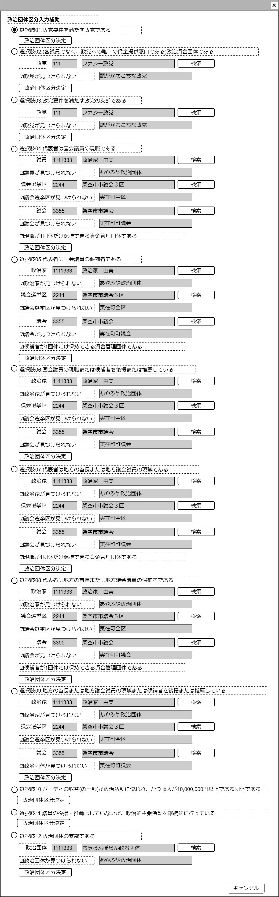

# 政治団体区分関係一括処理【コンポーネント】設計書

## 状態：ほぼ実装完了

## 1.目的

政治団体設立届を作成するときに、政治団体区分に関連した記述のサポートを行う

## 2. 構成コンポーネント

1. 独自フィールド
2. [政党検索](./#)コンポート
3. [議員検索](./#)コンポート
4. [議会選挙区検索](./#)コンポート
5. [議会検索](./#)コンポート
6. [政治家検索](./#)コンポート
7. [政治団体検索](../search_politic_orgnization/search_politic_orgnization.md)コンポート

### 2.1 繰り返し項目

政党検索、議員検索、議会選挙区、議会検索、政治家検索、政治団体検索は複数回使用し、選択肢で指定された変数に設定される必要がある

## 3. 画面イメージ

### 3.1 画面イメージ

### 3.2 画面イメージ(項番)

## 4. フィールド要素一覧

| 番号 |         論理名         |    タイプ    |  活性／表示  |                                  内容                                  |
| ---- | ---------------------- | ------------ | ------------ | ---------------------------------------------------------------------- |
| 1    | 選択肢 01 ラジオボタン | ラジオボタン | 活性         | 選択肢 01.政党要件を満たす政党である、に該当している入力を受け付けること |
| 1    | 選択肢 01 入力エリア   | 領域         | 表示／非表示 | 選択肢 01.が`on`の場合表示されること。`off`の場合は非表示              |
| 1    | 選択肢 02 ラジオボタン | ラジオボタン | 活性         | 選択肢 02.(各議員でなく、政党への唯一の資金提供窓口である)政治資金団体である、に該当している入力を受け付けること |
| 1    | 選択肢 02 入力エリア   | 領域         | 表示／非表示 | 選択肢 02.が`on`の場合表示されること。`off`の場合は非表示              |
| 1    | 選択肢 03 ラジオボタン | ラジオボタン | 活性         | 選択肢 03.政党要件を満たす政党の支部である、に該当している入力を受け付けること |
| 1    | 選択肢 03 入力エリア   | 領域         | 表示／非表示 | 選択肢 03.が`on`の場合表示されること。`off`の場合は非表示              |
| 1    | 選択肢 04 ラジオボタン | ラジオボタン | 活性         | 選択肢 04.代表者は国会議員の現職である、に該当している入力を受け付けること |
| 1    | 選択肢 04 入力エリア   | 領域         | 表示／非表示 | 選択肢 04.が`on`の場合表示されること。`off`の場合は非表示              |
| 1    | 選択肢 05 ラジオボタン | ラジオボタン | 活性         | 選択肢 05.代表者は国会議員の候補者である、に該当している入力を受け付けること |
| 1    | 選択肢 05 入力エリア   | 領域         | 表示／非表示 | 選択肢 05.が`on`の場合表示されること。`off`の場合は非表示              |
| 1    | 選択肢 06 ラジオボタン | ラジオボタン | 活性         | 選択肢 06.国会議員の現職または候補者を後援または推薦している、に該当している入力を受け付けること |
| 1    | 選択肢 06 入力エリア   | 領域         | 表示／非表示 | 選択肢 06.が`on`の場合表示されること。`off`の場合は非表示              |
| 1    | 選択肢 07 ラジオボタン | ラジオボタン | 活性         | 選択肢 07.代表者は地方の首長または地方議会議員の現職である、に該当している入力を受け付けること |
| 1    | 選択肢 07 入力エリア   | 領域         | 表示／非表示 | 選択肢 07.が`on`の場合表示されること。`off`の場合は非表示              |
| 1    | 選択肢 08 ラジオボタン | ラジオボタン | 活性         | 選択肢 08.代表者は地方の首長または地方議会議員の候補者である、に該当している入力を受け付けること |
| 1    | 選択肢 08 入力エリア   | 領域         | 表示／非表示 | 選択肢 08.が`on`の場合表示されること。`off`の場合は非表示              |
| 1    | 選択肢 09 ラジオボタン | ラジオボタン | 活性         | 選択肢 09.地方の首長または地方議会議員の現職または候補者を後援または推薦している、に該当している入力を受け付けること |
| 1    | 選択肢 09 入力エリア   | 領域         | 表示／非表示 | 選択肢 09.が`on`の場合表示されること。`off`の場合は非表示              |
| 1    | 選択肢 10 ラジオボタン | ラジオボタン | 活性         | 選択肢 10.パーティの収益(の一部)が政治活動に使われ、かつ収入が10,000,000円以上である団体である、に該当している入力を受け付けること |
| 1    | 選択肢 10 入力エリア   | 領域         | 表示／非表示 | 選択肢 10.が`on`の場合表示されること。`off`の場合は非表示              |
| 1    | 選択肢 11 ラジオボタン | ラジオボタン | 活性         | 選択肢 11.議員の後援・推薦はしていないが、政治的主張活動を継続的に行っている、に該当している入力を受け付けること |
| 1    | 選択肢 11 入力エリア   | 領域         | 表示／非表示 | 選択肢 11.が`on`の場合表示されること。`off`の場合は非表示              |
| 1    | 選択肢 12 ラジオボタン | ラジオボタン | 活性         | 選択肢 12.政治団体の支部である、に該当している入力を受け付けること |
| 1    | 選択肢 12 入力エリア   | 領域         | 表示／非表示 | 選択肢 12.が`on`の場合表示されること。`off`の場合は非表示              |

### 4.01 選択肢01入力エリア

| 番号 |      論理名      | タイプ | 活性／表示 |                                 内容                                 |
| ---- | ---------------- | ------ | ---------- | -------------------------------------------------------------------- |
| 1    | 政治団体区分決定 | ボタン | 活性       | 押下時：選択肢 01.を選択すると同時に、付随情報を親画面に通知すること |

### 4.02 選択肢02入力エリア

| 番号 |       論理名       |       タイプ       |  活性／表示  |                                         内容                                          |
| ---- | ------------------ | ------------------ | ------------ | ------------------------------------------------------------------------------------- |
| 1    | 政党同一識別コード | インプットテキスト | 非活性       | 政党同一識別コードを表示すること                                                      |
| 1    | 政党名称           | ボタン             | 非活性       | 政党名称を表示すること                                                                |
| 1    | 政党検索           | ボタン             | 活性         | 押下時：政党検索コンポーネントを表示すること                                          |
| 1    | 政党自由記述利用   | チェックボックス   | 活性         | `true`時、政党自由記述欄を活性とすること。`false`時、政党自由記述欄を非活性とすること |
| 1    | 政党自由記述       | インプットテキスト | 活性／非活性 | 政党名の自由記述入力を受け付けること                                                  |
| 1    | 政治団体区分決定   | ボタン             | 活性         | 押下時：選択肢 02.を選択すると同時に、付随情報を親画面に通知すること                  |

### 4.03 選択肢03入力エリア

| 番号 |       論理名       |       タイプ       |  活性／表示  |                                         内容                                          |
| ---- | ------------------ | ------------------ | ------------ | ------------------------------------------------------------------------------------- |
| 1    | 政党同一識別コード | インプットテキスト | 非活性       | 政党同一識別コードを表示すること                                                      |
| 1    | 政党名称           | ボタン             | 非活性       | 政党名称を表示すること                                                                |
| 1    | 政党検索           | ボタン             | 活性         | 押下時：政党検索コンポーネントを表示すること                                          |
| 1    | 政党自由記述利用   | チェックボックス   | 活性         | `true`時、政党自由記述欄を活性とすること。`false`時、政党自由記述欄を非活性とすること |
| 1    | 政党自由記述       | インプットテキスト | 活性／非活性 | 政党名の自由記述入力を受け付けること                                                  |
| 1    | 政治団体区分決定   | ボタン             | 活性         | 押下時：選択肢 03.を選択すると同時に、付随情報を親画面に通知すること                  |

### 4.04 選択肢04入力エリア

| 番号 |          論理名          |       タイプ       |  活性／表示  |                                               内容                                                |
| ---- | ------------------------ | ------------------ | ------------ | ------------------------------------------------------------------------------------------------- |
| 1    | 議員同一識別コード       | インプットテキスト | 非活性       | 議員同一識別コードを表示すること                                                                  |
| 1    | 議員名称                 | ボタン             | 非活性       | 議員名称を表示すること                                                                            |
| 1    | 議員検索                 | ボタン             | 活性         | 押下時：議員検索コンポーネントを表示すること                                                      |
| 1    | 議員自由記述利用         | チェックボックス   | 活性         | `true`時、議員自由記述欄を活性とすること。`false`時、議員自由記述欄を非活性とすること             |
| 1    | 議員自由記述             | インプットテキスト | 活性／非活性 | 議員名の自由記述入力を受け付けること                                                              |
| 1    | 議会選挙区同一識別コード | インプットテキスト | 非活性       | 議会選挙区同一識別コードを表示すること                                                            |
| 1    | 議会選挙区名称           | ボタン             | 非活性       | 議会選挙区名称を表示すること                                                                      |
| 1    | 議会選挙区検索           | ボタン             | 活性         | 押下時：議会選挙区検索コンポーネントを表示すること                                                |
| 1    | 議会選挙区自由記述利用   | チェックボックス   | 活性         | `true`時、議会選挙区自由記述欄を活性とすること。`false`時、議会選挙区自由記述欄を非活性とすること |
| 1    | 議会選挙区自由記述       | インプットテキスト | 活性／非活性 | 議会選挙区名の自由記述入力を受け付けること                                                        |
| 1    | 議会同一識別コード       | インプットテキスト | 非活性       | 議会同一識別コードを表示すること                                                                  |
| 1    | 議会名称                 | ボタン             | 非活性       | 議会名称を表示すること                                                                            |
| 1    | 議会検索                 | ボタン             | 活性         | 押下時：議会検索コンポーネントを表示すること                                                      |
| 1    | 議会自由記述利用         | チェックボックス   | 活性         | `true`時、議会自由記述欄を活性とすること。`false`時、議会自由記述欄を非活性とすること             |
| 1    | 議会自由記述             | インプットテキスト | 活性／非活性 | 議会名の自由記述入力を受け付けること                                                              |
| 1    | 資金管理団体該否         | チェックボックス   | 活性         | 資金管理団体であるかどうかの該否入力を受け付けること                                              |
| 1    | 政治団体区分決定         | ボタン             | 活性         | 押下時：選択肢 04.を選択すると同時に、付随情報を親画面に通知すること                              |

### 4.05 選択肢05入力エリア

| 番号 |          論理名          |       タイプ       |  活性／表示  |                                               内容                                                |
| ---- | ------------------------ | ------------------ | ------------ | ------------------------------------------------------------------------------------------------- |
| 1    | 政治家同一識別コード     | インプットテキスト | 非活性       | 政治家同一識別コードを表示すること                                                                |
| 1    | 政治家名称               | ボタン             | 非活性       | 政治家名称を表示すること                                                                          |
| 1    | 政治家検索               | ボタン             | 活性         | 押下時：政治家検索コンポーネントを表示すること                                                    |
| 1    | 政治家自由記述利用       | チェックボックス   | 活性         | `true`時、政治家自由記述欄を活性とすること。`false`時、政治家自由記述欄を非活性とすること         |
| 1    | 政治家自由記述           | インプットテキスト | 活性／非活性 | 政治家名の自由記述入力を受け付けること                                                            |
| 1    | 議会選挙区同一識別コード | インプットテキスト | 非活性       | 議会選挙区同一識別コードを表示すること                                                            |
| 1    | 議会選挙区名称           | ボタン             | 非活性       | 議会選挙区名称を表示すること                                                                      |
| 1    | 議会選挙区検索           | ボタン             | 活性         | 押下時：議会選挙区検索コンポーネントを表示すること                                                |
| 1    | 議会選挙区自由記述利用   | チェックボックス   | 活性         | `true`時、議会選挙区自由記述欄を活性とすること。`false`時、議会選挙区自由記述欄を非活性とすること |
| 1    | 議会選挙区自由記述       | インプットテキスト | 活性／非活性 | 議会選挙区名の自由記述入力を受け付けること                                                        |
| 1    | 議会同一識別コード       | インプットテキスト | 非活性       | 議会同一識別コードを表示すること                                                                  |
| 1    | 議会名称                 | ボタン             | 非活性       | 議会名称を表示すること                                                                            |
| 1    | 議会検索                 | ボタン             | 活性         | 押下時：議会検索コンポーネントを表示すること                                                      |
| 1    | 議会自由記述利用         | チェックボックス   | 活性         | `true`時、議会自由記述欄を活性とすること。`false`時、議会自由記述欄を非活性とすること             |
| 1    | 議会自由記述             | インプットテキスト | 活性／非活性 | 議会名の自由記述入力を受け付けること                                                              |
| 1    | 資金管理団体該否         | チェックボックス   | 活性         | 資金管理団体であるかどうかの該否入力を受け付けること                                              |
| 1    | 政治団体区分決定         | ボタン             | 活性         | 押下時：選択肢 05.を選択すると同時に、付随情報を親画面に通知すること                              |

### 4.06 選択肢06入力エリア

| 番号 |          論理名          |       タイプ       |  活性／表示  |                                               内容                                                |
| ---- | ------------------------ | ------------------ | ------------ | ------------------------------------------------------------------------------------------------- |
| 1    | 政治家同一識別コード     | インプットテキスト | 非活性       | 政治家同一識別コードを表示すること                                                                |
| 1    | 政治家名称               | ボタン             | 非活性       | 政治家名称を表示すること                                                                          |
| 1    | 政治家検索               | ボタン             | 活性         | 押下時：政治家検索コンポーネントを表示すること                                                    |
| 1    | 政治家自由記述利用       | チェックボックス   | 活性         | `true`時、政治家自由記述欄を活性とすること。`false`時、政治家自由記述欄を非活性とすること         |
| 1    | 政治家自由記述           | インプットテキスト | 活性／非活性 | 政治家名の自由記述入力を受け付けること                                                            |
| 1    | 議会選挙区同一識別コード | インプットテキスト | 非活性       | 議会選挙区同一識別コードを表示すること                                                            |
| 1    | 議会選挙区名称           | ボタン             | 非活性       | 議会選挙区名称を表示すること                                                                      |
| 1    | 議会選挙区検索           | ボタン             | 活性         | 押下時：議会選挙区検索コンポーネントを表示すること                                                |
| 1    | 議会選挙区自由記述利用   | チェックボックス   | 活性         | `true`時、議会選挙区自由記述欄を活性とすること。`false`時、議会選挙区自由記述欄を非活性とすること |
| 1    | 議会選挙区自由記述       | インプットテキスト | 活性／非活性 | 議会選挙区名の自由記述入力を受け付けること                                                        |
| 1    | 議会同一識別コード       | インプットテキスト | 非活性       | 議会同一識別コードを表示すること                                                                  |
| 1    | 議会名称                 | ボタン             | 非活性       | 議会名称を表示すること                                                                            |
| 1    | 議会検索                 | ボタン             | 活性         | 押下時：議会検索コンポーネントを表示すること                                                      |
| 1    | 議会自由記述利用         | チェックボックス   | 活性         | `true`時、議会自由記述欄を活性とすること。`false`時、議会自由記述欄を非活性とすること             |
| 1    | 議会自由記述             | インプットテキスト | 活性／非活性 | 議会名の自由記述入力を受け付けること                                                              |
| 1    | 政治団体区分決定         | ボタン             | 活性         | 押下時：選択肢 06.を選択すると同時に、付随情報を親画面に通知すること                              |

### 4.07 選択肢07入力エリア

| 番号 |          論理名          |       タイプ       |  活性／表示  |                                               内容                                                |
| ---- | ------------------------ | ------------------ | ------------ | ------------------------------------------------------------------------------------------------- |
| 1    | 議員同一識別コード       | インプットテキスト | 非活性       | 議員同一識別コードを表示すること                                                                  |
| 1    | 議員名称                 | ボタン             | 非活性       | 議員名称を表示すること                                                                            |
| 1    | 議員検索                 | ボタン             | 活性         | 押下時：議員検索コンポーネントを表示すること                                                      |
| 1    | 議員自由記述利用         | チェックボックス   | 活性         | `true`時、議員自由記述欄を活性とすること。`false`時、議員自由記述欄を非活性とすること             |
| 1    | 議員自由記述             | インプットテキスト | 活性／非活性 | 議員名の自由記述入力を受け付けること                                                              |
| 1    | 議会選挙区同一識別コード | インプットテキスト | 非活性       | 議会選挙区同一識別コードを表示すること                                                            |
| 1    | 議会選挙区名称           | ボタン             | 非活性       | 議会選挙区名称を表示すること                                                                      |
| 1    | 議会選挙区検索           | ボタン             | 活性         | 押下時：議会選挙区検索コンポーネントを表示すること                                                |
| 1    | 議会選挙区自由記述利用   | チェックボックス   | 活性         | `true`時、議会選挙区自由記述欄を活性とすること。`false`時、議会選挙区自由記述欄を非活性とすること |
| 1    | 議会選挙区自由記述       | インプットテキスト | 活性／非活性 | 議会選挙区名の自由記述入力を受け付けること                                                        |
| 1    | 議会同一識別コード       | インプットテキスト | 非活性       | 議会同一識別コードを表示すること                                                                  |
| 1    | 議会名称                 | ボタン             | 非活性       | 議会名称を表示すること                                                                            |
| 1    | 議会検索                 | ボタン             | 活性         | 押下時：議会検索コンポーネントを表示すること                                                      |
| 1    | 議会自由記述利用         | チェックボックス   | 活性         | `true`時、議会自由記述欄を活性とすること。`false`時、議会自由記述欄を非活性とすること             |
| 1    | 議会自由記述             | インプットテキスト | 活性／非活性 | 議会名の自由記述入力を受け付けること                                                              |
| 1    | 資金管理団体該否         | チェックボックス   | 活性         | 資金管理団体であるかどうかの該否入力を受け付けること                                              |
| 1    | 政治団体区分決定         | ボタン             | 活性         | 押下時：選択肢 07.を選択すると同時に、付随情報を親画面に通知すること                              |

### 4.08 選択肢08入力エリア

| 番号 |          論理名          |       タイプ       |  活性／表示  |                                               内容                                                |
| ---- | ------------------------ | ------------------ | ------------ | ------------------------------------------------------------------------------------------------- |
| 1    | 政治家同一識別コード     | インプットテキスト | 非活性       | 政治家同一識別コードを表示すること                                                                |
| 1    | 政治家名称               | ボタン             | 非活性       | 政治家名称を表示すること                                                                          |
| 1    | 政治家検索               | ボタン             | 活性         | 押下時：政治家検索コンポーネントを表示すること                                                    |
| 1    | 政治家自由記述利用       | チェックボックス   | 活性         | `true`時、政治家自由記述欄を活性とすること。`false`時、政治家自由記述欄を非活性とすること         |
| 1    | 政治家自由記述           | インプットテキスト | 活性／非活性 | 政治家名の自由記述入力を受け付けること                                                            |
| 1    | 議会選挙区同一識別コード | インプットテキスト | 非活性       | 議会選挙区同一識別コードを表示すること                                                            |
| 1    | 議会選挙区名称           | ボタン             | 非活性       | 議会選挙区名称を表示すること                                                                      |
| 1    | 議会選挙区検索           | ボタン             | 活性         | 押下時：議会選挙区検索コンポーネントを表示すること                                                |
| 1    | 議会選挙区自由記述利用   | チェックボックス   | 活性         | `true`時、議会選挙区自由記述欄を活性とすること。`false`時、議会選挙区自由記述欄を非活性とすること |
| 1    | 議会選挙区自由記述       | インプットテキスト | 活性／非活性 | 議会選挙区名の自由記述入力を受け付けること                                                        |
| 1    | 議会同一識別コード       | インプットテキスト | 非活性       | 議会同一識別コードを表示すること                                                                  |
| 1    | 議会名称                 | ボタン             | 非活性       | 議会名称を表示すること                                                                            |
| 1    | 議会検索                 | ボタン             | 活性         | 押下時：議会検索コンポーネントを表示すること                                                      |
| 1    | 議会自由記述利用         | チェックボックス   | 活性         | `true`時、議会自由記述欄を活性とすること。`false`時、議会自由記述欄を非活性とすること             |
| 1    | 議会自由記述             | インプットテキスト | 活性／非活性 | 議会名の自由記述入力を受け付けること                                                              |
| 1    | 資金管理団体該否         | チェックボックス   | 活性         | 資金管理団体であるかどうかの該否入力を受け付けること                                              |
| 1    | 政治団体区分決定         | ボタン             | 活性         | 押下時：選択肢 08.を選択すると同時に、付随情報を親画面に通知すること                              |

### 4.09 選択肢09入力エリア

| 番号 |          論理名          |       タイプ       |  活性／表示  |                                               内容                                                |
| ---- | ------------------------ | ------------------ | ------------ | ------------------------------------------------------------------------------------------------- |
| 1    | 政治家同一識別コード     | インプットテキスト | 非活性       | 政治家同一識別コードを表示すること                                                                |
| 1    | 政治家名称               | ボタン             | 非活性       | 政治家名称を表示すること                                                                          |
| 1    | 政治家検索               | ボタン             | 活性         | 押下時：政治家検索コンポーネントを表示すること                                                    |
| 1    | 政治家自由記述利用       | チェックボックス   | 活性         | `true`時、政治家自由記述欄を活性とすること。`false`時、政治家自由記述欄を非活性とすること         |
| 1    | 政治家自由記述           | インプットテキスト | 活性／非活性 | 政治家名の自由記述入力を受け付けること                                                            |
| 1    | 議会選挙区同一識別コード | インプットテキスト | 非活性       | 議会選挙区同一識別コードを表示すること                                                            |
| 1    | 議会選挙区名称           | ボタン             | 非活性       | 議会選挙区名称を表示すること                                                                      |
| 1    | 議会選挙区検索           | ボタン             | 活性         | 押下時：議会選挙区検索コンポーネントを表示すること                                                |
| 1    | 議会選挙区自由記述利用   | チェックボックス   | 活性         | `true`時、議会選挙区自由記述欄を活性とすること。`false`時、議会選挙区自由記述欄を非活性とすること |
| 1    | 議会選挙区自由記述       | インプットテキスト | 活性／非活性 | 議会選挙区名の自由記述入力を受け付けること                                                        |
| 1    | 議会同一識別コード       | インプットテキスト | 非活性       | 議会同一識別コードを表示すること                                                                  |
| 1    | 議会名称                 | ボタン             | 非活性       | 議会名称を表示すること                                                                            |
| 1    | 議会検索                 | ボタン             | 活性         | 押下時：議会検索コンポーネントを表示すること                                                      |
| 1    | 議会自由記述利用         | チェックボックス   | 活性         | `true`時、議会自由記述欄を活性とすること。`false`時、議会自由記述欄を非活性とすること             |
| 1    | 議会自由記述             | インプットテキスト | 活性／非活性 | 議会名の自由記述入力を受け付けること                                                              |
| 1    | 政治団体区分決定         | ボタン             | 活性         | 押下時：選択肢 09.を選択すると同時に、付随情報を親画面に通知すること                              |

### 4.10 選択肢10入力エリア

| 番号 |      論理名      | タイプ | 活性／表示 |                                 内容                                 |
| ---- | ---------------- | ------ | ---------- | -------------------------------------------------------------------- |
| 1    | 政治団体区分決定 | ボタン | 活性       | 押下時：選択肢 10.を選択すると同時に、付随情報を親画面に通知すること |

### 4.11 選択肢11入力エリア

| 番号 |      論理名      | タイプ | 活性／表示 |                                 内容                                 |
| ---- | ---------------- | ------ | ---------- | -------------------------------------------------------------------- |
| 1    | 政治団体区分決定 | ボタン | 活性       | 押下時：選択肢 11.を選択すると同時に、付随情報を親画面に通知すること |

### 4.12 選択肢12入力エリア

| 番号 |         論理名         |       タイプ       |  活性／表示  |                                             内容                                              |
| ---- | ---------------------- | ------------------ | ------------ | --------------------------------------------------------------------------------------------- |
| 1    | 政治団体同一識別コード | インプットテキスト | 非活性       | 政治団体同一識別コードを表示すること                                                          |
| 1    | 政治団体名称           | ボタン             | 非活性       | 政治団体名称を表示すること                                                                    |
| 1    | 政治団体検索           | ボタン             | 活性         | 押下時：政治団体検索コンポーネントを表示すること                                              |
| 1    | 政治団体自由記述利用   | チェックボックス   | 活性         | `true`時、政治団体自由記述欄を活性とすること。`false`時、政治団体自由記述欄を非活性とすること |
| 1    | 政治団体自由記述       | インプットテキスト | 活性／非活性 | 政治団体の自由記述入力を受け付けること                                                        |
| 1    | 政治団体区分決定       | ボタン             | 活性         | 押下時：選択肢 12.を選択すると同時に、付随情報を親画面に通知すること                          |

## 5.アクション一覧

| 番号 |         論理名         |      タイプ      | 活性／表示 |                                               内容                                                |
| ---- | ---------------------- | ---------------- | ---------- | ------------------------------------------------------------------------------------------------- |
| 1    | 表示選択ボタン         | ラジオボタン     | 活性       | 押下時：該当データが選択され、収入編集入力コンポーネントに表示されること                          |
| 1    | 選択肢 01 ラジオボタン | ラジオボタン     | 活性       | 選択肢 01.が`on`の場合選択肢領域 01 表示されること。`off`の場合は非表示                           |
| 1    | 選択肢 02 ラジオボタン | ラジオボタン     | 活性       | 選択肢 02.が`on`の場合選択肢領域 02 表示されること。`off`の場合は非表示                           |
| 1    | 選択肢 03 ラジオボタン | ラジオボタン     | 活性       | 選択肢 03.が`on`の場合選択肢領域 03 表示されること。`off`の場合は非表示                           |
| 1    | 選択肢 04 ラジオボタン | ラジオボタン     | 活性       | 選択肢 04.が`on`の場合選択肢領域 04 表示されること。`off`の場合は非表示                           |
| 1    | 選択肢 05 ラジオボタン | ラジオボタン     | 活性       | 選択肢 05.が`on`の場合選択肢領域 05 表示されること。`off`の場合は非表示                           |
| 1    | 選択肢 06 ラジオボタン | ラジオボタン     | 活性       | 選択肢 06.が`on`の場合選択肢領域 06 表示されること。`off`の場合は非表示                           |
| 1    | 選択肢 07 ラジオボタン | ラジオボタン     | 活性       | 選択肢 07.が`on`の場合選択肢領域 07 表示されること。`off`の場合は非表示                           |
| 1    | 選択肢 08 ラジオボタン | ラジオボタン     | 活性       | 選択肢 08.が`on`の場合選択肢領域 08 表示されること。`off`の場合は非表示                           |
| 1    | 選択肢 09 ラジオボタン | ラジオボタン     | 活性       | 選択肢 09.が`on`の場合選択肢領域 09 表示されること。`off`の場合は非表示                           |
| 1    | 選択肢 10 ラジオボタン | ラジオボタン     | 活性       | 選択肢 10.が`on`の場合選択肢領域 10 表示されること。`off`の場合は非表示                           |
| 1    | 選択肢 11 ラジオボタン | ラジオボタン     | 活性       | 選択肢 11.が`on`の場合選択肢領域 11 表示されること。`off`の場合は非表示                           |
| 1    | 選択肢 12 ラジオボタン | ラジオボタン     | 活性       | 選択肢 12.が`on`の場合選択肢領域 12 表示されること。`off`の場合は非表示                           |
| 1    | 政党自由記述利用       | チェックボックス | 活性       | `true`時、政党自由記述欄を活性とすること。`false`時、政党自由記述欄を非活性とすること             |
| 1    | 議員自由記述利用       | チェックボックス | 活性       | `true`時、議員自由記述欄を活性とすること。`false`時、議員自由記述欄を非活性とすること             |
| 1    | 政治家自由記述利用     | チェックボックス | 活性       | `true`時、政治家自由記述欄を活性とすること。`false`時、政治家自由記述欄を非活性とすること         |
| 1    | 議会選挙区自由記述利用 | チェックボックス | 活性       | `true`時、議会選挙区自由記述欄を活性とすること。`false`時、議会選挙区自由記述欄を非活性とすること |
| 1    | 議員自由記述利用       | チェックボックス | 活性       | `true`時、議員自由記述欄を活性とすること。`false`時、議員自由記述欄を非活性とすること             |
| 1    | 政治団体自由記述利用   | チェックボックス | 活性       | `true`時、政治団体自由記述欄を活性とすること。`false`時、政治団体自由記述欄を非活性とすること     |
| 1    | 政党検索               | ボタン           | 活性       | 押下時：政党検索コンポーネントを表示すること                                                      |
| 1    | 議員検索               | ボタン           | 活性       | 押下時：議員検索コンポーネントを表示すること                                                      |
| 1    | 政治家検索             | ボタン           | 活性       | 押下時：政治家検索コンポーネントを表示すること                                                    |
| 1    | 議会選挙区検索         | ボタン           | 活性       | 押下時：議会選挙区検索コンポーネントを表示すること                                                |
| 1    | 議員検索               | ボタン           | 活性       | 押下時：l議員検索コンポーネントを表示すること                                                     |
| 1    | 政治団体検索           | ボタン           | 活性       | 押下時：政治団体検索コンポーネントを表示すること                                                  |

### 5.1 政党検索コンポーネントから選択情報が渡された場合

- 政治団体区分付随情報.政党Idを引き渡された値とすること
- 政治団体区分付随情報.政党同一識別コードを引き渡された値とすること
- 政治団体区分付随情報.政党名称を引き渡された値とすること
- 政党自由記述利用を`false`とすること
- 政党自由記述を初期化`空文字`とすること

### 5.2 政治団体検索コンポーネントから選択情報が渡された場合

- 政治団体区分付随情報.政治団体Idを引き渡された値とすること
- 政治団体区分付随情報.政治団体同一識別コードを引き渡された値とすること
- 政治団体区分付随情報.政治団体名称を引き渡された値とすること
- 政治団体自由記述利用を`false`とすること
- 政治団体自由記述を初期化`空文字`とすること

### 5.3 議会検索コンポーネントから選択情報が渡された場合

- 政治団体区分付随情報.議会Idを引き渡された値とすること
- 政治団体区分付随情報.議会同一識別コードを引き渡された値とすること
- 政治団体区分付随情報.議会名称を引き渡された値とすること
- 議会自由記述利用を`false`とすること
- 議会自由記述を初期化`空文字`とすること

### 5.4 議会選挙区検索コンポーネントから選択情報が渡された場合

※ 議会選挙区情報には必ず議会情報が付属する

- 政治団体区分付随情報.議会選挙区Idを引き渡された値とすること
- 政治団体区分付随情報.議会選挙区同一識別コードを引き渡された値とすること
- 政治団体区分付随情報.議会選挙区名称を引き渡された値とすること
- 議会選挙区自由記述利用を`false`とすること
- 議会選挙区自由記述を初期化`空文字`とすること
- 政治団体区分付随情報.議会Idを引き渡された値とすること
- 政治団体区分付随情報.議会同一識別コードを引き渡された値とすること
- 政治団体区分付随情報.議会名称を引き渡された値とすること
- 議会自由記述利用を`false`とすること
- 議会自由記述を初期化`空文字`とすること

### 5.5 議員検索コンポーネントから選択情報が渡された場合

※ 議員情報には必ず議会情報・議会選挙区情報が付属する(公職兼業不可規定により、議会情報、議会選挙区情報入力を非活性にしてもよい)

- 政治団体区分付随情報.議員Idを引き渡された値とすること
- 政治団体区分付随情報.議員同一識別コードを引き渡された値とすること
- 政治団体区分付随情報.議員名称を引き渡された値とすること
- 議員自由記述利用を`false`とすること
- 議員自由記述を初期化`空文字`とすること
- 政治団体区分付随情報.議会選挙区Idを引き渡された値とすること
- 政治団体区分付随情報.議会選挙区同一識別コードを引き渡された値とすること
- 政治団体区分付随情報.議会選挙区名称を引き渡された値とすること
- 議会選挙区自由記述利用を`false`とすること
- 議会選挙区自由記述を初期化`空文字`とすること
- 政治団体区分付随情報.議会Idを引き渡された値とすること
- 政治団体区分付随情報.議会同一識別コードを引き渡された値とすること
- 政治団体区分付随情報.議会名称を引き渡された値とすること
- 議会自由記述利用を`false`とすること
- 議会自由記述を初期化`空文字`とすること

### 5.6 政治家検索コンポーネントから選択情報が渡された場合

※ (立候補の経験のある)政治家情報には必ず議会情報・議会選挙区情報が付属する
当選できる選挙区を求めて流浪することは少なくないと思われるので、あくまでも補助情報。非活性化不可

- 政治団体区分付随情報.政治家Idを引き渡された値とすること
- 政治団体区分付随情報.政治家同一識別コードを引き渡された値とすること
- 政治団体区分付随情報.政治家名称を引き渡された値とすること
- 政治家自由記述利用を`false`とすること
- 政治家自由記述を初期化`空文字`とすること
- 政治団体区分付随情報.議会選挙区Idを引き渡された値とすること
- 政治団体区分付随情報.議会選挙区同一識別コードを引き渡された値とすること
- 政治団体区分付随情報.議会選挙区名称を引き渡された値とすること
- 議会選挙区自由記述利用を`false`とすること
- 議会選挙区自由記述を初期化`空文字`とすること
- 政治団体区分付随情報.議会Idを引き渡された値とすること
- 政治団体区分付随情報.議会同一識別コードを引き渡された値とすること
- 政治団体区分付随情報.議会名称を引き渡された値とすること
- 議会自由記述利用を`false`とすること
- 議会自由記述を初期化`空文字`とすること

## 6. 政治団体区分付随情報インターフェイス

SelectPoliticalOrganizationKbnInterface

|          論理名          |                論理名                 |   型    |                           説明(例)                           |
| ------------------------ | ------------------------------------- | ------- | ------------------------------------------------------------ |
| 政治団体区分             | organizationKbn                       | String  | この作業者を識別する一意のId                                 |
| 資金管理団体指定         | isFundsManageOrg                      | Boolean | この作業者を変更履歴を取得するための一意の番号               |
| 政党団体Id               | politicalPartyId                      | Long    | 政党を一意に識別するId                                       |
| 政党同一識別コード       | politicalPartyCode                    | Integer | 変更にかかわらず、政党が同一であることを識別するコード       |
| 政党名称                 | politicalPartyName                    | String  | 政党名称                                                     |
| 政党検索不能             | isNotFindpPoliticalParty              | Boolean | 政党検索ができなくて自由記述するときには`true`               |
| 政党代替指定             | politicalPartyAlternativeText         | String  | 政党名(ただし検索できないもの)                               |
| 議員Id                   | parliamentMemberId                    | Long    | 議員を一意に識別するId                                       |
| 議員同一識別コード       | parliamentMemberCode                  | Integer | 変更にかかわらず、議員が同一であることを識別するコード       |
| 議員名称                 | parliamentMemberName                  | String  | 議員名称                                                     |
| 議員検索不能             | isNotFindParliamentMember             | Boolean | 議員検索ができなくて自由記述するときには`true`               |
| 議員代替指定             | parliamentMemberAlternativeText       | String  | 議員名(ただし検索できないもの)                               |
| 政治家Id                 | politicianAllId                       | Long    | 政治家を一意に識別するId                                     |
| 政治家同一識別コード     | politicianAllCode                     | Integer | 変更にかかわらず、政治家が同一であることを識別するコード     |
| 政治家名称               | politicianAllName                     | String  | 政治家名称                                                   |
| 政治家体検索不能         | isNotFindPoliticianAll                | Boolean | 政治家検索ができなくて自由記述するときには`true`             |
| 政治家代替指定           | politicianAllAlternativeText          | String  | 政治家名(ただし検索できないもの)                             |
| 議会Id                   | parliamentOrganizationId              | Long    | 議会を一意に識別するId                                       |
| 議会同一識別コード       | parliamentOrganizationCode            | Integer | 変更にかかわらず、議会が同一であることを識別するコード       |
| 議会名称                 | parliamentOrganizationName            | String  | 議会名称                                                     |
| 議会検索不能             | isNotFindParliamentOrganization       | Boolean | 議会検索ができなくて自由記述するときには`true`               |
| 議会代替指定             | parliamentOrganizationAlternativeText | String  | 議会名(ただし検索できないもの)                               |
| 議会選挙区Id             | electionDistrictId                    | Long    | 議会選挙区を一意に識別するId                                 |
| 議会選挙区同一識別コード | electionDistrictCode                  | Integer | 変更にかかわらず、議会選挙区が同一であることを識別するコード |
| 議会選挙区名称           | electionDistrictName                  | String  | 議会選挙区名称                                               |
| 議会選挙区体検索不能     | isNotFindElectionDistrict             | Boolean | 議会選挙区検索ができなくて自由記述するときには`true`         |
| 議会選挙区代替指定       | electionDistrictAlternativeText       | String  | 議会選挙区名(ただし検索できないもの)                         |
| 政治団体Id               | politicalOrganizationId               | Long    | 政治団体を一意に識別するId                                   |
| 政治団体同一識別コード   | politicalOrganizationCode             | Integer | 変更にかかわらず、政治団体が同一であることを識別するコード   |
| 政治団体名称             | politicalOrganizationName             | String  | 政治団体名称                                                 |
| 政治団体検索不能         | isNotFindPoliticalOrganization        | Boolean | 政治団体検索ができなくて自由記述するときには`true`           |
| 政治団体代替指定         | politicalPartyAlternativeText         | String  | 政治団体名(ただし検索できないもの)                           |

## 7. 連携

TODO 政党検索コンポーネントの連携記述
TODO 議員検索コンポーネントの連携記述
TODO 議会選挙区検索コンポーネントの連携記述
TODO 議会検索コンポーネントの連携記述
TODO 政治家検索コンポーネントの連携記述
TODO 政治団体検索コンポーネントの連携記述

TODO 親コンポーネントの連携記述
