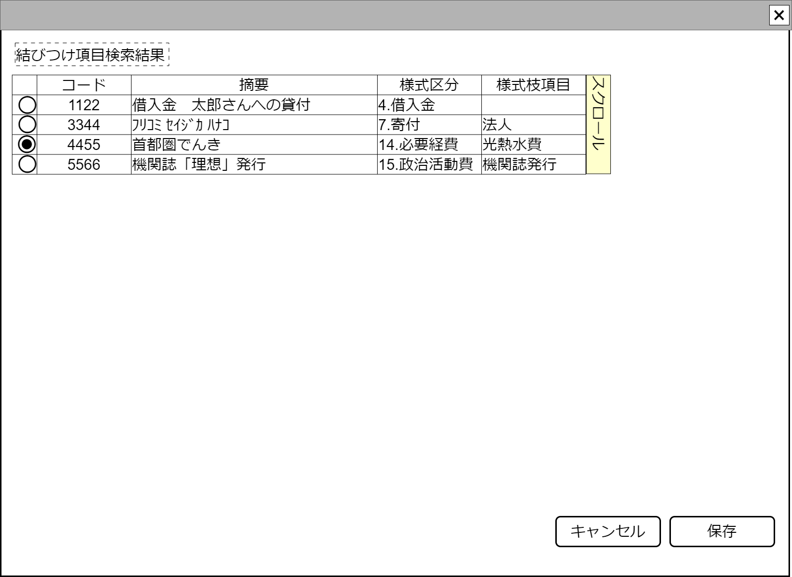

# 項目呼び出し候補表示【コンポーネント】設計書

## 状態：仕様未確定(一部修正で実装完了)

## 1.目的

政治資金収支報告書における、検索された項目名称(と住所、団体者氏名または個人職業)を一覧し選択する

## 2. 構成コンポーネント

1. 独自フィールド

### 2.1 繰り返し項目

なし

## 3. 画面イメージ

### 3.1 画面イメージ

### 3.2 画面イメージ(項番)

## 4. フィールド要素一覧

TODO 表示項目は仕様が決定次第修正する

| 番号 |       論理名       |    タイプ    | 活性／表示 |                      内容                      |
| ---- | ------------------ | ------------ | ---------- | ---------------------------------------------- |
| 1    | 行選択ラジオボタン | ラジオボタン | 活性       | 押下時：行選択できること。                     |
| 1    | 同一識別コード     | ラベル       | 表示       | 呼び出し項目同一識別コードが表示されていること |
| 1    | 摘要               | ラベル       | 表示       | 呼び出し項目摘要が表示されていること           |
| 1    | 様式区分           | ラベル       | 表示       | 紐づく様式区分が表示されていること             |
| 1    | 様式枝区分項目     | ラベル       | 表示       | 紐づく様式枝区分項目が表示されていること       |

## 5.アクション一覧

| 番号 |   論理名   | タイプ | 活性／表示 |                                 内容                                 |
| ---- | ---------- | ------ | ---------- | -------------------------------------------------------------------- |
| 1    | サンプル   | ボタン | 活性       | 押下時：サンプルコンポーネントを表示すること。                       |
| 1    | キャンセル | ボタン | 活性       | 押下時：選択せずにコンポーネントを閉じること。                       |
| 1    | 選択       | ボタン | 活性       | 押下時：行選択の内容を親画面に通知しコンポーネントが閉じられること。 |

## 6. 項目結びつけインターフェイス

CallingItemInterface

CallingItemEntityを継承していること

 |               論理名               |               論理名               |   型    |                         説明(例)                         |
 | ---------------------------------- | ---------------------------------- | ------- | -------------------------------------------------------- |
 | 読み取り行                         | readLine                           | Integer | 書証における読み取り行                                   |
 | 項目名称取得Id                     | callingItemId                      | Integer | 項目名称Is                                               |
 | 項目名称取得同一識別コード         | callingItemCode                    | Integer | 変更にかかわらず、同一であることを識別する同一識別コード |
 | 最新区分                           | saishinKbn                         | Integer | 最新であることを示す区分                                 |
 | ユーザ団体Id                       | userOrganizationId                 | Long    | ユーザが所属する政治団体Id                               |
 | ユーザ団体同一識別コード           | userOrganizationCode               | Integer | ユーザが所属する政治団体同一識別コード                   |
 | ユーザ団体名称                     | userOrganizationName               | String  | ユーザが所属する政治団体名称                             |
 | 報告書記載名称区分                 | publishItemKbn                     | Integer | 報告書の名称区分                                         |
 | 項目呼び出し条件摘要               | callingReferDigest                 | String  | 呼び出し条件となる摘要                                   |
 | 項目名称取得名称                   | callingItemName                    | String  | 呼び出し条件となる項目名称                               |
 | 報告書記載名称                     | publishItemName                    | String  | 実際に報告書に記載する項目名称                           |
 | 報告書記載住所                     | publishOrgnizationAddress          | String  | 実際に報告書に記載する個人または団体住所                 |
 | 報告書記載職業または代表者氏名     | publishProfessionOrgnizationName   | String  | 実際に報告書に記載する個人職業または団体代表者氏名       |
 | 項目呼び出し条件各種PayId          | callingItemVariousFinancialPayId   | Long    | 呼び出し条件となる各種PayId                              |
 | 項目呼び出し条件各種Payコード      | callingItemVariousFinancialPayCode | Integer | 呼び出し条件となる各種Pay同一識別コード                  |
 | 項目呼び出し条件各種Pay名称        | callingItemVariousFinancialPayName | String  | 呼び出し条件となる各種Pay名称                            |
 | 項目呼び出し条件全銀金融機関コード | callingItemZenginFinancialOrgCode  | String  | 呼び出し条件となる全銀金融機関同一識別コード             |
 | 項目呼び出し条件全銀金融機関名称   | callingItemZenginFinancialOrgName  | String  | 呼び出し条件となる全銀金融機関名称                       |
 | 項目呼び出し条件支店名称           | callingItemZenginBranchName        | String  | 呼び出し条件となる全銀金融機関支店同一識別コード         |
 | 項目呼び出し条件口座種別区分       | callingItemAccountType             | Integer | 呼び出し条件となる全銀金融機関支店名称                   |
 | 項目呼び出し条件口座番号           | callingItemAccountNo               | String  | 呼び出し条件となる全銀金融機関口座種別                   |
 | 項目呼び出し条件支店コード         | callingItemZenginBranchCode        | String  | 呼び出し条件となる全銀金融機関口座番号                   |
 | 項目呼び出し条件口座名義人         | callingItemAccountHas              | String  | 呼び出し条件となる全銀金融機関口座名義人                 |
 | 項目呼び出し条件郵便番号・前       | callingItemPostal1                 | String  | 呼び出し条件となる住所郵便番号・前                       |
 | 項目呼び出し条件郵便番号・後       | callingItemPostal2                 | String  | 呼び出し条件となる住所郵便番号・後                       |
 | 項目呼び出し条件電話番号・市外局番 | callingItemTel1                    | String  | 呼び出し条件となる電話番号・市外局番                     |
 | 項目呼び出し条件電話番号・局番     | callingItemTel2                    | String  | 呼び出し条件となる電話番号・局番                         |
 | 項目呼び出し条件電話番号・番号     | callingItemTel3                    | String  | 呼び出し条件となる電話番号・番号                         |
 | 項目呼び出し条件住所               | callingItemAddressPost             | String  | 呼び出し条件となる住所                                   |
 | 項目呼び出し条件住所番地           | callingItemAddressBlock            | String  | 呼び出し条件となる住所番地                               |
 | 項目呼び出し条件住所建物           | callingItemAddressString           | Integer | 呼び出し条件となる住所建物                               |
 | 様式区分                           | youshikiKbn                        | Integer | 報告書に記載する様式区分                                 |
 | 様式枝区分項目                     | youshikiEdaKbn                     | Integer | 報告書に記載する様式枝区分項目                           |
 | 関連者区分                         | relationKbn                        | Integer | 報告書で検索条件となる関連者区分                         |
 | 一般項目Id                         | generalItemId                      | Long    | 報告書で検索条件となる一般項目Id                         |
 | 一般項目同一識別コード             | generalItemCode                    | Integer | 報告書で検索条件となる一般項目同一識別コード             |
 | 継続事業Id                         | continueBuissinessId               | Long    | 報告書で検索条件となる継続事業Id                         |
 | 継続事業同一識別コード             | continueBuissinessCodee            | Integer | 報告書で検索条件となる継続事業同一識別コード             |
 | 関連者個人Id                       | relationPersonId                   | Long    | 報告書で検索条件となる関連者個人Id                       |
 | 関連者個人同一識別コード           | relationPersonCode                 | Integer | 報告書で検索条件となる関連者個人名称                     |
 | 関連者法人Id                       | relationCorporationId              | Long    | 報告書で検索条件となる関連者法人Id                       |
 | 関連者法人同一識別コード           | relationCorporationCode            | Integer | 報告書で検索条件となる関連者法人同一識別コード           |
 | 関連者政治団体Id                   | relationPoliticsOrganizationId     | Long    | 報告書で検索条件となる関連者政治団体Id                   |
 | 関連者政治団体同一識別コード       | relationPoliticsOrganizationCode   | Integer | 報告書で検索条件となる関連者政治団体同一識別コード       |

## 7. 連携

- キャンセルイベント送信を`emit(sendCancelCallingItem)`ですること
- 選択イベント送信を`emit(sendCallingItemInterface,selectedDto)`ですること
- 親コンポーネントからデータ読み取り行`readLine`と`listCallingItem:`を受け取り、readLineでフィルタして表示されること

※TODO 現在は摘要でフィルタしているが、全銀取引情報、レシート取引情報でも再利用できるよう読み取り行に変更する