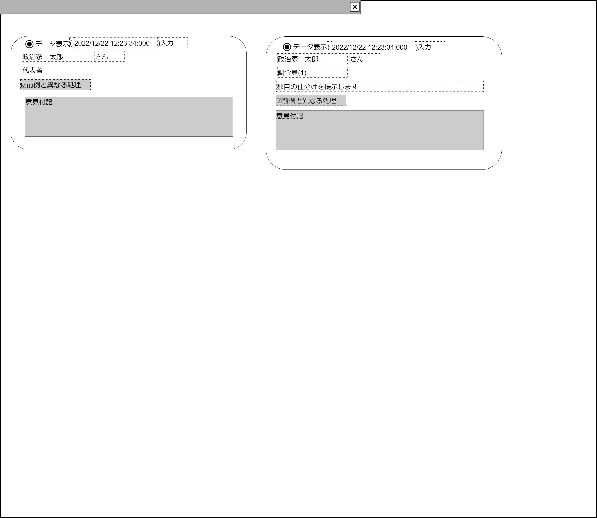

# 意見付記調整収入表示【コンポーネント】設計書

## 状態：実装中(収入項目など連動した項目で修正の発生の可能性はゼロではないが、骨格は変更なし)

## 1.目的

指定の収支報告書収入項目履歴の1件を表示する

## 2. 構成コンポーネント

1. 独自フィールド

### 2.1 繰り返し項目

なし

## 3. 画面イメージ

### 3.1 画面イメージ

### 3.2 画面イメージ(項番)

## 4. フィールド要素一覧

| 番号 |              論理名              | タイプ |  活性／表示  |                    内容                    |
| ---- | -------------------------------- | ------ | ------------ | ------------------------------------------ |
| 1    | 政治団体ユーザ意見付記表示エリア | 領域   | 表示／非表示 | 政治団体ユーザ意見表示エリアを表示すること |
| 1    | 調査(監査)意見付記表示エリア     | 領域   | 表示／非表示 | 調査(監査)意見付記表示エリアを表示すること |

### 4.1 政治団体ユーザ意見付記表示エリア フィールド要素一覧

| 番号 |             論理名             |      タイプ      | 活性／表示 |                                         内容                                         |
| ---- | ------------------------------ | ---------------- | ---------- | ------------------------------------------------------------------------------------ |
| 1    | 表示選択ボタン                 | ラジオボタン     | 活性       | 押下時：該当データが選択され、収入編集入力コンポーネントに表示されること             |
| 1    | データ入力時間                 | ラベル           | 表示       | 操作タイムスタンプを表示すること                                                     |
| 1    | 政治団体所属所属ユーザ名称     | ラベル           | 表示       | 操作ユーザ名称を表示すること                                                         |
| 1    | 政治団体所属所属ユーザ役割名称 | ラベル           | 表示       | 操作ユーザ名称の団体内における役割(代表者、会計責任者、事務担当者)が表示されること。 |
| 1    | 前例と異なる処理フラグ         | チェックボックス | 非活性     | 前例と異なる処理フラグが表示されること                                               |
| 1    | 意見付記                       | テキストエリア   | 非活性     | 意見付記が表示されること                                                             |

※意見付記と連動している機能であるが、この画面では書証保全参照ボタンは実装しないこと。(当人が保全書証について言及しない限りは、基本的に存在の有無を伏せるのが目的)

### 4.2 監査人意見付記表示エリア フィールド要素一覧

| 番号 |         論理名         |      タイプ      | 活性／表示 |                                        内容                                         |
| ---- | ---------------------- | ---------------- | ---------- | ----------------------------------------------------------------------------------- |
| 1    | 表示選択ボタン         | ラジオボタン     | 活性       | 押下時：該当データが選択され、収入編集入力コンポーネントに表示されること            |
| 1    | データ入力時間         | ラベル           | 表示       | 操作タイムスタンプを表示すること                                                    |
| 1    | 監査人ユーザ名称       | ラベル           | 表示       | 操作ユーザ名称を表示すること                                                        |
| 1    | 監査人意見総人数       | ラベル           | 表示       | 意見付記をユーザの総件数を「調査員(`件数`)」形式で表示されていること(最大3人を想定) |
| 1    | 支持意見表明選択       | ラベル           | 表示       | 意見付記と同時に付された支持意見が表示されていること                                |
| 1    | 前例と異なる処理フラグ | チェックボックス | 非活性     | 前例と異なる処理フラグが表示されること                                              |
| 1    | 意見付記               | テキストエリア   | 非活性     | 意見付記が表示されること                                                            |

## 5.アクション一覧

| 番号 |     論理名     |    タイプ    | 活性／表示 |                                   内容                                   |
| ---- | -------------- | ------------ | ---------- | ------------------------------------------------------------------------ |
| 1    | 表示選択ボタン | ラジオボタン | 活性       | 押下時：該当データが選択され、収入編集入力コンポーネントに表示されること |

### 5.1 データ作成が調査側フラグ

1. データ作成が調査側フラグが`該当:true`の場合
    - 政治団体ユーザ意見付記表示エリアが非表示であること
    - 調査(監査)意見付記表示エリアが非表示されていること
2. データ作成が調査側フラグが`非該当:false`の場合
    - 政治団体ユーザ意見付記表示エリアが表示さていること
    - 調査(監査)意見付記表示エリアが非表示であること

## 6. 意見付記調整(収入)インターフェイス

AuditOpinionIncomeInterface

収支報告書収入データBalancesheetIncomeInterfaceを継承すること

|                    論理名                     |              物理名              |    型     |                                                   説明(例)                                                    |
| --------------------------------------------- | -------------------------------- | --------- | ------------------------------------------------------------------------------------------------------------- |
| 収入データ意見付記Id                          | auditOpinionId                   | Long      | 意見付記Id。例示：「1234567890」                                                                              |
| データ作成が調査側フラグ                      | isCreatedItemByInvest            | Boolean   | データ作成が調査側である場合`true`                                                                            |
| 収入データId                                  | balancesheetIncomeId             | Long      | \* 収支報告書収入Id。例示：「1234567890」                                                                     |
| 収入データ同一識別コード                      | balancesheetIncomeCode           | Long      | \* 変更した際に同一の収支報告書収入項目であることを識別するコード。例示：「111222」                           |
| 政治団体Id                                    | politicalOrganizationId          | Long      | \* 操作ユーザが所属する政治団体Id。例示：「21101333」                                                         |
| 政治団体同一識別コード                        | politicalOrganizationCode        | Integer   | \* 変更した際に同一の政治団体であることを識別するコード。例示：「333」                                        |
| 政治団体名称                                  | politicalOrganizationCode        | String    | \* 操作ユーザが所属する政治団体名称。例示：「サンプル政治団体」                                               |
| 書証Id                                        | shoshouId                        | String    | \* 読み込みした書証Id。例示：「111/20221101/333」                                                             |
| 書証識別コード                                | shoshouHistoryCode               | Long      | \* 変更した際に同一意味の書証であることを識別するコード。例示：「333」                                        |
| 書証区分                                      | shoshouKbn                       | Integer   | \* 書証を区分する。書証アップロード機能参照                                                                   |
| 書証読み取り行                                | readLine                         | Integer   | \* 書証読み取り行                                                                                             |
| 参照した摘要                                  | referDigest                      | String    | \* 書証に記載された取引概要。例示：「ﾌﾘｺﾐ ﾕｳｹﾝｼｬﾀﾛｳ」                                                         |
| 発生日                                        | accrualDate                      | Date      | \* 取引発生日                                                                                                 |
| 取引金額                                      | amount                           | Long      | \* 取引した金額                                                                                               |
| 自動入力部分の編集有無                        | isEditAutoInput                  | Boolean   | \* 自動入力部を編集しようとしているかどうか。編集している場合は`true`                                         |
| 収支報告区分                                  | reportKbn                        | Integer   | \* 支出／収入                                                                                                 |
| 様式仕訳区分                                  | yoshikiKbn                       | Integer   | \* 様式仕訳区分。収入データ編集参照                                                                           |
| 様式仕訳枝項目区分                            | yoshikiEdaKbn                    | Integer   | \* 様式仕訳枝項目区分。収入データ編集参照                                                                     |
| 項目名称                                      | itemName                         | String    | \* 項目名称                                                                                                   |
| 項目名称Id区分                                | itemIdKbn                        | Integer   | \* 項目名称に紐づくIdが、どの区分でを表すコード(様式区分／様式枝区分と併用して様式区分で代用可能であれば廃止) |
| 一般項目名称区分                              | generalItemCode                  | Integer   | \* 項目名称にどの分類のデータ(一般、継続事業、関連者個人・法人・政治団体)が読み取られているかの区分           |
| 一般項目名称Id                                | generalItemId                    | Long      | \* 集計に活用をしない、一般的かつ属性を持たない項目を識別する一意のId。                                       |
| 一般項目同一識別コード                        | generalItemCode                  | Integer   | \* 集計に活用をしない一般的かつ属性を持たない項目を識別する一意のId。                                         |
| 継続事業Id                                    | continueBuissinessId             | Long      | \* 継続事業を識別する一意のId。                                                                               |
| 継続事業同一識別コード                        | continueBuissinessCode           | Integer   | \* 変更にかかわらず、継続事業を同一であると識別するためのコード                                               |
| 関連者区分                                    | relationPersonId                 | Long      | \* 関連者のうち個人を識別する一意のId。                                                                       |
| 関連者個人Id                                  | relationKbn                      | Integer   | \* 関連者が個人・法人・政治団体のいずれかを表す区分                                                           |
| 関連者個人同一識別コード                      | relationPersonCode               | Integer   | \* 変更にかかわらず、関連者のうち個人を同一と識別するコード                                                   |
| 関連者法人Id                                  | relationCorporationId            | Long      | \* 関連者のうち法人を識別する一意のId。                                                                       |
| 関連者法人同一識別コード                      | relationCorporationCode          | String    | \* 変更にかかわらず、関連者のうち法人を同一と識別するコード                                                   |
| 関連者政治団体Id                              | relationPoliticsOrganizationId   | Long      | \* 関連者のうち政治団体を識別する一意のId。                                                                   |
| 関連者政治団体同一識別コード                  | relationPoliticsOrganizationCode | Integer   | \* 変更にかかわらず、関連者のうち政治団体を同一と識別するコード                                               |
| 個人・団体住所                                | orgnizationAddress               | String    | \* 個人または団体住所                                                                                         |
| 個人職業・団体代表者                          | professionOrgnizationName        | String    | \* 氏名(職業)、または団体名称                                                                                 |
| あっせん期間開始日                            | mediationStartDate               | Date      | \* あっせんのする場合、期間開始日                                                                             |
| あっせん期間終了日                            | mediationEndDate                 | Date      | \* あっせんのする場合、期間終了日                                                                             |
| パーティ開催日                                | partyDate                        | Date      | \* パーティ開催日                                                                                             |
| 備考                                          | biko                             | String    | \* 備考                                                                                                       |
| 税額控除有無                                  | isCreditTax                      | Boolean   | \* 税控除対象かどうか。該当する場合は`true`                                                                   |
| 寄付が遺贈有無フラグ                          | isBequest                        | Boolean   | \* 寄付が遺贈かどうか。該当する場合は`true`                                                                   |
| 寄付法人が上場または外資50%超え会社有無フラグ | isPrimeListedOrForeign           | Boolean   | \* 寄付法人が上場または外資50%超え会社有無。該当する場合は`true`                                              |
| 政治資金パーティ名称                          | partyName                        | String    | \* 政治資金パーティ名称                                                                                       |
| 意見付記                                      | note                             | String    | \* 仕訳に対する意見、メモ                                                                                     |
| 前例と異なる処理フラグ                        | isDifferPrecedent                | String    | \* 前例と異なる処理を行った場合`true`(仕訳者の主観)                                                           |
| 保全書証リスト                                | storagedDocumentIdList           | String    | \* この仕訳に関して指示内容等を保全した場合の書証Idリスト                                                     |
| 調査側意見ユーザ人数                          | researcherAmount                 | Integer   | 意見付記を行った調査側のユーザ人数(意見回数ではない)                                                          |
| 監査意見支持意見の値                          | audit_agree_item_value           | String    | データ作成が調査側フラグ(`該当:1`) + "--"+ 意見支持をした項目データId                                         |
| 監査意見支持意見の表示テキスト                | audit_agree_item_text            | String    | 意見付記の再選択された支持意見の表示テキスト                                                                  |
| 操作ユーザId                                  | loginUserId                      | Long      | \* ログインし、この操作を行ったユーザを識別する一意のId。                                                     |
| 操作ユーザ同一識別コード                      | loginUserCode                    | Integer   | \* 変更にかかわらず、ログインし、この操作を行ったユーザを同一と識別するコード                                 |
| 操作ユーザ名称                                | loginUserCode                    | String    | \* ログインし、この操作を行ったユーザ名称                                                                     |
| 操作ユーザ団体役割名称                        | loginUserRole                    | String    | ログインし、この操作を行ったユーザ役割名称                                                                    |
| 更新時間                                      | update_time                      | Timestamp | \* ログインし、この操作を行われたタイムスタンプ                                                               |

### 6.1 支持意見選択

|                                 値                                  |                                                            テキスト                                                            |
| ------------------------------------------------------------------- | ------------------------------------------------------------------------------------------------------------------------------ |
| データ作成が調査側該当+ "-"+収支報告書収入項目Id  「1-3428346」 | ユーザ名称+"さん("+ユーザ団体役割または調査員人数番目+")"+"さんの意見を支持" 「監査人　太郎さん(調査員1)+さんの意見を支持」 |

※調査員独自が意見表示する場合は、選択項目を値`1-0`、表示テキスト`独自の仕訳を作成`とする

## 7. 連携

表示選択ボタン押下時：`emit(sendAuditOpinionIncomeInterface,selectedData:AuditOpinionIncomeInterface)`で選択されたデータを親画面に送信すること
