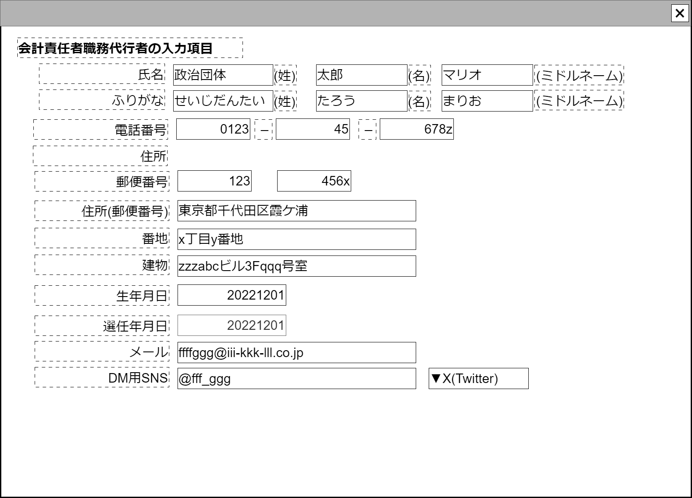

# 団体内ユーザ【コンポーネント】設計書

## 状態：フィールド要素はほぼ確定(実装しながら修正)

## 1.目的

ユーザ情報の登録と編集を行う

## 2. 構成コンポーネント

1. 独自フィールド

### 2.1 繰り返し項目

なし

## 3. 画面イメージ

### 3.1 画面イメージ

### 3.2 画面イメージ(項番)

## 4. フィールド要素一覧

| 番号 |           論理名           |        タイプ        | 活性／表示 |                             内容                             |
| ---- | -------------------------- | -------------------- | ---------- | ------------------------------------------------------------ |
| 1    | 氏名の姓                   | インプットテキスト   | 活性       | 姓名の姓を入力の受け付けること。                             |
| 2    | 氏名の名                   | インプットテキスト   | 活性       | 姓名の名を入力の受け付けること。                             |
| 2    | 氏名のミドルネーム         | インプットテキスト   | 活性       | 姓名のミドルネームの入力を受け付けること。                   |
| 1    | 氏名の姓ふりがな           | インプットテキスト   | 活性       | 姓名の姓ふりがなの入力を受け付けること。                     |
| 2    | 氏名の名ふりがな           | インプットテキスト   | 活性       | 姓名の名ふりがなの入力を受け付けること。                     |
| 2    | 氏名のミドルネームふりがな | インプットテキスト   | 活性       | 姓名のミドルネームふりがなの入力を受け付けること。           |
| 2    | 電話番号の市外局番         | インプットテキスト   | 活性       | 電話番号の市外局番を入力を受け付けること。                   |
| 2    | 電話番号の局番             | インプットテキスト   | 活性       | 電話番号の局番の入力を受け付けること。                       |
| 2    | 電話番号の番号             | インプットテキスト   | 活性       | 電話番号の番号の入力を受け付けること。                       |
| 2    | 郵便番号の前半             | インプットテキスト   | 活性       | 郵便番号の前半部分の入力を受け付けること。                   |
| 2    | 郵便番号の後半             | インプットテキスト   | 活性       | 郵便番号の後半部分の入力の受け付けること。                   |
| 2    | 住所の郵便番号自動入力部分 | インプットテキスト   | 活性       | 住所で郵便番号で自動入力できる部分の入力の受け付けること。   |
| 2    | 住所の郵便番号番地         | インプットテキスト   | 活性       | 住所で郵便番号で自動入力できない番地の入力の受け付けること。 |
| 2    | 住所の郵便番号建物         | インプットテキスト   | 活性       | 住所で郵便番号で建物に関する入力の受け付けること。           |
| 2    | 生年月日                   | インプットカレンダー | 活性       | 生年月日の入力の受け付けること。                             |
| 2    | 選任年月日                 | インプットカレンダー | 活性       | 生年月日の入力の受け付けること。                             |
| 2    | メールアドレス             | インプットメール形式 | 活性       | 利用するメールアドレスの入力を受け付けること。               |
| 2    | 指定SNSアカウント          | インプット英数字記号 | 活性       | 利用するSNSのアカウントの入力を受け付けること。              |
| 2    | 連絡用SNSサービス          | セレクトボタン       | 活性       | 利用するSNSサービスの選択を受け付けること。                  |

## 5.アクション一覧

なし

## 6. 組織内作業者インターフェイス

UserOfOrganizationInterface

|           論理名           |        論理名        |    型     |                                                                      説明(例)                                                                      |
| -------------------------- | -------------------- | --------- | -------------------------------------------------------------------------------------------------------------------------------------------------- |
| 作業者Id                   | userId               | Long      | この作業者を識別する一意のId                                                                                                                       |
| 同一人識別コード           | userCide             | Long      | この作業者を変更履歴を取得するための一意の番号                                                                                                     |
| 氏名の姓                   | userNameLast         | String    | 例示：「政治団体」                                                                                                                                 |
| 氏名の名                   | userNameFirst        | String    | 例示：「太郎」                                                                                                                                     |
| 氏名のミドルネーム         | userNameMiddle       | String    | 例示：「マリオ」                                                                                                                                   |
| 氏名の姓ふりがな           | userNameKanaLast     | String    | 例示：「せいじだんたい」                                                                                                                           |
| 氏名の名ふりがな           | userNameKanaFirst    | String    | 例示：「たろう」                                                                                                                                   |
| 氏名のミドルネームふりがな | userNameKanaMiddle   | String    | 例示：「まりお」                                                                                                                                   |
| 電話番号の市外局番         | userTel1             | String    | 例示：「080」                                                                                                                                      |
| 電話番号の局番             | userTel2             | String    | 例示：「1234」                                                                                                                                     |
| 電話番号の番号             | userTel3             | String    | 例示：「5678」                                                                                                                                     |
| 個人情報許諾有無           | isAcceptuserPlusInfo | Boolean   | ※このインターフェイス内の情報は団体設立届で必要であり、ユーザ側でも情報管理が求められる(変更があれば変更届？)ので、値は常に`true` |
| 郵便番号の前半             | userPostalcode1      | String    | 例示：「012」                                                                                                                                      |
| 郵便番号の後半             | userPostalcode2      | String    | 例示：「9876」                                                                                                                                     |
| 住所の郵便番号自動入力部分 | userAddress          | String    | 例示：「東京都千代田区霞が関」                                                                                                                     |
| 住所の郵便番号番地         | userAddressBlock     | String    | 例示：「999番地」                                                                                                                                  |
| 住所の郵便番号建物         | userAddressBuilding  | String    | 例示：「zzzabcビル3Fqqq号室。」                                                                                                                    |
| 生年月日                   | userBirthDate        | LocalDate | 例示：「1994/03/03」                                                                                                                               |
| 選任年月日                 | userAppointDate      | LocalDate | 例示：「1994/03/03                                                                                                                                 |
| メールアドレス             | userMailAddress      | String    | 例示：「<fff-qqq@qqq-rrr.co.jp>」                                                                                                                  |
| 指定SNSアカウント          | userSnsAccount       | String    | 例示：「@fff-qqq」                                                                                                                                 |
| 連絡用SNSサービス          | userSnsService       | Long      | 例示「4:Facebook」                                                                                                                                 |

## 7. 連携

親画面から`props{organizationDto:UserOfOrganizationInterface}`を受け取り、`computed`を設定することで変更状態を常に親画面に通知すること
