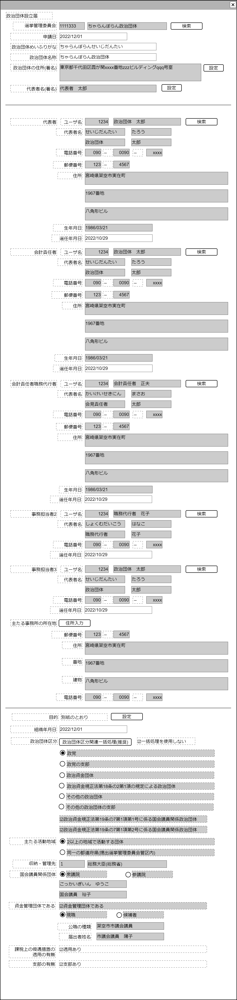
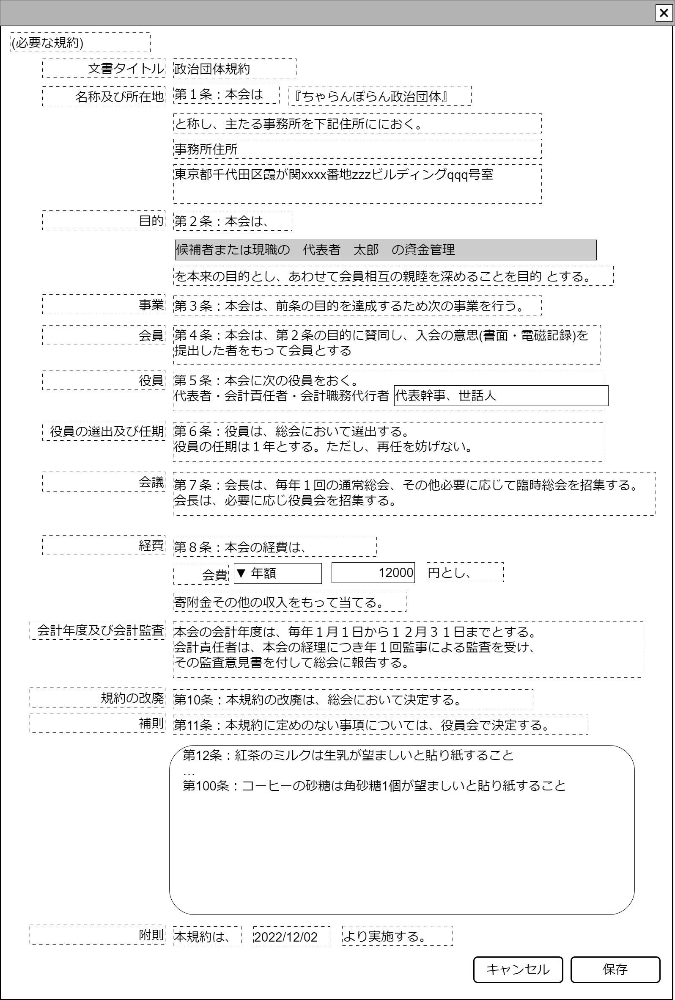

# 政治団体設立届【表示画面】設計書

## 状態：Mockデータによる仮実装

## 1.目的

政治団体を新設する政治団体設立届を作成する

## 2. 構成コンポーネント

1. 独自フィールド
2. [選挙管理委員会検索](./#)コンポーネント
3. [責任者検索](./#)コンポーネント
4. [作業検索](./#)コンポーネント
5. [責任者](./#)コンポーネント
6. [作業者](./#)コンポーネント
7. [住所入力](./#)コンポーネント
8. [政治団体区分入力補助](../../common/front/select_political_orgnization_kbn/select_political_orgnization_kbn.md)コンポーネント

### 2.1 繰り返し項目

責任者、作業者、責任者検索、作業者検索は複数個所で使用されている

## 3. 画面イメージ

### 3.1 画面イメージ

### 3.2 画面イメージ(項番)

## 4. フィールド要素一覧

| 番号 |                     論理名                     |       タイプ       |  活性／表示  |                                                                                        内容                                                                                         |
| ---- | ---------------------------------------------- | ------------------ | ------------ | ----------------------------------------------------------------------------------------------------------------------------------------------------------------------------------- |
| 1    | 選挙管理委員会同一識別コード                   | インプットテキスト | 非活性       | 選挙管理委員会同一識別コードを表示すること。                                                                                                                                        |
| 1    | 選挙管理委員会名称                             | インプットテキスト | 非活性       | 選挙管理委員会名称を表示すること。                                                                                                                                                  |
| 1    | 選挙管理委員会検索                             | ボタン             | 活性         | 押下時：選挙管理委員会検索コンポーネントを表示すること。                                                                                                                            |
| 1    | 申請日                                         | インプット日付     | 活性         | 申請日の入力を受け付けること。初期値はシステム日付                                                                                                                                  |
| 1    | 政治団体名称ふりがな                           | インプットテキスト | 活性         | 政治団体名称ふりがなの入力を受け付けること                                                                                                                                          |
| 1    | 政治団体名称                                   | インプットテキスト | 活性         | 政治団体名称の入力を受け付けること                                                                                                                                                  |
| 1    | 政治団体住所(署名)                             | テキストエリア     | 非活性       | 政治団体の主たる事務所住所が表示されること                                                                                                                                          |
| 1    | 政治団体住所(署名)入力                         | ボタン             | 活性         | 政治団体の主たる事務所住所が入力補助コンポーネントが表示されること                                                                                                                  |
| 1    | 代表者姓名(署名)                               | インプットテキスト | 非活性       | 政治団体代表者名が表示されること                                                                                                                                                    |
| 1    | 代表者姓名(署名)入力                           | ボタン             | 活性         | 代表者用が責任者入力補助コンポーネントが表示されること                                                                                                                              |
| 1    | ユーザ同一識別コード(代表者用)                 | インプットテキスト | 非活性       | ユーザ同一識別コードを表示すること。                                                                                                                                                |
| 1    | ユーザ姓名(代表者用)                           | インプットテキスト | 非活性       | ユーザ姓名を表示すること。                                                                                                                                                          |
| 1    | ユーザ検索(代表者用)                           | ボタン             | 活性         | 押下時：責任者検索コンポーネントを表示すること。                                                                                                                                    |
| 1    | 責任者情報(代表者用)                           | コンポーネント     | 表示         | 代表者の責任者情報を表示すること。                                                                                                                                                  |
| 1    | 代表者選任年月日                               | インプット日付     | 活性         | 代表者の選任年月日の入力を受け付けること                                                                                                                                            |
| 1    | ユーザ同一識別コード(会計責任者用)             | インプットテキスト | 非活性       | ユーザ同一識別コードを表示すること。                                                                                                                                                |
| 1    | ユーザ姓名(会計責任者用)                       | インプットテキスト | 非活性       | ユーザ姓名を表示すること。                                                                                                                                                          |
| 1    | ユーザ検索(会計責任者用)                       | ボタン             | 活性         | 押下時：責任者検索コンポーネントを表示すること。                                                                                                                                    |
| 1    | 責任者情報(会計責任者用)                       | コンポーネント     | 表示         | 会計責任者の責任者情報を表示すること。                                                                                                                                              |
| 1    | 会計責任者選任年月日                           | インプット日付     | 活性         | 会計責任者の選任年月日の入力を受け付けること                                                                                                                                        |
| 1    | ユーザ同一識別コード(会計責任者の職務代行者用) | インプットテキスト | 非活性       | ユーザ同一識別コードを表示すること。                                                                                                                                                |
| 1    | ユーザ姓名(会計責任者の職務代行者用)           | インプットテキスト | 非活性       | ユーザ姓名を表示すること。                                                                                                                                                          |
| 1    | ユーザ検索(会計責任者用の職務代行者)           | ボタン             | 活性         | 押下時：責任者検索コンポーネントを表示すること。                                                                                                                                    |
| 1    | 責任者情報(会計責任者の職務代行者用)           | コンポーネント     | 表示         | 会計責任者の職務代行者の責任者情報を表示すること。                                                                                                                                  |
| 1    | 会計責任者の職務代行者選任年月日               | インプット日付     | 活性         | 会計責任者の職務代行者の選任年月日の入力を受け付けること                                                                                                                            |
| 1    | ユーザ同一識別コード(事務作業者2用)            | インプットテキスト | 非活性       | ユーザ同一識別コードを表示すること。                                                                                                                                                |
| 1    | ユーザ姓名(事務作業者2用)                      | インプットテキスト | 非活性       | ユーザ姓名を表示すること。                                                                                                                                                          |
| 1    | ユーザ検索(事務作業者2用)                      | ボタン             | 活性         | 押下時：作業者検索コンポーネントを表示すること。                                                                                                                                    |
| 1    | 作業者情報(事務作業者2用)                      | コンポーネント     | 表示         | 事務作業者2の作業者情報を表示すること。                                                                                                                                             |
| 1    | 事務作業者2の選任年月日                        | インプット日付     | 活性         | 事務作業者2の選任年月日の入力を受け付けること                                                                                                                                       |
| 1    | ユーザ同一識別コード(事務作業者3用)            | インプットテキスト | 非活性       | ユーザ同一識別コードを表示すること。                                                                                                                                                |
| 1    | ユーザ姓名(事務作業者3の職務代行者用)          | インプットテキスト | 非活性       | ユーザ姓名を表示すること。                                                                                                                                                          |
| 1    | ユーザ検索(事務作業者3の職務代行者)            | ボタン             | 活性         | 押下時：作業者検索コンポーネントを表示すること。                                                                                                                                    |
| 1    | 作業者情報(事務作業者3の職務代行者用)          | コンポーネント     | 表示         | 事務作業者2の作業者情報を表示すること。                                                                                                                                             |
| 1    | 事務作業者3の選任年月日                        | インプット日付     | 活性         | 事務作業者2の選任年月日の入力を受け付けること                                                                                                                                       |
| 1    | 住所入力                                       | ボタン             | 活性         | 押下時：住所入力補助コンポーネントを表示すること                                                                                                                                    |
| 1    | 住所表示                                       | コンポーネント     | 表示         | 政治団体の主たる事務所住所を表示すること                                                                                                                                            |
| 1    | 目的                                           | ボタン             | 活性         | 規約入力部に移動すること                                                                                                                                                            |
| 1    | 政治団体区分一括入力補助                       | ボタン             | 活性         | 押下時：政治団体区分入力補助コンポーネントを表示すること                                                                                                                            |
| 1    | 一括入力未使用                                 | チェックボックス   | 活性         | 押下時：`true`時、政治団体区分入力関連項目を活性にすること。詳細は別途記述                                                                                                          |
| 1    | 政治団体区分(政党)                             | ラジオボタン       | 活性／非活性 | 新設したい政治団体が政党である場合、`on`であることで入力を受け付けること                                                                                                            |
| 1    | 政治団体区分(政党支部)                         | ラジオボタン       | 活性／非活性 | 新設したい政治団体が政党支部である場合、`on`であることで入力を受け付けること                                                                                                        |
| 1    | 政治団体区分(政治資金団体)                     | ラジオボタン       | 活性／非活性 | 新設したい政治団体が政治資金団体ある場合、`on`であることで入力を受け付けること                                                                                                      |
| 1    | 政治団体区分(18条2項1に該当する団体)           | ラジオボタン       | 活性／非活性 | 新設したい政治団体が18条2項1に該当する団体である場合、`on`であることで入力を受け付けること                                                                                          |
| 1    | 政治団体区分(その他団体)                       | ラジオボタン       | 活性／非活性 | 新設したい政治団体がその他団体である場合、`on`であることで入力を受け付けること                                                                                                      |
| 1    | 政治団体区分(政治団体支部)                     | ラジオボタン       | 活性／非活性 | 新設したい政治団体が政治団体支部である場合、`on`であることで入力を受け付けること                                                                                                    |
| 1    | 国会議員1項団体該否                            | チェックボックス   | 活性／非活性 | 新設したい政治団体が国会議員関連団体19条1項団体である場合、`true`であること                                                                                                         |
| 1    | 国会議員2項団体該否                            | チェックボックス   | 活性／非活性 | 新設したい政治団体が国会議員関連団体19条2項団体である場合、`true`であること                                                                                                         |
| 1    | 団体活動地域区分(2地域以上)                    | ラジオボタン       | 活性／非活性 | 新設したい政治団体が、代表者が国会議員またはその候補者がである場合、`on`であることで入力を受け付けること                                                                            |
| 1    | 団体活動地域区分(1地域)                        | ラジオボタン       | 活性／非活性 | 新設したい政治団体が、代表者が国会議員またはその候補者でない場合、`on`であることで入力を受け付けること                                                                              |
| 1    | 収納・管理先同一識別コード                     | インプットテキスト | 活性／非活性 | 収納・管理先同一識別コードを表示すること。活動地域が2地域＝国会議員関連団体の場合は総務大臣(総務省)を表すコードを表示、それ以外の場合は提出先選挙管理委員会同一識別コードを表示する |
| 1    | 収納・管理先名称                               | インプットテキスト | 活性／非活性 | 収納・管理先会名称を表示すること。活動地域が2地域＝国会議員関連団体の場合は総務大臣(総務省)を表示、それ以外の場合は提出先選挙管理委員会名称を表示する                               |
| 1    | 国会議員団体詳細                               | チェックボックス   | 活性／非活性 | 新設したい政治団体が、国会議員関連団体の場合は`true` であること                                                                                                                     |
| 1    | 国会議員団体詳細(衆議院)                       | ラジオボタン       | 活性／非活性 | 代表者が衆議院の国会議員またはその候補者である場合、`on`であること                                                                                                                  |
| 1    | 国会議員団体詳細(参議院)                       | ラジオボタン       | 活性／非活性 | 代表者が参議院の国会議員またはその候補者である場合、`on`であること                                                                                                                  |
| 1    | 国会議員姓名かな                               | インプットテキスト | 活性／非活性 | 国会議員の姓名ふりがなを表示すること                                                                                                                                                |
| 1    | 国会議員姓名                                   | インプットテキスト | 活性／非活性 | 国会議員の姓名を表示すること                                                                                                                                                        |
| 1    | 資金管理団体該否                               | チェックボックス   | 活性／非活性 | 新設したい政治団体が、代表者資金管理に使用する資金管理団体の場合は`true`であること                                                                                                  |
| 1    | 現職と候補者の別(現職)                         | ラジオボタン       | 活性／非活性 | 代表者が公職の現職である場合、`on`であること                                                                                                                                        |
| 1    | 現職と候補者の別(候補者)                       | ラジオボタン       | 活性／非活性 | 代表者が公職の校舎またはその候補者である場合、`on`であること                                                                                                                        |
| 1    | 公職の種類                                     | インプットテキスト | 活性／非活性 | 議会名称を表示すること。TODO 議員と首長の別は仕様決定次第修正する                                                                                                                   |
| 1    | 届出者姓名                                     | インプットテキスト | 活性／非活性 | 資金管理団体を使用する者＝代表者姓名を表示すること                                                                                                                                  |
| 1    | 課税上の優遇措置団体該否                       | チェックボックス   | 活性         | 新設したい政治団体が、優遇措置適用団体の場合は`true`であること                                                                                                                      |
| 1    | 団体有無支部                                   | チェックボックス   | 活性         | 新設したい政治団体が、既存団体の支部である場合は`true`であること                                                                                                                    |
| 1    | (規約)政治団体名                               | ラベル             | 表示         | 政治団体名称を再掲すること                                                                                                                                                          |
| 1    | (規約)政治団体主たる事務所の所在地             | ラベル             | 表示         | 政治団体の主な事務所の住所を再掲すること                                                                                                                                            |
| 1    | (規約)政治団体の目的                           | インプットテキスト | 活性／非活性 | 政治団体の主な目的を表示すること。詳細は別記                                                                                                                                        |
| 1    | (規約)団体追加役職                             | インプットテキスト | 活性         | 政治団体で法で規定された以上に、追加の役職がある場合は追加する                                                                                                                      |
| 1    | (規約)会費期間                                 | セレクトボックス   | 活性         | 会費の支払いサイクルを指定する(年払い、月払いなど)TODO 仕様が決定次第修正する                                                                                                       |
| 1    | (規約)会費金額                                 | インプット数字     | 活性         | 指定したサイクルでの、1回分の会費金額を指定する                                                                                                                                     |
| 1    | (規約)追加条文                                 | テキストエリア     | 活性         | 追加の条文の入力を受け付ける                                                                                                                                                        |
| 1    | (規約)規約発行日                               | インプット日付     | ラベル       | 組織年月日を再掲する                                                                                                                                                                |

※　課税上の優遇措置団体該否は、制度上、国会議員関連2号団体であれば、申告可能であるため、自動でチェックしたするが、2号団体であるが、
追加申請作業を嫌う団体が任意でチェックを外すのが妥当な操作と思われるが、仕様確定後追加修正を行う。
実態について総務省提出分のうち相当数のサンプル調査、または現場インタビューが必須と思われる

※　規約発効日は組織年月日とする(実態には若干の差異があるかもしれないが、規約のテンプレートととして)

※　会計年の開始日・終了日は指定なので、変更を許さないこと。第三者監査も少なくとも国会議員には義務付けられているので、安易にチェックボックスなどで外す実装はできない

## 5.アクション一覧

| 番号 |                論理名                 |      タイプ      | 活性／表示 |                                    内容                                    |
| ---- | ------------------------------------- | ---------------- | ---------- | -------------------------------------------------------------------------- |
| 1    | サンプル                              | ボタン           | 活性       | 押下時：サンプルコンポーネントを表示すること。                             |
| 1    | 選挙管理委員会検索                    | ボタン           | 活性       | 押下時：選挙管理委員会検索コンポーネントを表示すること。                   |
| 1    | 政治団体住所(署名)入力                | ボタン           | 活性       | 政治団体の主たる事務所住所が入力補助コンポーネントが表示されること         |
| 1    | 代表者姓名(署名)入力                  | ボタン           | 活性       | 代表者用が責任者入力補助コンポーネントが表示されること                     |
| 1    | ユーザ検索(代表者用)                  | ボタン           | 活性       | 押下時：責任者検索コンポーネントを表示すること。                           |
| 1    | ユーザ検索(会計責任者用)              | ボタン           | 活性       | 押下時：責任者検索コンポーネントを表示すること。                           |
| 1    | ユーザ検索(会計責任者用の職務代行者)  | ボタン           | 活性       | 押下時：責任者検索コンポーネントを表示すること。                           |
| 1    | ユーザ検索(事務作業者2用)             | ボタン           | 活性       | 押下時：作業者検索コンポーネントを表示すること。                           |
| 1    | 作業者情報(事務作業者3の職務代行者用) | コンポーネント   | 表示       | 事務作業者2の作業者情報を表示すること。                                    |
| 1    | 住所入力                              | ボタン           | 活性       | 押下時：住所入力補助コンポーネントを表示すること                           |
| 1    | 政治団体区分一括入力補助              | ボタン           | 活性       | 押下時：政治団体区分入力補助コンポーネントを表示すること                   |
| 1    | 一括入力未使用                        | チェックボックス | 活性       | 押下時：`true`時、政治団体区分入力関連項目を活性にすること。詳細は別途記述 |

### 5.1 一括入力未使用

1. `true`時には下記の変更を行う

- 政治団体区分(政党) を活性とすること
- 政治団体区分(政党支部) を活性とすること
- 政治団体区分(政治資金団体)を活性とすること
- 政治団体区分(18条2項1に該当する団体)を活性とすること
- 政治団体区分(その他団体)を活性とすること
- 政治団体区分(政治団体支部)を活性とすること
- 国会議員1項団体該否を活性とすること
- 国会議員2項団体該否を活性とすること
- 団体活動地域区分(2地域以上) を活性とすること
- 団体活動地域区分(1地域)を活性／非活性とすること
- 収納・管理先同一識別コードを活性とすること
- 収納・管理先名称を活性とすること
- 国会議員団体詳細を活性とすること
- 国会議員団体詳細(衆議院)を活性とすること
- 国会議員団体詳細(参議院)を活性とすること
- 国会議員姓名かなを活性とすること
- 国会議員姓名を活性とすること
- 資金管理団体該否を活性とすること
- 現職と候補者の別(現職)を活性とすること
- 現職と候補者の別(候補者)を活性とすること
- 公職の種類を活性とすること
- 届出者姓名を活性とすること

2.`false`時には下記の変更を行う

- 政治団体区分(政党) を活性とすること
- 政治団体区分(政党支部) を活性とすること
- 政治団体区分(政治資金団体)を活性とすること
- 政治団体区分(18条2項1に該当する団体)を活性とすること
- 政治団体区分(その他団体)を活性とすること
- 政治団体区分(政治団体支部)を活性とすること
- 国会議員1項団体該否を活性とすること
- 国会議員2項団体該否を活性とすること
- 団体活動地域区分(2地域以上) を活性とすること
- 団体活動地域区分(1地域)を活性／非活性とすること
- 収納・管理先同一識別コードを活性とすること
- 収納・管理先名称を活性とすること
- 国会議員団体詳細を活性とすること
- 国会議員団体詳細(衆議院)を活性とすること
- 国会議員団体詳細(参議院)を活性とすること
- 国会議員姓名かなを活性とすること
- 国会議員姓名を活性とすること
- 資金管理団体該否を活性とすること
- 現職と候補者の別(現職)を活性とすること
- 現職と候補者の別(候補者)を活性とすること
- 公職の種類を活性とすること
- 届出者姓名を活性とすること

### 5.2 区分選択時

1. 選択肢 01.政党要件を満たす政党である

    - 政治団体区分を1.政党とすること
    - 活動地域を2地域以上とする(自動的に収納・管理先は総務省となる)こと
    - その他の項目を初期化すること
    - 規約の目的を「法の基準を満たす政党としての政治活動」とし、(規約)政治団体の目的 を非活性とすること

2. 選択肢 02.(各議員でなく、政党への唯一の資金提供窓口である)政治資金団体である

    - 政治団体区分を3.政治資金団体とすること
    - 活動地域を2地域以上とする(自動的に収納・管理先は総務省となる)こと
    - その他の項目を初期化すること
    - 規約の目的を「政党の唯一の資金窓口である政治資金管理活動」とし、(規約)政治団体の目的 を非活性とすること

3. 選択肢 03.政党要件を満たす政党の支部である

    - 政治団体区分を3.政治資金団体とすること
    - 活動地域を1地域とすること(自動的に収納・管理先は指定された選挙管理委員会となる)
    - その他の項目を初期化すること
    - 規約の目的を「政党支部活動を行う」とし、(規約)政治団体の目的 を非活性とすること

4. 選択肢 04.代表者は国会議員の現職である

    - 政治団体区分を5.その他の政治団体とする
    - 代表者を国会議員とすること
    - 推薦・後援をしている団体フラグを`false`とすること
    - 現職区分を`1:現職`とすること
    - 活動地域を2地域以上とすること(自動的に収納・管理先は総務省となる)
    - 議員姓名を議員の選択値または修正入力値とすること
    - 公職の種類を議会の選択値または修正入力値とすること
    - 衆議院・参議院の別は入力内容を複写すること
    - 資金管理団体該否は入力内容を複写すること
    - 規約の目的を資金管理団体該否が`true`の場合「`議員姓名`の資金管理団体である」とする。`false`の場合は「`議員姓名`の活動団体である」とし、(規約)政治団体の目的 を非活性とすること

5. 選択肢 05.代表者は国会議員の候補者である

    - 政治団体区分を5.その他の政治団体とすること
    - 代表者を国会議員とすること
    - 推薦・後援をしている団体フラグを`false`とすること
    - 活動地域を2地域以上とすること(自動的に収納・管理先は総務省となる)
    - 現職区分を`2:候補者`とすること
    - 議員姓名を議員の選択値または修正入力値とすること
    - 公職の種類を議会の選択値または修正入力値とすること
    - 衆議院・参議院の別は入力内容を複写すること
    - 資金管理団体該否は入力内容を複写すること
    - 規約の目的を資金管理団体該否が`true`の場合「`政治家姓名`の資金管理団体である」とする。`false`の場合は「`政治家姓名`の活動団体である」とし、(規約)政治団体の目的 を非活性とすること

6. 選択肢 06.国会議員の現職または候補者を後援または推薦している

    - 政治団体区分を5.その他の政治団体とすること
    - 代表者を国会議員とすること
    - 推薦・後援をしている団体フラグを`true`とすること
    - 現職区分を`0:指定なし`とすること
    - 活動地域を1地域とすること(自動的に収納・管理先は指定された選挙管理委員会となる)
    - 議員姓名を議員の選択値または修正入力値とすること
    - 公職の種類を議会の選択値または修正入力値とすること
    - 衆議院・参議院の別は入力内容を複写すること
    - 資金管理団体該否は初期化すること
    - 規約の目的を「`政治家姓名`の推薦・後援である」とし、(規約)政治団体の目的 を非活性とすること

7. 選択肢 07.代表者は地方の首長または地方議会議員の現職である

    - 政治団体区分を5.その他の政治団体とすること
    - 代表者を国会議員でないとすること
    - 推薦・後援をしている団体フラグを`false`とすること
    - 現職区分を`1:現職`とすること
    - 活動地域を1地域とすること(自動的に収納・管理先は指定された選挙管理委員会となる)
    - 議員姓名を議員の選択値または修正入力値とすること
    - 公職の種類を議会の選択値または修正入力値とすること
    - 衆議院・参議院の別を初期化すること
    - 資金管理団体該否は入力内容を複写すること
    - 規約の目的を資金管理団体該否が`true`の場合「`議員姓名`の資金管理団体である」とする。`false`の場合は「`議員姓名`の活動団体である」とし、(規約)政治団体の目的 を非活性とすること

8. 選択肢 08.代表者は地方の首長または地方議会議員の候補者である

    - 政治団体区分を5.その他の政治団体とすること
    - 代表者を国会議員でないとすること
    - 推薦・後援をしている団体フラグを`false`とすること
    - 活動地域を1地域とすること(自動的に収納・管理先は指定された選挙管理委員会となる)
    - 現職区分を`2:候補者`とすること
    - 議員姓名を議員の選択値または修正入力値とすること
    - 公職の種類を議会の選択値または修正入力値とすること
    - 衆議院・参議院の別は初期化すること
    - 資金管理団体該否は入力内容を複写すること
    - 規約の目的を資金管理団体該否が`true`の場合「`政治家`の資金管理団体である」とする。`false`の場合は「`政治家`の活動団体である」とし、(規約)政治団体の目的 を非活性とすること

9. 選択肢 09.地方の首長または地方議会議員の現職または候補者を後援または推薦している

    - 政治団体区分を5.その他の政治団体とすること
    - 代表者を国会議員でないとすること
    - 推薦・後援をしている団体フラグを`true`とすること
    - 現職区分を`0:指定なし`とすること
    - 活動地域を1地域とすること(自動的に収納・管理先は指定された選挙管理委員会となる)
    - 議員姓名を議員の選択値または修正入力値とすること
    - 公職の種類を議会の選択値または修正入力値とすること
    - 衆議院・参議院の別は初期化すること
    - 資金管理団体該否は初期化すること
    - 規約の目的を「`政治家姓名`の推薦・後援である」とし、(規約)政治団体の目的 を非活性とすること

10. 選択肢 10.パーティの収益(の一部)が政治活動に使われ、かつ収入が10,000,000円以上である団体である

    - 政治団体区分を4.18条2項団体とすること
    - その他の項目を初期化すること
    - 規約の目的を「パーティの収支が法律の規定以上に大きく、政治活動に寄付を行っている」とし、(規約)政治団体の目的 を非活性とすること

11. 選択肢 11.議員の後援・推薦はしていないが、政治的主張活動を継続的に行っている

    - 政治団体区分を5.その他団体とすること
    - その他の項目を初期化すること
    - 規約の目的を`空文字`で初期化し、(規約)政治団体の目的を**活性とし入力を受け付ける**こと

12. 選択肢 12.政治団体の支部である

    - 政治団体区分を6.その他政治団体の支部とすること
    - その他の項目を初期化すること
    - 規約の目的を「`政治団体名称`の支部活動である」とし、(規約)政治団体の目的 を非活性とすること

## 6. 政治団体設立届インターフェイス

AddPoliticianOrgnizationInterface

 |                  論理名                  |                  論理名                  |           型           |                 説明(例)                 |
 | ---------------------------------------- | ---------------------------------------- | ---------------------- | ---------------------------------------- |
 | 提出選挙管理委員会Id                     | electionComitteeId                       | Long                   | 提出選挙管理委員会Id                     |
 | 提出選挙管理委員会同一識別コード         | electionComitteeCode                     | Integer                | 提出選挙管理委員会同一識別コード         |
 | 提出選挙管理委員会名称                   | electionComitteeName                     | String                 | 提出選挙管理委員会名称                   |
 | 住所情報受け取り                         | inputAddressDto                          | InputAddressDto        | 住所情報受け取り                         |
 | 団体区分                                 | organizationKbn                          | String                 | 団体区分                                 |
 | 主たる活動地域                           | activityArea                             | String                 | 主たる活動地域                           |
 | 国会議員条項(代表者が現職または候補者)   | isKokkaiGiinHonninKouhosha               | Boolean                | 国会議員条項(代表者が現職または候補者)   |
 | 国会議員条項(後援・支援)                 | isKokkaiGiinSuisen                       | Boolean                | 国会議員条項(後援・支援)                 |
 | 衆議院・参議院の別                       | selectedCountryParliament                | String                 | 衆議院・参議院の別                       |
 | 国会議員の本人または候補者の姓名         | kokkaGinName                             | String                 | 国会議員の本人または候補者の姓名         |
 | 国会議員の本人または候補者の姓名ふりがな | kokkaGinNameKana                         | String                 | 国会議員の本人または候補者の姓名ふりがな |
 | 受領先Id                                 | acceptOrgnizationId                      | Long                   | 受領先Id                                 |
 | 受領先同一識別コード                     | acceptOrgnizationCode                    | Integer                | 受領先同一識別コード                     |
 | 受領先名称                               | acceptOrgnizationName                    | String                 | 受領先名称                               |
 | 資金管理団体指定                         | isFundsManageOrg                         | Boolean                | 資金管理団体指定                         |
 | 資金管理団体 現職候補者の別              | selectParliamentOrCandidate              | String                 | 資金管理団体 現職候補者の別              |
 | 資金管理団体 届出者                      | fundsManageOrgDelegateName               | String                 | 資金管理団体 届出者                      |
 | 資金管理団体 役職                        | parliamentName                           | String                 | 資金管理団体 役職                        |
 | 代表者                                   | personManagerDelegate                    | PersonManagerInterface | 代表者                                   |
 | 会計責任者                               | personManagerAccountManager              | PersonManagerInterface | 会計責任者                               |
 | 会計職務代行者                           | personManagerAccountSupport              | PersonManagerInterface | 会計職務代行者                           |
 | 事務事務担当者2                          | personWorkser2                           | PersonWorkerInterface  | 事務事務担当者2                          |
 | 事務事務担当者3                          | personWorkser3                           | PersonWorkerInterface  | 事務事務担当者3                          |
 | 設立年月日                               | foundingNengappi                         | String                 | 設立年月日                               |
 | 申請日                                   | applicationNengappi                      | String                 | 申請日                                   |
 | 新設政治団体名称                         | politicalOrgnozationName                 | String                 | 新設政治団体名称                         |
 | 新設政治団体名称かな                     | politicalOrgnozationNameKana             | String                 | 新設政治団体名称かな                     |
 | 設立の目的                               | orgnozationPurpose                       | String                 | 設立の目的                               |
 | 課税優遇あり                             | hasTaxBenefits                           | Boolean                | 課税優遇あり                             |
 | 支部あり                                 | hasBranch                                | Boolean                | 支部あり                                 |
 | 法定以外の役職自由記述                   | irregularPosts                           | String                 | 法定以外の役職自由記述                   |
 | 会費支払いサイクル                       | paymentCycleKbn                          | String                 | 会費支払いサイクル                       |
 | 会費1回あたり金額                        | membershipFee                            | Integer                | 会費1回あたり金額                        |
 | 選任年月日(代表者)                       | appointmentNengappiDelegate              | LocalDate              | 選任年月日(代表者)                       |
 | 選任年月日(会計責任者)                   | appointmentNengappiAccountManager        | LocalDate              | 選任年月日(会計責任者)                   |
 | 選任年月日(会計責任者職務代行者)         | appointmentNengappiAccountManagerSupport | LocalDate              | 選任年月日(会計責任者職務代行者)         |
 | 選任年月日(作業者2)                      | appointmentNengappiWorker2               | LocalDate              | 選任年月日(作業者2)                      |
 | 選任年月日(作業者3)                      | appointmentNengappiWorker3               | LocalDate              | 選任年月日(作業者3)                      |
 | 追加条文                                 | addArticleContent                        | String                 | 追加条文                                 |
 | 事業内容列挙                             | businessText                             | String                 | 事業内容列挙                             |

## 7. 連携

入力内容が変更された都度、入力チェックを行い親画面に変更内容を通知する`emit[sendSampleTemplateInterface(data,errorInfo)]`

TODO 選挙管理委員会検索コンポーネントに関する記述記載
TODO 責任者検索コンポーネントに関する記述記載
TODO 作業検索コンポーネントに関する記述記載
TODO 住所入力コンポーネントに関する記述記載
TODO 政治団体区分入力補助コンポーネントに関する記述記載
