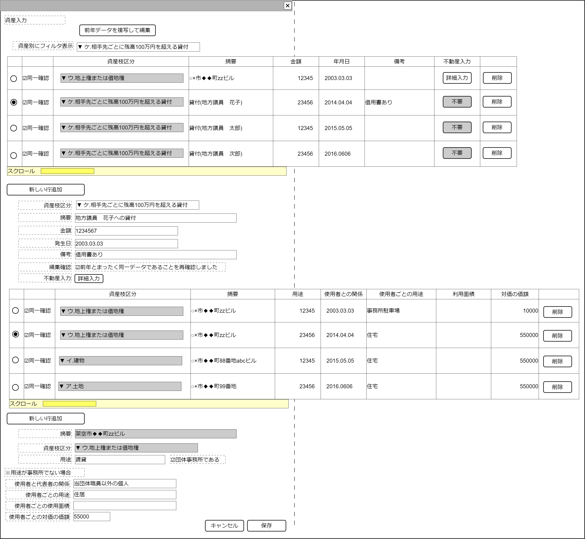

# 資産入力【表示画面】設計書

## 状態：仕様未確定(実装不可)

## 1.目的

保持している資産の内訳の入力を受け付ける

## 2. 構成コンポーネント

1. 独自フィールド
2. [不動産詳細入力コンポーネント](../../common/front/realestate_input/realestimate_input.md)

※事業継続登録(など)はマスタであるため、再活用性向上を目的に編集部とテーブルが切り分けてあるが、この機能は資産『データ』入力であり、マスタでなく、「資産を手放さない限り、過去データをテーブル上で承認して終了(取引成立日と当日の取引金額)」のが手数が最も少なくなるという性質から、テーブルに編集項目が入っている。基本的にテーブルと編集部を切り分けるのはprops,emitの量が増えるだけと理解するのを推奨する。
毎年査定された現在価格を表示する場合はエラーチェックが全く異なるので注意が必要(現実問題として毎年の査定作業に耐えられるかは不明)

### 2.1 繰り返し項目

なし

## 3. 画面イメージ

### 3.1 画面イメージ

### 3.2 画面イメージ(項番)

## 4. フィールド要素一覧

| 番号 |             論理名             |      タイプ      |  活性／表示  |                                    内容                                    |
| ---- | ------------------------------ | ---------------- | ------------ | -------------------------------------------------------------------------- |
| 1    | 前年データ複写ボタン           | ボタン           | 活性         | 下記アクションリスト参照                                                   |
| 1    | 資産表示フィルタセレクトボタン | セレクトボタン   | 活性         | 下記アクションリスト参照                                                   |
| 1    | 資産データ表示テーブル         | テーブル         | －           | 下記参照                                                                   |
| 1    | 新しい行追加ボタン             | ボタン           | 活性         | 下記アクションリスト参照                                                   |
| 1    | 編集_資産枝区分                | セレクトボックス | 活性         | 選択されたデータの資産枝区分の入力を受け付けること。下記アクション項目参照 |
| 1    | 編集_摘要                      | ラベル           | －           | 摘要の入力を受け付けること                                                 |
| 1    | 編集_金額                      | ラベル           | －           | 取引発生当時の取引金額の入力を受け付けること                               |
| 1    | 編集_年月日                    | ラベル           | －           | 取引発生日付の入力を受け付けること                                         |
| 1    | 編集_備考                      | ラベル           | －           | 備考の入力を受け付けること                                                 |
| 1    | 編集_不動産入力                | ボタン           | 活性／非活性 | 下記アクションリスト参照                                                   |
| 1    | 編集_前年同一確認チェック      | チェックボックス | 活性         | 前年と同一であることを確認できたことの入力を受け付けること                 |

### 4.1 資産表示テーブル

| 番号 |           論理名           |      タイプ      |  活性／表示  |                             内容                             |
| ---- | -------------------------- | ---------------- | ------------ | ------------------------------------------------------------ |
| 1    | データ編集選択ラジオボタン | ラジオボタン     | 活性         | 下記アクションリスト参照                                     |
| 1    | 前年同一確認チェック       | チェックボタン   | 活性         | 前年と同じデータを記載することを確認した入力を受け付けること |
| 1    | 資産枝区分                 | セレクトボックス | 非活性       | 仕訳枝項目区分(資産小分類)を表示すること                     |
| 1    | 摘要                       | ラベル           | －           | 摘要を表示すること                                           |
| 1    | 金額                       | ラベル           | －           | 取引発生当時の取引金額を表示すること                         |
| 1    | 年月日                     | ラベル           | －           | 取引発生日付を表示すること                                   |
| 1    | 備考                       | ラベル           | －           | 備考を表示すること                                           |
| 1    | 不動産入力                 | ボタン           | 活性／非活性 | 下記アクションリスト参照                                     |
| 1    | 行削除ボタン               | ボタン           | 活性         | 下記アクションリスト参照                                     |

### 4.2 政治資金収支報告書資産項目定数

仕訳区分

 |   論理名   | 区分(様式) |
 | ---------- | ---------- |
 | 資産の内訳 | その18     |

仕訳枝項目区分(資産小分類)

 |  様式  | 小項目の値 |               論理名                |
 | ------ | ---------: | ----------------------------------- |
 | その18 |         ア | 土地                                |
 | その18 |         イ | 建物                                |
 | その18 |         ウ | 地上権または借地権                  |
 | その18 |         エ | 取得価額が100万円を超える動産       |
 | その18 |         オ | 普通または当座でない預金(貯金)      |
 | その18 |         カ | 金銭信託                            |
 | その18 |         キ | 有価証券                            |
 | その18 |         ク | 出資による権利                      |
 | その18 |         ケ | 相手先ごとに残高100万円を超える貸付 |
 | その18 |         コ | 100万円を超える敷金                 |
 | その18 |         サ | 100万円を超える施設利用の権利       |
 | その18 |         シ | 相手先ごとに100万円を超える借入金   |

## 5.アクション一覧

| 番号 |             論理名             |     タイプ     |  活性／表示  |                                内容                                |
| ---- | ------------------------------ | -------------- | ------------ | ------------------------------------------------------------------ |
| 1    | 前年データ複写ボタン           | ボタン         | 活性         | 編集中の団体の前年の資産リストを取得し表示すること                 |
| 1    | 資産表示フィルタセレクトボタン | セレクトボタン | 活性         | 編集中の資産リストを選択された仕訳枝項目区分でフィルタ表示すること |
| 1    | 新しい行追加ボタン             | ボタン         | 活性         | テーブルに新しい行を追加すること。詳細は下記参照                   |
| 1    | データ編集選択ラジオボタン     | ラジオボタン   | 活性         | 選択された行を編集入力に複写されること。                           |
| 1    | 不動産入力                     | ボタン         | 活性／非活性 | 不動産入力コンポーネントを表示すること                             |
| 1    | 行削除ボタン                   | ボタン         | 活性         | ボタンを押された行のデータを削除すること                           |

### 5.1 新しい行追加ボタン

1.新しい行を追加すること
2.編集_資産枝区分を初期データ`未選択`すること
3.編集_摘要を初期データ`空文字`すること
3.編集_金額を初期データ`0`すること
3.編集_年月日を初期データ`空文字`すること
3.編集_備考を初期データ`空文字`すること

### 5.2 編集_資産枝区分

a.ア、イ、ウ(不動産関連)が選択された場合、編集_不動産詳細入力ボタンを活性とすること
b.ア、イ、ウ(不動産関連)が以外が選択された場合、編集_不動産詳細入力ボタンを非活性とすること

## 6. サンプルテンプレートインターフェイス

BalancesheetEsateInterface

|       論理名       |        論理名        |                   型                    |                    説明(例)                    |
| ------------------ | -------------------- | --------------------------------------- | ---------------------------------------------- |
| 資産Id             | balancesheetEstateId | String                                  | データを一意に識別するId                       |
| 資産同一識別コード | estateCode           | String                                  | データを一意に識別するId                       |
| 前年同一確認       | isSameData           | Boolean                                 | 前年のデータと同一であることを確認したら`true` |
| 様式仕訳区分       | yoshikiKbn           | String                                  | 様式仕訳区分。固定値`18`                       |
| 様式仕訳枝項目区分 | yoshikiEdaKbn        | String                                  | 仕訳枝項目区分(資産小分類)                     |
| 摘要               | itemName             | String                                  | 摘要                                           |
| 取引金額           | amount               | String                                  | 取引金額(取得当時)                             |
| 発生年月日         | accrualDate          | String                                  | 取引成立日付                                   |
| 備考               | biko                 | String                                  | 備考                                           |
| 不動産詳細リスト   | biko                 | List\<BalancesheetRealEstateInterface\> | 不動産詳細項目データリスト                     |

BalancesheetRealEstateInterfaceは[不動産入力コンポーネント](../../common/front/realestate_input/realestimate_input.md)を参照

## 7. 連携

**TODO** 不動産詳細リスト変更を受信する
入力内容が変更された都度、入力チェックを行い親画面に変更内容を通知する`emit[sendEstateInterface(data,errorInfo)]`
