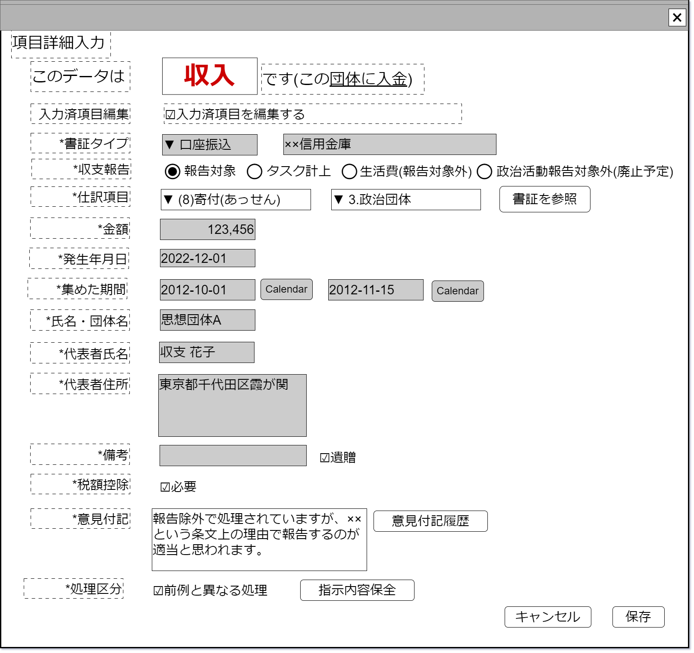

# 収入データ編集【表示画面】設計書

## 状態：フィールド要素はほぼ確定(実装しながら修正)

## 1.目的

収入項目データの編集

## 2. 構成コンポーネント

1. 独自フィールド

## 3. 画面イメージ

### 3.1 画面イメージ

### 3.2 画面イメージ(項番)

## 4. フィールド要素一覧

| 番号 |      論理名      |        タイプ        |      活性／表示      |                                         内容                                         |
| ---- | ---------------- | -------------------- | -------------------- | ------------------------------------------------------------------------------------ |
| 1    | 書証タイプ       | セレクトボタン       | 非活性               | 書証タイプを表示すること                                                             |
| 1    | 書証詳細         | インプットテキスト   | 非活性               | 書証の詳細を表示すること                                                             |
| 1    | 収支報告ボタン   | ラジオボタン         | 活性                 | 収支報告選択入力を受け付けること                                                     |
| 1    | 生活費ボタン     | ラジオボタン         | 活性                 | 収支報告外(生活費)選択入力を受け付けること                                           |
| 1    | 政治活動収支報告 | ラジオボタン         | 活性                 | 政治活動収支報告外選択入力を受け付けること                                           |
| 1    | 収支仕訳大項目   | セレクトボタン       | 活性                 | 収支仕訳(大項目)選択を受け付けること                                                 |
| 1    | 収支仕訳枝項目   | セレクトボタン       | 活性                 | 収支仕訳(枝別れ項目)選択を受け付けること                                             |
| 1    | 書証参照ボタン   | ボタン               | 活性                 | アクション一覧参照                                                                   |
| 1    | 取引金額         | インプットテキスト   | 非活性               | 取引金額を表示すること                                                               |
| 1    | 発生日           | インプットカレンダー | 非活性               | 発生日を表示すること                                                                 |
| 1    | 集めた期間開始日 | インプットカレンダー | 活性 表示／非表示 | 選択された項目が期間入力を必要とする場合に表示 期間の開始日を表示すること         |
| 1    | 集めた期間終了日 | インプットカレンダー | 活性 表示／非表示 | 選択された項目が期間入力を必要とする場合に表示 期間の終了日を表示すること         |
| 1    | 氏名・団体名称   | インプットテキスト   | 活性 表示／非表示 | 選択された項目が氏名・名称入力を必要とする場合に表示 名称を表示すること           |
| 1    | 氏名名称         | インプットテキスト   | 活性 表示／非表示 | 選択された項目が団体の名称とその氏名入力を必要とする場合に表示 氏名を表示すること |
| 1    | 団体住所         | テキストエリア       | 活性 表示／非表示 | 選択された項目が団体の住所入力を必要とする場合に表示 団体の住所を表示すること     |
| 1    | 備考             | テキストエリア       | 活性 表示／非表示 | 備考を表示すること                                                                   |
| 1    | 遺贈有無         | チェックボックス     | 活性 表示／非表示 | 値が`1:有`の場合には備考に『「遺贈」』と記入され、記入チェックがされること           |
| 1    | 税額控除有無     | チェックボックス     | 活性 表示／非表示 | 税額控除の有無入力を受け付けること                                                   |
| 1    | 意見付記         | チェックボックス     | 活性                 | 最新の意見付記の入力を受け付けること                                                 |
| 1    | 履歴参照ボタン   | ボタン               | 活性                 | アクション一覧参照                                                                   |
| 1    | 前例と異なる処理 | チェックボックス     | 活性                 | この処理が前例と異なっていることの入力を受け付けること                               |
| 1    | 指示内容保全     | ボタン               | 活性                 | アクション一覧参照                                                                   |

### 4.1 仕訳大項目

 |                   論理名                   | 区分(値) |
 | ------------------------------------------ | -------- |
 | 機関誌の発行その他                         | 3        |
 | 借入金                                     | 4        |
 | 本部または支部からの交付金                 | 5        |
 | その他の収入                               | 6        |
 | 寄付                                       | 7        |
 | 寄付のうちあっせんによるもの               | 8        |
 | 政党匿名寄付                               | 9        |
 | 特定パーティー                             | 10       |
 | 政治資金パーティー                         | 11       |
 | 政治資金パーティーのうちあっせんによるもの | 12       |

### 4.2 仕訳枝項目

 |   様式    | 小項目の値 |      論理名      |
 | --------- | ---------- | ---------------- |
 | 7,8,11,12 | 1          | 個人             |
 | 7,8,11,12 | 2          | 法人その他の団体 |
 | 7,8,11,12 | 3          | 政治団体         |

## 5.アクション一覧

| 番号 |       論理名       | タイプ | 活性／表示 |                                                          内容                                                           |
| ---- | ------------------ | ------ | ---------- | ----------------------------------------------------------------------------------------------------------------------- |
| 1    | 証票参照ボタン     | ボタン | 活性       | 結びつく証票を別エリアで表示すること ※TODO 別コンポーネントかリンクしてタブで表示かは今後検討する                   |
| 1    | 履歴参照ボタン     | ボタン | 活性       | このデータの履歴を参照できるコンポーネントを表示すること ※TODO 意見の付記のみの参照か編集履歴かは別途決定後修正する |
| 1    | 指示内容保全ボタン | ボタン | 活性       | ファイルアップロードストレージコンポーネントを表示すること                                                              |
| 1    | すでに入力済内容編集チェック | チェックボタン | 活性       | 下記参照                                                                                                                |

### 5.1 すでに入力済内容編集チェック

目的：仕訳項目など議論の余地がある項目でなく、発行日・取引金額・取引相手など不変であるはずの項目を編集している作業を抽出する

- `true`選択時
  -　書証タイプを活性とすること
  -　取引金額を活性とすること
  -　発生日を活性とすること
  -　取引相手名を活性とすること
  -　取引相手住所を活性とすること

- `false`選択時
  -　書証タイプを非活性と呼び出し時のデータに復元すること
  -　取引金額を非活性と呼び出し時のデータに復元すること
  -　発生日を非活性と呼び出し時のデータに復元すること
  -　取引相手名を非活性と呼び出し時のデータに復元すること
  -　取引相手住所を非活性と呼び出し時のデータに復元すること

## 6. 収入情報インターフェイス

BalancesheetIncomeInfoInterface

|         論理名         |      物理名      |             型              |                                       説明(例)                                       |
| ---------------------- | ---------------- | --------------------------- | ------------------------------------------------------------------------------------ |
| 書証Id                 | 物理名           | String                      | 書証を一意に識別するId                                                               |
| 書証識別コード         | 物理名           | Long                        | 編集履歴を把握するための識別コード                                                   |
| 書証区分               | 物理名           | Integer                     | 例示「1:口座振り込み」「2:領収書(レシート)」                                         |
| 入力済項目編集区分     | 物理名           | Boolean                     | 例示「false:自動入力部分を編集していない」「true:自動入力部分を編集している」        |
| 収支報告区分           | 物理名           | Integer                     | 収支報告選択入力を受け付けること                                                     |
| 様式仕訳区分           | 物理名           | Integer                     | 収支仕訳(大項目)選択を受け付けること                                                 |
| 様式仕訳枝項目区分     | 物理名           | Integer                     | 収支仕訳(枝別れ項目)選択を受け付けること                                             |
| 取引金額               | 物理名           | Long                        | 取引金額を表示すること                                                               |
| 発生日                 | 物理名           | LocalDate                   | 発生日を表示すること                                                                 |
| 集めた期間開始日       | 物理名           | LocalDate                   | 選択された項目が期間入力を必要とする場合に表示 期間の開始日を表示すること         |
| 集めた期間終了日       | 物理名           | LocalDate                   | 選択された項目が期間入力を必要とする場合に表示 期間の終了日を表示すること         |
| 氏名・団体名称         | 物理名           | String                      | 選択された項目が氏名・名称入力を必要とする場合に表示 名称を表示すること           |
| 氏名名称               | 物理名           | String                      | 選択された項目が団体の名称とその氏名入力を必要とする場合に表示 氏名を表示すること |
| 団体住所               | 物理名           | String                      | 選択された項目が団体の住所入力を必要とする場合に表示 団体の住所を表示すること     |
| 備考                   | 物理名           | String                      | 備考を表示すること                                                                   |
| 税額控除有無           | 物理名           | Boolean                     | 税額控除の有無入力を受け付けること                                                   |
| 意見付記               | 物理名           | String                      | 最新の意見付記の入力を受け付けること                                                 |
| 前例と異なる処理フラグ | 物理名           | Boolean                     | この処理が前例と異なっていることの入力を受け付けること                               |
| 保全証票リスト         | listSaveShohyoId | ArrayLst<保全証票Id:String> | この証票に関連した証票をストレージに保存した時に発行された、一意に証票を識別するId   |

## 7. 連携

子コンポーネントを持たないため親／子での通信を行わない
