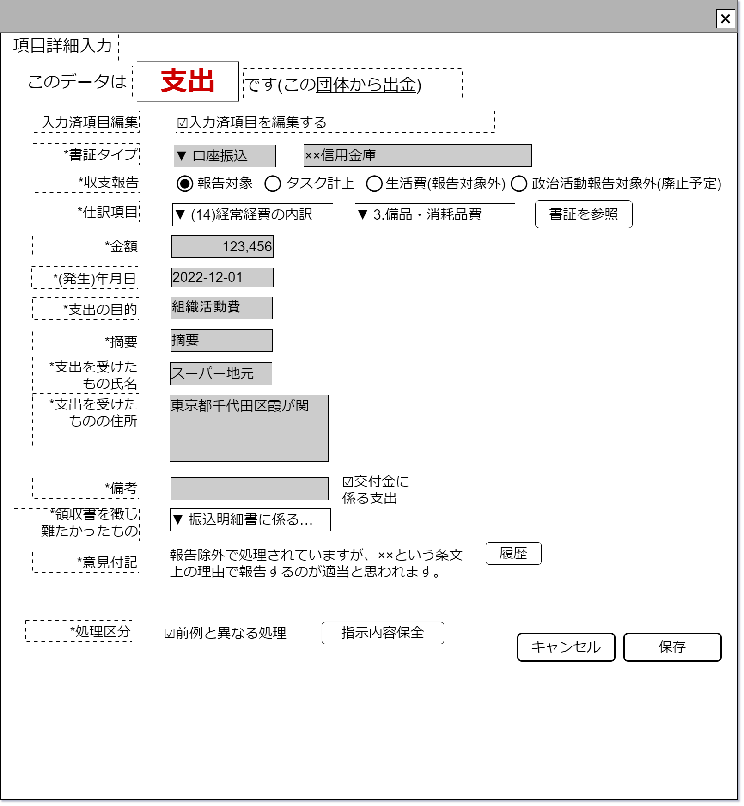

# 支出データ編集【表示画面】設計書

## 状態：フィールド要素はほぼ確定(実装しながら微修正)

## 1.目的

支出項目データの編集

## 2. 構成コンポーネント

1. 独自フィールド

## 3. 画面イメージ

### 3.1 画面イメージ

### 3.2 画面イメージ(項番)

## 4. フィールド要素一覧

| 番号 |           論理名           |        タイプ        |          活性／表示          |                                                              内容                                                              |
| ---- | -------------------------- | -------------------- | ---------------------------- | ------------------------------------------------------------------------------------------------------------------------------ |
| 1    | 書証タイプ                 | インプットテキスト   | 非活性                       | 書証タイプを表示すること                                                                                                       |
| 1    | すでに入力済編集区分       | チェックボタン       | 活性                         | アクションリスト参照                                                                                                           |
| 1    | 収支報告ボタン             | ラジオボタン         | 活性                         | 収支報告選択入力を受け付けること                                                                                               |
| 1    | 生活費ボタン               | ラジオボタン         | 活性                         | 収支報告外(生活費)選択入力を受け付けること                                                                                     |
| 1    | 政治活動収支報告           | ラジオボタン         | 活性                         | 政治活動収支報告外選択入力を受け付けること                                                                                     |
| 1    | 収支仕訳大項目             | セレクトボタン       | 活性                         | 収支仕訳(大項目)選択を受け付けること                                                                                           |
| 1    | 収支仕訳枝項目             | セレクトボタン       | 活性                         | 収支仕訳(枝別れ項目)選択を受け付けること                                                                                       |
| 1    | 書証参照ボタン             | ボタン               | 活性                         | アクション一覧参照                                                                                                             |
| 1    | 取引金額                   | インプットテキスト   | 活性／非活性                 | 取引金額を表示すること                                                                                                         |
| 1    | 発生日                     | インプットカレンダー | 活性／非活性                 | 発生日を表示すること                                                                                                           |
| 1    | 支出の目的                 | インプットテキスト   | 活性 表示／非表示         | 選択された仕訳項目が支出の目的を必要とする場合に表示 摘要の入力を受け付けること                                             |
| 1    | 摘要                       | インプットテキスト   | 活性 表示／非表示         | 選択された仕訳項目が摘要を必要とする場合に表示 摘要の入力を受け付けること                                                   |
| 1    | 支出を受けたものの名称     | インプットテキスト   | 活性／非活性 表示／非表示 | 選択された項目が支出を受けたものの名称入力を必要とする場合に表示 支出を受けたものの名称を表示すること                       |
| 1    | 支出を受けたものの住所     | テキストエリア       | 活性／非活性 表示／非表示 | 選択された項目が支出を受けたものの住所入力を必要とする場合に表示 支出を受けたものの名称を表示すること                       |
| 1    | 備考                       | テキストエリア       | 活性 表示／非表示         | 備考を表示すること                                                                                                             |
| 1    | 交付金に係る支出有無       | チェックボックス     | 活性 表示／非表示         | 交付金に係る支出であるかの有無入力を受け付けること                                                                             |
| 1    | 領収書を徴しがたかった支出 | セレクトボックス     | 活性 表示／非表示         | `0:選択なし`、`1:領収書を徴しがたかった支出の明細書を作成する`、`2:振込明細書に係る支出目的書を作成する`の選択を受け付けること |
| 1    | 意見付記                   | チェックボックス     | 活性                         | 最新の意見付記の入力を受け付けること                                                                                           |
| 1    | 履歴参照ボタン             | ボタン               | 活性                         | アクション一覧参照                                                                                                             |
| 1    | 前例と異なる処理           | チェックボックス     | 活性                         | この処理が前例と異なっていることの入力を受け付けること                                                                         |
| 1    | 指示内容保全               | ボタン               | 活性                         | アクション一覧参照                                                                                                             |

### 4.1.1 仕訳大項目一覧

 |             論理名             |  区分  |
 | ------------------------------ | ------ |
 | 経常経費の内訳                 | その14 |
 | 政治活動費                     | その15 |
 | 本部または支部に供与した交付金 | その16 |
 | 資産の内訳                     | その18 |

### 4.1.1 仕訳小項目一覧

 |  様式  | 小項目の値 |               論理名                |
 | ------ | ---------: | ----------------------------------- |
 | その14 |          2 | 光熱水費                            |
 | その14 |          3 | 備品・消耗品費                      |
 | その14 |          4 | 事務所費                            |
 | その15 |          1 | 組織活動費                          |
 | その15 |          2 | 選挙関係費                          |
 | その15 |          3 | 機関紙の、発行事業費                |
 | その15 |          4 | 宣伝事業費                          |
 | その15 |          5 | 政治資金パーティー開催事業費        |
 | その15 |          6 | その他の事業費                      |
 | その15 |          7 | 調査研究費                          |
 | その15 |          8 | 寄付交付金                          |
 | その15 |          9 | その他の経費                        |
 | その18 |         ア | 土地                                |
 | その18 |         イ | 建物                                |
 | その18 |         ウ | 地上権または借地権                  |
 | その18 |         エ | 取得価額が100万円を超える動産       |
 | その18 |         オ | 普通または当座でない預金(貯金)      |
 | その18 |         カ | 金銭信託                            |
 | その18 |         キ | 有価証券                            |
 | その18 |         ク | 出資による権利                      |
 | その18 |         ケ | 相手先ごとに残高100万円を超える貸付 |
 | その18 |         コ | 100万円を超える敷金                 |
 | その18 |         サ | 100万円を超える施設利用の権利       |
 | その18 |         シ | 相手先ごとに100万円を超える借入金   |

### 4.2 領収書を徴し難かったもの

 |                    論理名                    | 項目 |
 | -------------------------------------------- | ---- |
 | (無選択)                                     | 0    |
 | 領収書等を徴し難かった支出の明細書を作成する | 1    |
 | 振込明細書に係る支出目的書を作成する         | 2    |

## 5.アクション一覧

| 番号 |            論理名            |     タイプ     | 活性／表示 |                                                          内容                                                           |
| ---- | ---------------------------- | -------------- | ---------- | ----------------------------------------------------------------------------------------------------------------------- |
| 1    | 書証参照ボタン               | ボタン         | 活性       | 結びつく諸表を別エリアで表示すること ※TODO 別コンポーネントかリンクしてタブで表示かは今後検討する                   |
| 1    | 履歴参照ボタン               | ボタン         | 活性       | このデータの履歴を参照できるコンポーネントを表示すること ※TODO 意見の付記のみの参照か編集履歴化は別途決定後修正する |
| 1    | 指示内容保全ボタン           | ボタン         | 活性       | ファイルアップロード／ストレージコンポーネントを表示すること                                                              |
| 1    | 入力済内容編集チェック | チェックボタン | 活性       | 下記参照                                                                                                                |

### 5.1 入力済内容編集チェック

目的：仕訳項目など議論の余地がある項目でなく、発行日・取引金額・取引相手など不変であるはずの項目を編集している作業を抽出する

- `true`選択時
  -　書証タイプを活性とすること
  -　取引金額を活性とすること
  -　発生日を活性とすること
  -　取引相手名を活性とすること
  -　取引相手住所を活性とすること

- `false`選択時
  -　書証タイプを非活性とし、呼び出し時のデータに復元すること
  -　取引金額を非活性とし、呼び出し時のデータに復元すること
  -　発生日を非活性とし、呼び出し時のデータに復元すること
  -　取引相手名を非活性とし、呼び出し時のデータに復元すること
  -　取引相手住所を非活性とし、呼び出し時のデータに復元すること

## 6. 支出情報インターフェイス

OutcomeInfoInterface

|           論理名           |      物理名      |             型              |                                                            説明(例)                                                            |
| -------------------------- | ---------------- | --------------------------- | ------------------------------------------------------------------------------------------------------------------------------ |
| 政治団体Id                 | 物理名           | Long                        | 政治団体を一意に識別するId                                                                                                     |
| 政治団体名称               | 物理名           | String                      | 政治団体名称                                                                                                                   |
| 書証Id                     | 物理名           | String                      | 書証を一意に識別するId                                                                                                         |
| 書証識別コード             | 物理名           | Long                        | 編集履歴を把握するための識別コード                                                                                             |
| 書証名称                   | 物理名           | Long                        | 書証を説明した名称                                                                                                             |
| 入力済項目編集区分         | 物理名           | Boolean                     | 例示「false:自動入力部分を編集していない」「true:自動入力部分を編集している」                                                  |
| 書証区分                   | 物理名           | Integer                     | 例示「1:口座振り込み」「2:領収書(レシート)」                                                                                   |
| 収支報告区分               | 物理名           | Integer                     | 収支報告選択入力を受け付けること                                                                                               |
| 様式仕訳区分               | 物理名           | Integer                     | 収支仕訳(大項目)選択を受け付けること                                                                                           |
| 様式仕訳枝項目区分         | 物理名           | Integer                     | 収支仕訳(枝別れ項目)選択を受け付けること                                                                                       |
| 取引金額                   | 物理名           | Long                        | 取引金額を表示すること                                                                                                         |
| 発生日                     | 物理名           | LocalDate                   | 発生日を表示すること                                                                                                           |
| 支出の目的                 | 物理名           | String                      | 選択された仕訳項目が支出の目的を必要とする場合に表示 摘要の入力を受け付けること                                             |
| 摘要                       | 物理名           | String                      | 選択された仕訳項目が摘要を必要とする場合に表示 摘要の入力を受け付けること                                                   |
| 支出を受けたものの名称     | 物理名           | String                      | 選択された項目が支出を受けたものの名称入力を必要とする場合に表示 支出を受けたものの名称を表示すること                       |
| 支出を受けたものの住所     | 物理名           | String                      | 選択された項目が支出を受けたものの住所入力を必要とする場合に表示 支出を受けたものの名称を表示すること                       |
| 備考                       | 物理名           | String                      | 備考を表示すること                                                                                                             |
| 交付金に係る支出有無       | 物理名           | Integer                     | 交付金に係る支出であるかの有無入力を受け付けること                                                                             |
| 領収書を徴しがたかった支出 | 物理名           | Integer                     | `0:選択なし`、`1:領収書を徴しがたかった支出の明細書を作成する`、`2:振込明細書に係る支出目的書を作成する`の選択を受け付けること |
| 意見付記                   | 物理名           | String                      | 最新の意見付記の入力を受け付けること                                                                                           |
| 前例と異なる処理           | 物理名           | Boolean                     | この処理が前例と異なっていることの入力を受け付けること                                                                         |
| 保全証票リスト             | listSaveShohyoId | ArrayLst<保全証票Id:String> | この証票に関連した証票をストレージに保存した時に発行された、一意に証票を識別するId                                             |

## 7. 連携

子コンポーネントを持たないため親／子での通信を行わない
