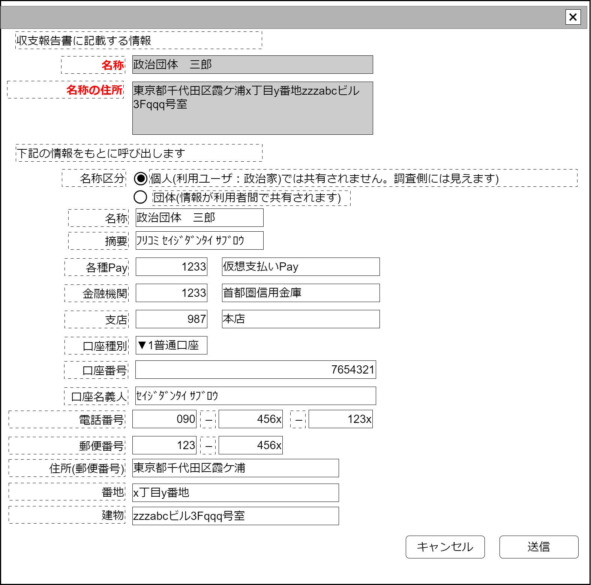

# 関係者編集【表示画面】設計書

## 状態：フィールド要素はほぼ確定(実装しながら微修正)

## 1.目的

政治資金収支報告書に記載する関係者情報の編集を行う

## 2. 構成コンポーネント

1. 政治家表示コンポーネント
2. 独自フィールド

### 2.1 繰り返し項目

なし

## 3. 画面イメージ

### 3.1 画面イメージ

### 3.2 画面イメージ(項番)

## 4. フィールド要素一覧

| 番号 |          論理名          |       タイプ       | 活性／表示 |                                                          内容                                                          |
| ---- | ------------------------ | ------------------ | ---------- | ---------------------------------------------------------------------------------------------------------------------- |
| 1    | 報告書記載名称           | インプットテキスト | 非活性     | 報告書に記載する名称を表示すること。下記検索条件入力欄と同じであること                                                 |
| 1    | 報告書記載住所           | テキストエリア     | 非活性     | 報告書に記載する住所を表示すること。下記検索条件入力欄(住所郵便番号、住所番地、住所肩書を結合したもの)と同じであること |
| 1    | 名称区分(個人)           | ラジオボタン       | 活性       | 名称が個人であることの入力を受け付けること                                                                             |
| 1    | 名称区分(団体)           | ラジオボタン       | 活性       | 名称が団体であることの入力を受け付けること                                                                             |
| 1    | 検索条件名称             | インプットテキスト | 活性       | 該当報告記載データの呼び出しに使用する名称の入力を受け付けること                                                       |
| 1    | 検索条件摘要             | インプットテキスト | 活性       | 該当報告記載データの呼び出しに使用する摘要の入力を受け付けること                                                       |
| 1    | 検索条件各種Payコード    | インプットテキスト | 活性       | 該当報告記載データの呼び出しに使用する金融機関コードの入力を受け付けること                                             |
| 1    | 検索条件各種Pay名称      | インプットテキスト | 活性       | 該当報告記載データの呼び出しに使用する金融機関名称の入力を受け付けること                                               |
| 1    | 検索条件金融機関コード   | インプットテキスト | 活性       | 該当報告記載データの呼び出しに使用する金融機関コードの入力を受け付けること                                             |
| 1    | 検索条件金融機関名称     | インプットテキスト | 活性       | 該当報告記載データの呼び出しに使用する金融機関名称の入力を受け付けること                                               |
| 1    | 検索条件支店コード       | インプットテキスト | 活性       | 該当報告記載データの呼び出しに使用する金融機関支店コードの入力を受け付けること                                         |
| 1    | 検索条件支店名称         | インプットテキスト | 活性       | 該当報告記載データの呼び出しに使用する金融機関支店名称の入力を受け付けること                                           |
| 1    | 検索条件口座種別区分     | セレクトボックス   | 活性       | 該当報告記載データの呼び出しに使用する口座種別区分の入力を受け付けること                                               |
| 1    | 検索条件口座番号         | インプットテキスト | 活性       | 該当報告記載データの呼び出しに使用する口座番号の入力を受け付けること                                                   |
| 1    | 検索条件口座名義人       | インプットテキスト | 活性       | 該当報告記載データの呼び出しに使用する口座名義人の入力を受け付けること                                                 |
| 1    | 検索条件電話番号市外局番 | インプットテキスト | 活性       | 該当報告記載データの呼び出しに使用する電話番号のうち市外局番の入力を受け付けること                                     |
| 1    | 検索条件電話番号局番     | インプットテキスト | 活性       | 該当報告記載データの呼び出しに使用する電話番号のうち局番の入力を受け付けること                                         |
| 1    | 検索条件電話番号番号     | インプットテキスト | 活性       | 該当報告記載データの呼び出しに使用する電話番号のうち番号の入力を受け付けること                                         |
| 1    | 検索条件郵便番号・前     | インプットテキスト | 活性       | 該当報告記載データの呼び出しに使用する郵便番号のうち前3桁の入力を受け付けること                                        |
| 1    | 検索条件郵便番号・後     | インプットテキスト | 活性       | 該当報告記載データの呼び出しに使用する郵便番号のうち後4桁の入力を受け付けること                                        |
| 1    | 検索条件住所             | インプットテキスト | 活性       | 該当報告記載データの呼び出しに使用する住所のうち郵便番号で呼び出せる範囲の入力を受け付けること                         |
| 1    | 検索条件住所番地         | インプットテキスト | 活性       | 該当報告記載データの呼び出しに使用する住所のうち郵便番号で呼び出せない番地の入力を受け付けること                       |
| 1    | 検索条件住所肩書         | インプットテキスト | 活性       | 該当報告記載データの呼び出しに使用する住所肩書の入力を受け付けること                                                   |

## 4.1 口座種別

全銀フォーマットに準ずる固定値

 |    論理名    | 値  |
 | ------------ | --- |
 | 普通預金     | 1   |
 | 当座預金     | 2   |
 | 納税準備預金 | 3   |
 | 貯蓄預金     | 4   |
 | 通知預金     | 5   |
 | 定期預金     | 6   |
 | 積立定期預金 | 7   |
 | 定期積金     | 8   |
 | その他       | 9   |

## 5.アクション一覧

| 番号 |   論理名   | タイプ | 活性／表示 |               内容               |
| ---- | ---------- | ------ | ---------- | -------------------------------- |
| 1    | キャンセル | ボタン | 活性       | 押下時：入力内容を破棄すること。 |
| 1    | 保存       | ボタン | 活性       | 押下時：入力内容を保存すること。 |

## 6. サンプルテンプレートインターフェイス

※記載内容『呼び出し検索条件』であるので、下手に編集されないように教示するべきと考える

SampleTemplateInterface

 |           論理名           |              物理名               |      型       |                                                     説明(例)                                                     |
 | -------------------------- | --------------------------------- | ------------- | ---------------------------------------------------------------------------------------------------------------- |
 | 報告書記載名称             | publishName                       | String        | 例示：「政治団体　三郎」                                                                                         |
 | 報告書記載住所             | publishAddress                    | String        | 例示：「東京都千代田区霞が関10番地100号成金ビル 401号室」                                                        |
 | 名称区分(個人)             | meishouKbnPerson                  | String        | 1:個人                                                                                                           |
 | 名称区分(団体)             | meishouKbnOrg                     | String        | 2: 団体                                                                                                          |
 | 検索条件名称               | relationConditionName             | String        | 例示：「政治団体　三郎」                                                                                         |
 | 検索条件摘要               | relationConditionDigest           | String／null  | 例示：「ﾌﾘｺﾐ ｾｲｼﾞﾀﾞﾝﾀｲ ｻﾌﾞﾛｳ」                                                                                   |
 | 検索条件各種Payコード      | relationConditionFinancialPayCode | String        | 例示：「政治団体　三郎」                                                                                         |
 | 検索条件各種Pay名称        | relationConditionFinancialPayName | String        | 例示：「2次元コード専用Pay」                                                                                     |
 | 検索条件金融機関コード     | relationConditionFinancialOrgCode | String／null  | 例示：「0002」                                                                                                   |
 | 検索条件金融機関名称       | relationConditionFinancialOrgName | String／null  | 例示：「首都圏市民銀行」※TODO 金融機関コードから名称を取得出来るAPIが利用できれば取得する(該当フィールド非活性)       |
 | 検索条件支店コード         | relationConditionBranchCode       | String／null  | 例示：「123」                                                                                                    |
 | 検索条件支店名称           | relationConditionBranchName       | String／null  | 例示：「番町皿屋敷支店」※TODO 金融機関コードから名称を取得出来るAPIが利用できれば取得する(該当フィールド非活性) |
 | 検索条件口座種別区分       | relationConditionAccountType      | String／null  | 口座区分。下記参照                                                                                               |
 | 検索条件口座番号           | relationConditionAccountNo        | String／null  | 例示：「1233」                                                                                                   |
 | 検索条件口座名義人         | relationConditionAccountHas       | String／null  | 例示：「ｾｲｼﾞﾀﾞﾝﾀｲ ｻﾌﾞﾛｳ」                                                                                        |
 | 検索条件電話番号・市外局番 | relationConditionTel1             | Integer／null | 例示：「123」                                                                                                    |
 | 検索条件電話番号・局番     | relationConditionTel2             | Integer／null | 例示：「4567」                                                                                                   |
 | 検索条件電話番号・番号     | relationConditionTel3             | Integer／null | 例示：「080」                                                                                                    |
 | 検索条件郵便番号・前       | relationConditionPostal1          | Integer／null | 例示：「123」                                                                                                    |
 | 検索条件郵便番号・後       | relationConditionPostal2          | Integer／null | 例示：「456x」                                                                                                   |
 | 検索条件住所               | relationConditionAddressPost      | String        | 例示：「東京都千代田区霞が関」                                                                                   |
 | 検索条件住所番地           | relationConditionAddressBlock     | String        | 例示：「10番地100号」                                                                                            |
 | 検索条件住所肩書           | relationConditionAddressBuiding   | String／null  | 例示：「成金ビル 401号室」                                                                                       |

## 7. 連携

子コンポーネントを持たないため親／子での連携通信を行わない
