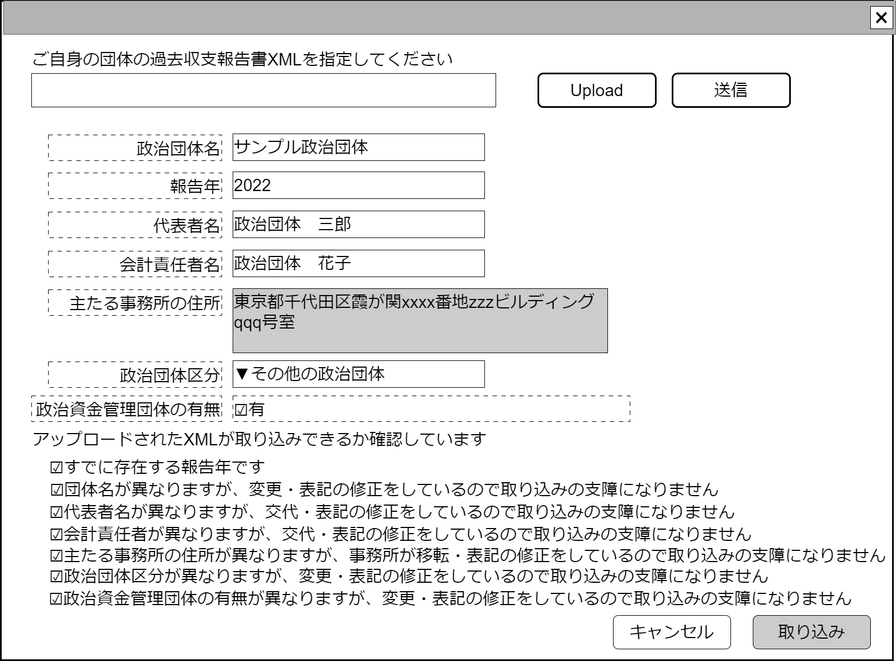

# 過去政治資金収支報告書取込み処理【表示画面】設計書

## 状態：フィールド要素はほぼ確定(実装しながら修正)

## 1.目的

ユーザの過去の政治資金収支報告書を取り込み、データベースに記録すること

## 2. 構成コンポーネント

1. 政治資金報告書アップロードコンポーネント
2. 独自フィールド

### 2.1 繰り返し項目

なし

## 3. 画面イメージ

### 3.1 画面イメージ

### 3.2 画面イメージ(項番)

## 4. フィールド要素一覧

| 番号 |                         論理名                         |      タイプ      |  活性／表示  |                                                                                              内容                                                                                              |
| ---- | ------------------------------------------------------ | ---------------- | ------------ | ---------------------------------------------------------------------------------------------------------------------------------------------------------------------------------------------- |
| 1    | 報告年存在有無                                         | チェックボックス | 非活性       | 報告年がすでに存在するかどうかを表示する。存在する報告年に含まれる場合は`false`、含まれない場合は`true`                                                                                        |
| 1    | 報告年存在有無ラベル                                   | ラベル           | 非活性       | すでに存在する報告年をアップロードしようとしている場合は「すでに存在する報告年です」。存在しない場合は「アップロードできる報告年です」と表示する                                               |
| 1    | 取込み前確認・政治団体名称相違存在                     | チェックボックス | 活性／非活性 | 政治団体名称が異なる場合は活性かつ初期値を`false`とする。異ならない場合は非活性、初期値を`true`とする                                                                                          |
| 1    | 取込み前確認・政治団体名称相違存在ラベル               | ラベル           | 非活性       | 政治団体名称が一致する場合は「政治団体名が合致します」、一致しない場合は「政治団体名が異なりますが、交代表記の修正があったので取り込みの支障になりません」とする                               |
| 1    | 取込み前確認・団体代表者姓名相違存在                   | チェックボックス | 活性／非活性 | 団体代表者姓名が異なる場合は活性かつ初期値を`false`とする。異ならない場合は非活性、初期値を`true`とする                                                                                        |
| 1    | 取込み前確認・団体代表者姓名相違存在ラベル             | ラベル           | 非活性       | 団体代表者姓名が一致する場合は「団体代表者の名前が合致します」、一致しない場合は「代表者の名前が異なりますが、交代表記の修正があったので取り込みの支障になりません」とする                     |
| 1    | 取込み前確認・団体会計責任者姓名相違存在               | チェックボックス | 活性／非活性 | 団体会計責任者姓名が異なる場合は活性かつ初期値を`false`とする。異ならない場合は非活性、初期値を`true`とする                                                                                    |
| 1    | 取込み前確認・団体会計責任者姓名相違存在ラベル         | ラベル           | 非活性       | 団体会計責任者姓名がが一致する場合は表示を「団体会計責任者の名前が合致します」、一致しない場合は「会計責任者の名前が異なりますが、交代表記の修正があったので取り込みの支障になりません」とする |
| 1    | 取込み前確認・政治団体主たる事務所の住所相違存在       | チェックボックス | 活性／非活性 | 政治団体主たる事務所の住所が異なる場合は活性かつ初期値を`false`とする。異ならない場合は非活性、初期値を`true`とする                                                                            |
| 1    | 取込み前確認・政治団体主たる事務所の住所相違存在ラベル | ラベル           | 非活性       | 政治団体主たる事務所の住所がが一致する場合は表示を「主たる事務所の住所が合致します」一致しない場合は「主な住所が異なりますが、交代表記の修正があったので取り込みの支障になりません」とする     |
| 1    | 取込み前確認・政治団体区分相違存在                     | チェックボックス | 活性／非活性 | 政治団体区分が異なる場合は活性かつ初期値を`false`とする。異ならない場合は非活性、初期値を`true`とする                                                                                          |
| 1    | 取込み前確認・政治団体区分相違存在ラベル               | ラベル           | 非活性       | 政治団体区分がが一致する場合は表示を「政治団体区分が合致します」、一致しない場合は「政治団体区分が異なりますが、交代表記の修正があったので取り込みの支障になりません」とする                   |
| 1    | 取込み前確認・資金管理団体の有無相違存在               | チェックボックス | 活性／非活性 | 資金管理団体の有無が異なる場合は活性かつ初期値を`false`とする。異ならない場合は非活性、初期値を`true`とする                                                                                    |
| 1    | 取込み前確認・資金管理団体の有無相違存在ラベル         | ラベル           | 非活性       | 資金管理団体の有無がが一致する場合は表示を「資金管理団体の有無が合致します」、一致しない場合は「資金管理団体の有無が異なりますが、交代表記の修正があったので取り込みの支障になりません」とする |

## 5.アクション一覧

| 番号 |   論理名   | タイプ | 活性／表示 |                                                                                     内容                                                                                     |
| ---- | ---------- | ------ | ---------- | ---------------------------------------------------------------------------------------------------------------------------------------------------------------------------- |
| 1    | キャンセル | ボタン | 活性       | 押下時：入力内容を破棄すること                                                                                                                                               |
| 1    | 保存       | ボタン | 活性       | 押下時： 1. 取り込み承諾インターフェイスのデータをデータベースに登録する。 2. 正常に承諾内容が登録出来たらアップロードされ、変換されたデータをデータベースに保存する。 |

## 6. サンプルテンプレートインターフェイス

CheckConmbinedBalancesheetInterface

 |              論理名              |           物理名            |   型    |          説明(例)          |
 | -------------------------------- | --------------------------- | ------- | -------------------------- |
 | 政治団体Id                       | politicianOrganizationId    | Long    | 政治団体を識別する一意のId |
 | 報告年                           | submissionYear              | Integer | 報告年                     |
 | 取込み前確認・報告年             | isConfirmYear               | boolean | 0/1の2項値                 |
 | 取込み前確認・代表者名           | isConfirmDelegate               | boolean | 0/1の2項値                 |
 | 取込み前確認・会計責任者名       | isConfirmAccountOfiicerName | boolean | 0/1の2項値                 |
 | 取込み前確認・主たる事務所の住所 | isConfirmOfficeAddress      | boolean | 0/1の2項値                 |
 | 取込み前確認・政治団体区分       | isConfirmRepresentName      | boolean | 0/1の2項値                 |
 | 取込み前確認・政治資金団体の有無 | isConfirmHasOtherOrg        | boolean | 0/1の2項値                 |

## 7. 連携

**TODO** 子画面からの入力変更内容を都度受信する
