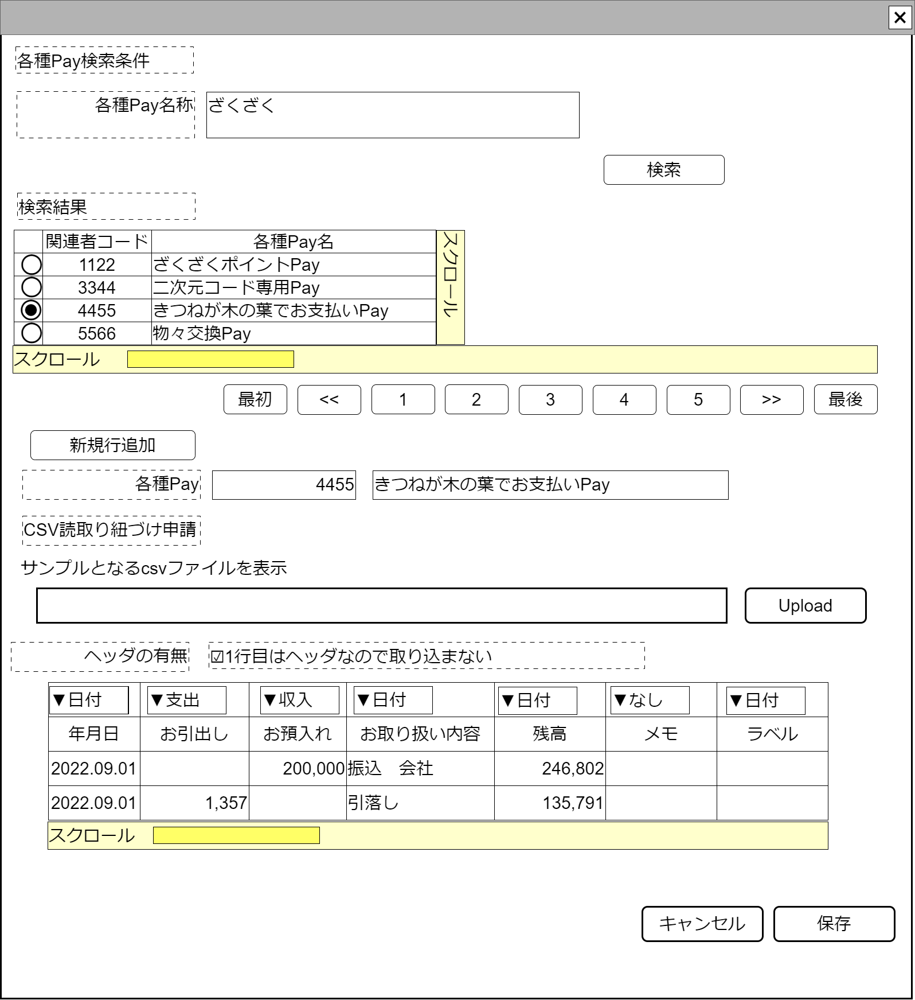

# 各種Pay登録【表示画面】設計書

## 状態：仕様未確定(実装不可)

## 1.目的

各種Payに必要な属性を入力し保存する

## 2. 構成コンポーネント

1. [各種Pay検索コンポーネント](../../common/front/search_various_pay/search_various_pay.md)
2. 独自フィールド
3. [csv読取り仕様申請入力コンポーネント](../../common/front/input_institution_csv/input_institution_csv.md)

### 2.1 繰り返し項目

なし

## 3. 画面イメージ

### 3.1 画面イメージ

### 3.2 画面イメージ(項番)

## 4. フィールド要素一覧

| 番号 |               論理名                |       タイプ       | 活性／表示 |                              内容                               |
| ---- | ----------------------------------- | ------------------ | ---------- | --------------------------------------------------------------- |
| 1    | 各種Pay検索コンポーネント           | コンポーネント     | 表示       | 各種Pay検索コンポーネントを表示すること                         |
| 1    | 新規行追加ボタン                    | ボタン             | 活性       | 入力内容を新規データと設定する入力を受け付けること              |
| 1    | 各種Pay同一識別コード               | インプットテキスト | 非活性     | 各種Pay同一識別コードを表示すること                             |
| 1    | 各種Pay同一識別コード               | インプットテキスト | 活性       | 各種Pay名称の入力を受け付けること                               |
| 1    | csv読取り仕様申請入力コンポーネント | コンポーネント     | 表示       | csv読取り仕様申請入力コンポーネントコンポーネントを表示すること |

## 5.アクション一覧

| 番号 |      論理名      | タイプ | 活性／表示 |                        内容                        |
| ---- | ---------------- | ------ | ---------- | -------------------------------------------------- |
| 1    | キャンセル       | ボタン | 活性       | 押下時：入力内容を破棄すること                     |
| 1    | 保存             | ボタン | 活性       | 押下時：入力内容を保存すること                     |
| 1    | 新規行追加ボタン | ボタン | 活性       | 入力内容を新規データと設定する入力を受け付けること |

## 6. 各種Pay保存インターフェイス

FinacialVariousPayInterface

 |        論理名         |         論理名         |               型                |                    説明(例)                     |
 | --------------------- | ---------------------- | ------------------------------- | ----------------------------------------------- |
 | 各種PayId             | finacialVariousPayId   | Long                            | 各種Payを識別する一意のId                       |
 | 各種同一識別          | finacialVariousPayCode | Integer                         | 変更にかかわらず、各種Payを同一と識別するコード |
 | 各種名称              | finacialVariousPayName | String                          | 各種Pay名称                                     |
 | csv読み取り仕様リスト | listReadingPattern     | List\<ReadCsvPatternInterface\> | この各種Payが保持するcsv読取り仕様リスト        |

## 7. 連携

TODO 入力内容が変更された都度、入力チェックを行い親画面に変更内容を通知する`emit[sendSampleTemplateInterface(data,errorInfo)]`
