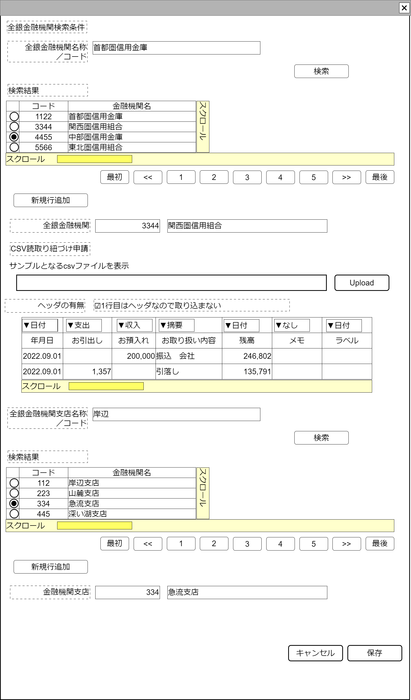

# 全銀金融機関入力【表示画面】設計書

## 状態：仕様未確定(実装不可)

## 1.目的

全銀金融機関の属性を保存する

## 2. 構成コンポーネント

1. [全銀金融機関支店なし検索コンポーネント](../../common/front/search_zengin_org/search_zengin_org.md)
2. 独自フィールド
3. [csv読取り仕様申請入力コンポーネント](../../common/front/input_institution_csv/input_institution_csv.md)
4. [全銀金融機関支店のみ検索コンポーネント](../../common/front/search_zengin_branch/search_zengin_branch.md)

### 2.1 繰り返し項目

なし

## 3. 画面イメージ

### 3.1 画面イメージ

### 3.2 画面イメージ(項番)

## 4. フィールド要素一覧

| 番号 |                 論理名                 |       タイプ       | 活性／表示 |                              内容                              |
| ---- | -------------------------------------- | ------------------ | ---------- | -------------------------------------------------------------- |
| 1    | 全銀金融機関支店なし検索コンポーネント | コンポーネント     | 表示       | 全銀金融機関支店なし検索コンポーネントを表示すること           |
| 1    | 新規行追加(金融機関)                   | ボタン             | 活性       | 押下時：入力内容を新規データとして取り扱う入力を受け付けること |
| 1    | 全銀金融機関コード                     | インプットテキスト | 活性       | 全銀金融機関コードの入力を受け付けること                       |
| 1    | 全銀金融機関名称                       | インプットテキスト | 活性       | 全銀金融機関名称の入力を受け付けること                         |
| 1    | csv読取り仕様申請入力コンポーネント    | コンポーネント     | 表示       | csv読取り仕様申請入力コンポーネントを表示すること              |
| 1    | 全銀金融機関支店のみ検索コンポーネント | コンポーネント     | 表示       | 全銀金融機関支店のみ検索コンポーネントを表示すること           |
| 1    | 新規行追加(金融機関支店)               | ボタン             | 活性       | 押下時：入力内容を新規データとして取り扱う入力を受け付けること |
| 1    | 全銀金融機関支店コード                 | インプットテキスト | 活性       | 全銀金融機関支店コードの入力を受け付けること                   |
| 1    | 全銀金融機関支店名称                   | インプットテキスト | 活性       | 全銀金融機関支店名称の入力を受け付けること                     |

## 5.アクション一覧

| 番号 |          論理名          | タイプ | 活性／表示 |                              内容                              |
| ---- | ------------------------ | ------ | ---------- | -------------------------------------------------------------- |
| 1    | キャンセル               | ボタン | 活性       | 押下時：入力内容を破棄すること                                 |
| 1    | 保存                     | ボタン | 活性       | 押下時：入力内容を保存すること                                 |
| 1    | 新規行追加(金融機関)     | ボタン | 活性       | 押下時：入力内容を新規データとして取り扱う入力を受け付けること |
| 1    | 新規行追加(金融機関支店) | ボタン | 活性       | 押下時：入力内容を新規データとして取り扱う入力を受け付けること |

## 6. 全銀金融機関インターフェイス

ZenginFinacialOrgInterface

 |         論理名         |        論理名         |                    型                    |                 説明(例)                 |
 | ---------------------- | --------------------- | ---------------------------------------- | ---------------------------------------- |
 | 全銀金融機関コード     | zenginFinacialOrgCode | String                                   | 全銀金融機関コード                       |
 | 全銀金融機関名称       | zenginFinacialOrgName | String                                   | 全銀金融機関名称                         |
 | 全銀金融機関支店リスト | listZenginBranch      | List\<ZenginFinacialOrgBranchInterface\> | 全銀金融機関支店リスト                   |
 | csv読み取り仕様リスト  | listReadingPattern    | List\<ReadCsvPatternInterface\>          | この各種Payが保持するcsv読取り仕様リスト |

### 6.1 全銀金融機関支店インターフェイス

ZenginFinacialOrgBranchInterface

 |         論理名         |        論理名         |   型   |        説明(例)        |
 | ---------------------- | --------------------- | ------ | ---------------------- |
 | 全銀金融機関支店コード | zenginFinacialOrgCode | String | 全銀金融機関支店コード |
 | 全銀金融機関支店名称   | zenginFinacialOrgName | String | 全銀金融機関支店名称   |

## 7. 連携

TODO 入力内容が変更された都度、入力チェックを行い親画面に変更内容を通知する`emit[sendSampleTemplateInterface(data,errorInfo)]`
