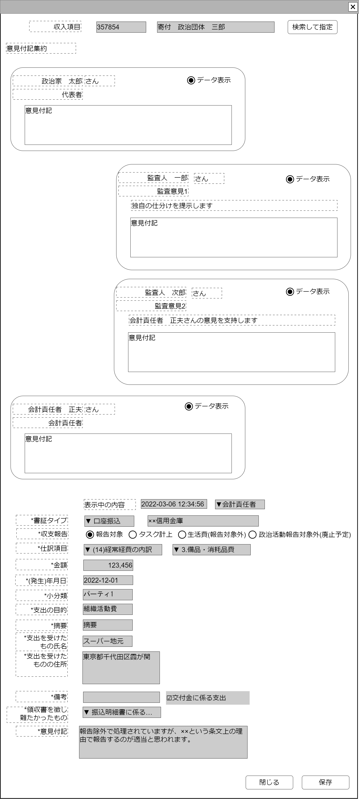

# 意見付記調整(支出)【表示画面】設計書

## 状態：実装中(収入項目など連動した項目で修正の発生の可能性はあるが、骨格は変更なし)

※各自個別に用意したチャット等でさらに詰めた意見交換を行うと想定されるが、意見交換の過程を別作業なく保全すべきとの意見がある場合は、ブラウザ別タブでのチャット機能提供も検討する

## 1.目的

指定の収支報告書支出項目について、政治団体所属ユーザ、オンブズマン(監査人)間で仕訳について意見集約し、修正する

## 2. 構成コンポーネント

1. 独自フィールド
2. [意見付記表示支出コンポーネント](../../common/front/show_meeting_adjust_outcome/show_meeting_adjust_outcome.md)
3. [支出項目編集入力コンポーネント](../edit_outcome/edit_outcome.md)
4. [支出項目検索コンポーネント](../../common/front/#)

### 2.1 繰り返し項目

なし

## 3. 画面イメージ

### 3.1 画面イメージ

### 3.2 画面イメージ(項番)

## 4. フィールド要素一覧

| 番号 |             論理名             |       タイプ       | 活性／表示 |                        内容                        |
| ---- | ------------------------------ | ------------------ | ---------- | -------------------------------------------------- |
| 1    | 支出項目同一識別コード         | インプットテキスト | 非活性     | 収支報告書支出項目同一識別コードを表示すること     |
| 1    | 支出項目項目名称               | インプットテキスト | 非活性     | 収支報告書支出項目項目名称を表示すること           |
| 1    | 検索して指定ボタン             | ボタン             | 活性       | 押下時：収支報告書支出項目検索コンポーネントを表示すること |
| 1    | 意見付記表示支出コンポーネント | コンポーネント     | 表示       | 意見付記表示支出コンポーネントを表示すること       |
| 1    | 支出項目編集入力コンポーネント | コンポーネント     | 表示       | 支出項目編集入力コンポーネントを表示すること       |

## 5.アクション一覧

| 番号 |       論理名       | タイプ | 活性／表示 |                                         内容                                         |
| ---- | ------------------ | ------ | ---------- | ------------------------------------------------------------------------------------ |
| 1    | 検索して指定ボタン | ボタン | 活性       | 押下時：収支報告書検索コンポーネントを表示すること                                   |
| 1    | キャンセル         | ボタン | 活性       | 押下時：入力内容を破棄すること                                                       |
| 1    | 保存               | ボタン | 活性       | 押下時：収入項目編集入力コンポーネントに表示された値を最新としてデータを保存すること |

## 6. 意見付記表示支出インターフェイス

AuditOpinionOutcomeInterface

[意見付記表示支出コンポーネント](../../common/front/show_meeting_adjust_outcome/show_meeting_adjust_outcome.md)を参照

## 7. 連携

意見付記(支出)リストの各行を意見付記表示支出コンポーネントに`props[auditOutcomeDto:AuditOpinionOutcomeInterface]`で引き渡す
意見付記(支出)リストのうち選択されたデータを支出項目編集入力コンポーネント`props[balancesheetOutcomeDto:[balancesheetOutcomeInterface]`で引き渡す
