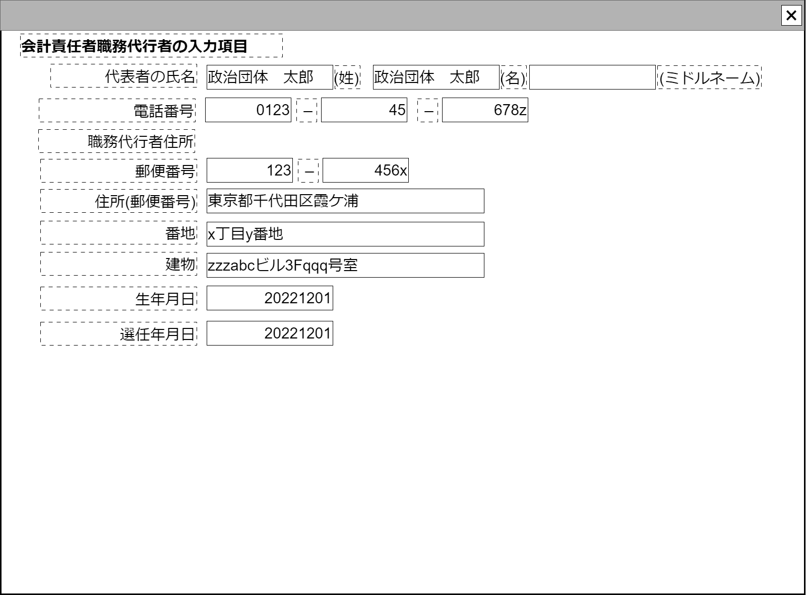

# 責任者編集【コンポーネント】

## 状態：微修正があれば適宜修正

## 1. 目的

会計責任者などの住所、生年月日など詳細な責任者情報を入力できること

## 2. 構成コンポーネント

なし

## 3.　画面イメージ

### 3.1 注釈なし

### 3.2 参照情報を含む

## 4.フィールド要素一覧

| 番号 |       論理名       | 物理名 |        タイプ        |         活性／表示         |                                                                                    内容                                                                                    |
| ---: | ------------------ | ------ | -------------------- | -------------------------- | -------------------------------------------------------------------------------------------------------------------------------------------------------------------------- |
|    1 | 用途フラグ         | 物理名 | フラグ(0/1)          | 非表示                     | 親コンポーネントから引き継いだ、この画面の用途。政治資金収支報告書:0、政治団体設立届:1                                                                                     |
|    1 | コンポーネント名称 | 物理名 | テキスト             | 非活性                     | 親コンポーネントから引き継いだ表示用の名称が表示されること                                                                                                                 |
|    1 | 氏名－姓           | 物理名 | テキスト             | 非活性                     | 氏名の姓が入力されること                                                                                                                                                   |
|    2 | 氏名－名           | 物理名 | テキスト             | 非活性                     | 氏名の名が入力されること                                                                                                                                                   |
|    3 | 氏名－ミドルネーム | 物理名 | テキスト             | 非活性                     | 氏名のミドルネームが入力されること                                                                                                                                         |
|    4 | 電話番号1          | 物理名 | テキスト(半角数字)   | 活性                       | 電話番号市外局番が入力されること                                                                                                                                           |
|    5 | 電話番号2          | 物理名 | テキスト(半角数字)   | 活性                       | 電話番号の局番が入力されること                                                                                                                                             |
|    6 | 電話番号3          | 物理名 | テキスト(半角数字)   | 活性                       | 電話番号の番号部分が入力されること                                                                                                                                         |
|    1 | 住所名称           | 物理名 | テキスト             | 非活性 表示/非表示      | 親コンポーネントから引き継いだ表示用の名称が表示されること 用途フラグが「政治資金収支報告書」の場合は非表示                                                             |
|    2 | 住所名称付加ラベル | 物理名 | ラベル               | - 表示/非表示           | 「住所」と表示されること 用途フラグが「政治資金収支報告書」の場合は非表示                                                                                               |
|    1 | 住所タイトル       | 物理名 | ラベル               | - 表示/非表示           | 「主たる事務所の所在地」と表示されること 用途フラグが「政治資金収支報告書」の場合は非表示                                                                               |
|    2 | 郵便番号1          | 物理名 | テキスト(半角数字)   | 活性 表示/非表示        | 郵便番号前3ケタが入力されること  用途フラグが「政治資金収支報告書」の場合は非表示                                                                                       |
|    3 | 郵便番号2          | 物理名 | テキスト(半角数字)   | 活性 表示/非表示        | 郵便番号後4桁が入力されること 用途フラグが「政治資金収支報告書」の場合は非表示                                                                                          |
|    4 | 住所(郵便番号)     | 物理名 | テキスト             | 活性/非活性 表示/非表示 | 郵便番号から呼び出し可能な住所が表示されること 郵便番号から正常に住所が呼び出しされたら非活性 長押しされたら活性 用途フラグが「政治資金収支報告書」の場合は非表示 |
|    5 | 番地               | 物理名 | テキスト             | 非活性 表示/非表示      | 住所の番地が入力されること 用途フラグが「政治資金収支報告書」の場合は非表示                                                                                             |
|    6 | 建物               | 物理名 | テキスト             | 非活性 表示/非表示      | 住所の建物が入力されること 用途フラグが「政治資金収支報告書」の場合は非表示                                                                                             |
|    7 | 生年月日           | 物理名 | テキスト(yyyy/MM/dd) | 活性 表示/非表示        | 政治団体組織の年月が入力されること 用途フラグが「政治資金収支報告書」の場合は非表示                                                                                     |
|    7 | 選任年月日         | 物理名 | テキスト(yyyy/MM/dd) | 活性 表示/非表示        | 政治団体組織の年月が入力されること 用途フラグが「政治資金収支報告書」の場合は非表示                                                                                     |

## 5.アクション

なし

## 6.責任者編集インターフェース

収支報告書解析表示一覧するときに表示する満たすべき要素。

PersonManagerInterface

|       論理名       | 物理名 |          型          |                 説明(例)                 |
| ------------------ | ------ | -------------------- | ---------------------------------------- |
| 氏名－姓           | 物理名 | String               | 例示：「政治団体」                       |
| 氏名－名           | 物理名 | String               | 例示：「太郎」                           |
| 氏名－ミドルネーム | 物理名 | String               | 例示：「ミカエル」                       |
| 電話番号－市外局番 | 物理名 | String               | 例示：「0123」                           |
| 電話番号－局番     | 物理名 | String               | 例示：「45」                             |
| 電話番号－番号     | 物理名 | String               | 例示：「9999」                           |
| 郵便番号1          | 物理名 | テキスト(半角数字)   | 例示：「123」                            |
| 郵便番号2          | 物理名 | テキスト(半角数字)   | 例示：「456」                            |
| 住所(郵便番号)     | 物理名 | テキスト             | 例示：「東京都千代田区霞が関」           |
| 番地               | 物理名 | テキスト             | 例示：「3番地4号」                       |
| 建物               | 物理名 | テキスト             | 例示：「マンション政治資金406棟301号室」 |
| 生年月日           | 物理名 | テキスト(yyyy/MM/dd) | 例示：「2022/12/01」                     |
| 選任年月日         | 物理名 | テキスト(yyyy/MM/dd) | 例示：「2022/12/01」                     |

## 7. 連携

入力内容が変更された都度、入力チェックを行い変更内容を通知する`emit(sendPersonManagerInterface)`
