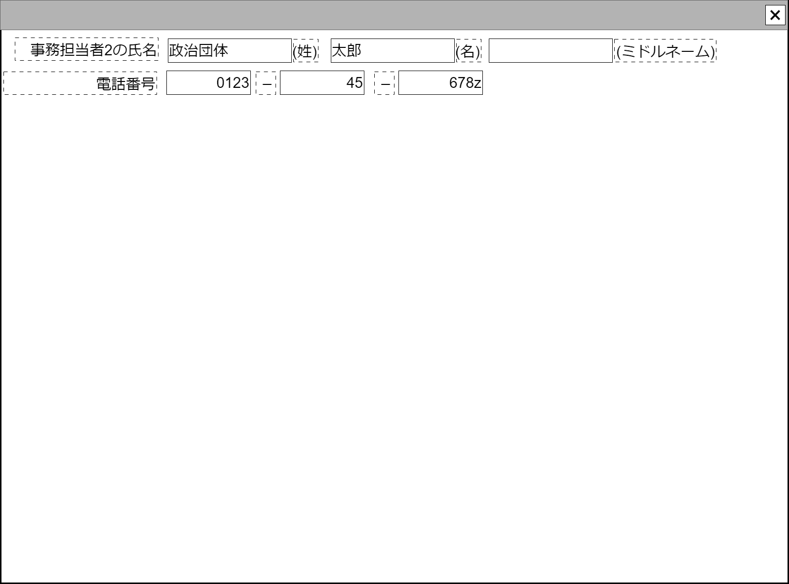

# 担当者(作業者)編集【コンポーネント】

## 状態：微修正があれば適宜修正

## 1. 目的

事務担当者の電話番号と氏名を入力できること

## 2. 構成コンポーネント

なし

## 3. 画面イメージ

### 3.1 注釈なし

### 3.2 参照情報を含む

## 4.フィールド要素一覧

### 4.1 独自フィールド

| 番号 |            論理名            | 物理名 |       タイプ       | 活性／表示 |                            内容                            |
| ---: | ---------------------------- | ------ | ------------------ | ---------- | ---------------------------------------------------------- |
|    1 | コンポーネント名称           | 物理名 | テキスト           | 非活性     | 親コンポーネントから引き継いだ表示用の名称が表示されること |
|    1 | 氏名－姓                     | 物理名 | テキスト           | 非活性     | 氏名の姓が入力されること                                   |
|    2 | 氏名－名                     | 物理名 | テキスト           | 非活性     | 氏名の名が入力されること                                   |
|    3 | 氏名－ミドルネーム           | 物理名 | テキスト           | 非活性     | 氏名のミドルネームが入力されること                         |
|    4 | 電話番号1                    | 物理名 | テキスト(半角数字) | 活性       | 電話番号市外局番が入力されること                           |
|    5 | 電話番号2                    | 物理名 | テキスト(半角数字) | 活性       | 電話番号の局番が入力されること                             |
|    6 | 電話番号3                    | 物理名 | テキスト(半角数字) | 活性       | 電話番号の番号部分が入力されること                         |

## 5.アクション

なし

## 6.担当者インターフェース

PersonWorkerInterface

 |       論理名       | 物理名 |   型   |       説明(例)        |
 | ------------------ | ------ | ------ | --------------------- |
 | 氏名－姓           | 物理名 | String | 例示：「政治団体」    |
 | 氏名－名           | 物理名 | String | 例示：「太郎」        |
 | 氏名－ミドルネーム | 物理名 | String | 例示：「ミカエル」    |
 | 電話番号－市外局番 | 物理名 | String | 例示：「0123」        |
 | 電話番号－局番     | 物理名 | String | 例示：「45」          |
 | 電話番号－番号     | 物理名 | String | 例示：「9999」        |

## 7. 連携

入力変更都度、入力チェックを行い変更内容を親に通知する`emit(sendPersonWorkerInterface)`
