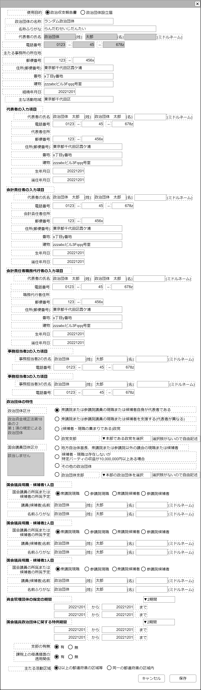

# 政治団体編集【画面】

## 状態：微修正があれば適宜修正

## 1. 目的

政治団体設立届の提出または政治資金収支報告書に使用する政治団体基礎情報の編集

## 2. 構成コンポーネント

1. 独自フィールド
2. 責任者コンポーネント(代表者用)
3. 責任者コンポーネント(会計責任者用)
4. 責任者コンポーネント(会計責任者職務代行者／事務担当者1用)
5. 担当者コンポーネント(事務担当者2用)
6. 担当者コンポーネント(事務担当者3用)
7. 政治団体コンポーネント
8. 独自フィールド

## 3.画面イメージ

### 3. 注釈なし

### 3. 参照情報を含む

## 4.フィールド要素一覧

### 1. 独自フィールド

| 番号 |          論理名          | 物理名 |        タイプ        | 活性／表示  |                                                          内容                                                          |
| ---: | ------------------------ | ------ | -------------------- | ----------- | ---------------------------------------------------------------------------------------------------------------------- |
|    1 | 用途入力                 | 物理名 | ボタン               | 活性        | 押下時：必要コンポーネントに変更を伝達すること。                                                                       |
|    1 | 政治団体                 | 物理名 | テキスト             | 活性        | 政治団体名称が入力されること                                                                                           |
|    2 | 政治団体ふりがな         | 物理名 | テキスト             | 活性        | 政治団体名称ふりがなが入力されること                                                                                   |
|    1 | 代表者氏名－姓           | 物理名 | テキスト             | 非活性      | 政治団体代表者氏名の姓が入力されること                                                                                 |
|    2 | 代表者氏名－名           | 物理名 | テキスト             | 非活性      | 政治団体代表者氏名の姓が入力されること                                                                                 |
|    3 | 代表者氏名－ミドルネーム | 物理名 | テキスト             | 非活性      | 政治団体代表者氏名のミドルネームが入力されること                                                                       |
|    4 | 電話番号1                | 物理名 | テキスト(半角数字)   | 活性        | 電話番号市外局番が入力されること                                                                                       |
|    5 | 電話番号2                | 物理名 | テキスト(半角数字)   | 活性        | 電話番号の局番が入力されること                                                                                         |
|    6 | 電話番号3                | 物理名 | テキスト(半角数字)   | 活性        | 電話番号の番号部分が入力されること                                                                                     |
|    1 | 住所タイトル             | 物理名 | ラベル               | -           | 「主たる事務所の所在地」と表示されること                                                                               |
|    2 | 郵便番号1                | 物理名 | テキスト(半角数字)   | 活性        | 郵便番号前3ケタが入力されること                                                                                        |
|    3 | 郵便番号2                | 物理名 | テキスト(半角数字)   | 活性        | 郵便番号後4桁が入力されること                                                                                          |
|    4 | 住所(郵便番号)           | 物理名 | テキスト             | 活性/非活性 | 郵便番号から呼び出し可能な住所が表示されること 郵便番号から正常に住所が呼び出しされたら非活性 長押しされたら活性 |
|    5 | 番地                     | 物理名 | テキスト             | 非活性      | 住所の番地が入力されること                                                                                             |
|    6 | 建物                     | 物理名 | テキスト             | 非活性      | 住所の建物が入力されること                                                                                             |
|    7 | 組織年月日               | 物理名 | テキスト(yyyy/MM/dd) | 活性        | 政治団体組織の年月が入力されること                                                                                     |

### 2.責任者コンポーネント(代表者用)

[責任者コンポーネント](person_manager.md)を参照

### 3.責任者コンポーネント(会計責任者用)

[責任者コンポーネント](person_manager.md)を参照

### 4.責任者コンポーネント(会計責任者職務代行者／事務担当者1用)

[責任者コンポーネント](person_manager.md)を参照

### 5.担当者コンポーネント(事務担当者2用)

[担当者コンポーネント](person_worker.md)を参照

### 6.担当者コンポーネント(事務担当者3用)

[担当者コンポーネント](person_worker.md)を参照

### 7.政治団体特性コンポーネント

[政治団体特性コンポーネント](political_organization_features.md)を参照

### 8.独自フィールド(ボタン)

| 番号 |   論理名   | タイプ | 活性／表示 |               内容               |
| ---- | ---------- | ------ | ---------- | -------------------------------- |
| 1    | キャンセル | ボタン | 活性       | 押下時：入力内容を破棄すること。 |
| 5    | 保存       | ボタン | 活性       | 押下時：入力内容を保存すること   |

## 7.アクション

| 番号 |   論理名   | タイプ | 活性／表示 |               内容               |
| ---- | ---------- | ------ | ---------- | -------------------------------- |
| 1    | キャンセル | ボタン | 活性       | 押下時：入力内容を破棄すること。 |
| 5    | 保存       | ボタン | 活性       | 押下時：入力内容を保存すること   |

## 6.政治団体編集インターフェース

収支報告書解析表示一覧するときに表示する満たすべき要素。

BalancesheetAnlysisViewInterface

 |    論理名    |      論理名      |   型   |                                  説明(例)                                  |
 | ------------ | ---------------- | ------ | -------------------------------------------------------------------------- |
 | 計算式       | calkExplain      | String | 例示：収支報告除外比率=1年分の書証における報告除外件数/1年分の書証明細件数 |
 | 指標タイトル | calkTitle        | String | 例示：収支報告除外比率                                                     |
 | 計算結果     | calkAnswer       | Double | 例示：33.7                                                                 |
 | 計算結果単位 | calkAnswer       | String | 例示：%                                                                    |
 | 判定詳細     | calkresultDetail | String | 例示：生活資金と政治資金が完全に分離しています                             |

## 7. 連携

子からの通知を受け取る。子コンポーネントの表示／非表示はあっても増減はないのでref化はない
