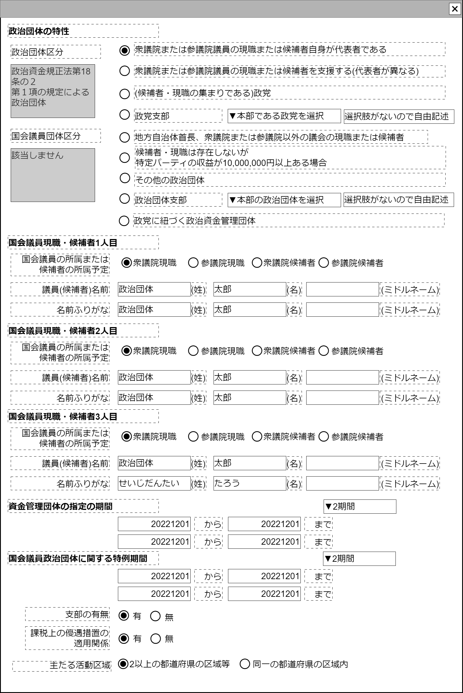

# 政治団体特性編集【コンポーネント】

## 状態：作成中(実装不可)

## 1. 目的

政治団体の特性を入力できること

## 2. 構成コンポーネント

1. 独自フィールド
2. 国会議員コンポーネント(1人目用)
3. 国会議員コンポーネント(2人目用)
4. 国会議員コンポーネント(3人目用)
5. 団体期間コンポーネント(資金団体用)
6. 団体期間コンポーネント(国会議員政治団体に関する特例用)
7. 独自フィールド

## 3. 画面イメージ

### 3.1 注釈なし

### 3.2 参照情報を含む

## 4.フィールド要素一覧

### 1.独自フィールド

| 番号 |                論理名                | 物理名 |     タイプ     | 活性／表示 |                                        内容                                        |
| ---: | ------------------------------------ | ------ | -------------- | ---------- | ---------------------------------------------------------------------------------- |
|    1 | 政治団体の区分                       | 物理名 | セレクトボタン | 非活性     | ラジオボタンに合わせて定数が設定されること                                         |
|    3 | 国会議員の区分                       | 物理名 | セレクトボタン | 非活性     | ラジオボタンに合わせて定数が設定されること                                         |
|    5 | 国会議員現職または候補者が代表者選択 | 物理名 | ラジオボタン   | 活性       | 代表者が国会議員の場合選択されること 選択時に挙動変更                           |
|    6 | 国会議員現職または候補者を支援選択   | 物理名 | ラジオボタン   | 活性       | 国会議員現職または候補者を支援している団体の場合選択されること 選択時に挙動変更 |
|    7 | 政党選択                             | 物理名 | ラジオボタン   | 活性       | 団体が政党の場合選択されること 選択時に挙動変更                                 |
|    8 | 政党支部選択                         | 物理名 | ラジオボタン   | 活性       | 団体が政党の支部の場合選択されること 選択時に挙動変更                           |
|    9 | 首長または地方議会議員選択           | 物理名 | ラジオボタン   | 活性       | 代表者が首長または地方議会議員の場合選択されること 選択時に挙動変更             |
|   10 | パーティ収益1千万円以上選択          | 物理名 | ラジオボタン   | 活性       | パーティ収益が1千万円以上の場合選択されること 選択時に挙動変更                  |
|   11 | その他の政治団体選択                 | 物理名 | ラジオボタン   | 活性       | その他の政治団体の場合選択されること 選択時に挙動変更                           |
|   12 | 政治団体支部選択                     | 物理名 | ラジオボタン   | 活性       | 政治団体支部が国会議員の場合選択されること 選択時に挙動変更                     |
|   12 | 政党に紐づく資金管理団体             | 物理名 | ラジオボタン   | 活性       | 政党の資金管理団体 選択時に挙動変更                                             |

### 2.国会議員コンポーネント(1人目)

[国会議員コンポーネント](member_of_parliament.md)を参照。

### 3.国会議員コンポーネント(2人目)

[国会議員コンポーネント](member_of_parliament.md)を参照。

### 4.国会議員コンポーネント(3人目)

[国会議員コンポーネント](member_of_parliament.md)を参照。

### 5.団体期間コンポーネント(資金管理団体)

[団体期間コンポーネント](period_organization.md)を参照。

### 6.団体期間コンポーネント(国会議員特例適用)

[団体期間コンポーネント](period_organization.md)を参照。
ラジオボタンの値が1(代表者が国会議員)または2(国会議員またはその候補者を支援)であるときのみ表示

### 7.独自フィールド

| 番号 |           論理名           | 物理名 |    タイプ    |  活性／表示  |                                                          内容                                                          |
| ---: | -------------------------- | ------ | ------------ | ------------ | ---------------------------------------------------------------------------------------------------------------------- |
|    1 | 支部の有無                 | 物理名 | ラジオボタン | 活性         | 支部の有無が入力されること 1:有、0:無                                                                               |
|    2 | 課税上の優遇措置の適用関係 | 物理名 | ラジオボタン | 活性         | 課税上の優遇措置の適用関係が入力されること 1:有、0:無                                                               |
|    3 | 主たる活動地域             | 物理名 | ラジオボタン | 非活性／活性 | 主たる活動地域が入力されること 初期状態は値が0で非活性あること 1:2以上の都道府県の区域 0:同一の都道府県の区域 |

## 5.アクション

### 1.衆議院または参議院議員の現職または候補者自身が代表者である

政治団体の区分に値5:その他の政治団体を設定する。紐づく名称は「その他の政治団体」
国会議員の区分に値1:議員または候補者自身を設定する。紐づく名称は「政治資金規正法第十九条の七第一項に係る国会議員関係団体」

a. 国会議員コンポーネント1人目を表示状態にすること
b. 国会議員コンポーネント2人目を表示状態にすること
c. 国会議員コンポーネント3人目を表示状態にすること
d. 団体期間コンポーネント国会議員政治団体の特例期間適用を表示状態にすること
e. 「主たる地域」を値1:「2以上の都道府県の区域等」とする(国会のある東京と地元)

### 2.衆議院または参議院議員の現職または候補者を支援する(代表者が異なる)

政治団体の区分に値5:その他の政治団体を設定する。紐づく名称は「その他の政治団体」
国会議員の区分に値2:議員または候補者が代表ではない団体を設定する。紐づく名称は「政治資金規正法第十九条の七第二項に係る国会議員関係団体」

a. 国会議員コンポーネント1人目を表示状態にすること
b. 国会議員コンポーネント2人目を表示状態にすること
c. 国会議員コンポーネント3人目を表示状態にすること
d. 団体期間コンポーネント国会議員政治団体の特例期間適用を表示状態にすること
e. 「主たる地域」を値1:「2以上の都道府県の区域等」とする(国会のある東京と地元)

### 3.(候補者・現職の集まりである)政党

政治団体の区分に値1:政党を設定する。紐づく名称は「政党」
国会議員の区分に値0:指定なしを設定する。紐づく名称は空文字

a. 国会議員コンポーネント1人目を非表示状態にすること(1.2に記載した本コンポーネントの状態を変更するような情報を発信しない)
b. 国会議員コンポーネント2人目を非表示状態にすること
c. 国会議員コンポーネント3人目を非表示状態にすること
d. 団体期間コンポーネント国会議員政治団体の特例期間適用を非表示状態にすること

### 4.政党支部

政治団体の区分に値2:政党支部を設定する。紐づく名称は「政党支部」
国会議員の区分に値0:指定なしを設定する。紐づく名称は空文字

a. 国会議員コンポーネント1人目を非表示状態にすること(1.2に記載した本コンポーネントの状態を変更するような情報を発信しない)
b. 国会議員コンポーネント2人目を非表示状態にすること
c. 国会議員コンポーネント3人目を非表示状態にすること
d. 団体期間コンポーネント国会議員政治団体の特例期間適用を非表示状態にすること
e. 政党本部選択セレクトボタンを活性にすること
f. 政党本部選択セレクトボタンで「選択肢不在」が選択された時、政党本部自由記述テキストボックスが活性であること

### 5.地方自治体首長、衆議院または参議院以外の議会の現職または候補者

政治団体の区分に値5:その他の政治団体を設定する。紐づく名称は「その他の政治団体」
国会議員の区分に値0:指定なしを設定する。紐づく名称は空文字

a. 国会議員コンポーネント1人目を非表示状態にすること(1.2に記載した本コンポーネントの状態を変更するような情報を発信しない)
b. 国会議員コンポーネント2人目を非表示状態にすること
c. 国会議員コンポーネント3人目を非表示状態にすること
d. 団体期間コンポーネント国会議員政治団体の特例期間適用を非表示状態にすること

### 6.候補者・現職は存在しないが特定パーティの収益が10,000,000円以上ある場合

政治団体の区分に値4:特定パーティの収益が1千万円以上を設定する。紐づく名称は「政治資金規正法第十八条の二第一項の規定による政治団体」
国会議員の区分に値0:指定なしを設定する。紐づく名称は空文字

a. 国会議員コンポーネント1人目を非表示状態にすること(1.2に記載した本コンポーネントの状態を変更するような情報を発信しない)
b. 国会議員コンポーネント2人目を非表示状態にすること
c. 国会議員コンポーネント3人目を非表示状態にすること
d. 団体期間コンポーネント国会議員政治団体の特例期間適用を非表示状態にすること

### 7.その他の政治団体

政治団体の区分に値5:その他の政治団体を設定する。紐づく名称は「その他の政治団体」
国会議員の区分に値0:指定なしを設定する。紐づく名称は空文字

a. 国会議員コンポーネント1人目を非表示状態にすること(1.2に記載した本コンポーネントの状態を変更するような情報を発信しない)
b. 国会議員コンポーネント2人目を非表示状態にすること
c. 国会議員コンポーネント3人目を非表示状態にすること
d. 団体期間コンポーネント国会議員政治団体の特例期間適用を非表示状態にすること

### 8.政治団体支部

政治団体の区分に値6:その他の政治団体支部を設定する。紐づく名称は「その他の政治団体の支部」
国会議員の区分に値0:指定なしを設定する。紐づく名称は空文字

a. 国会議員コンポーネント1人目を非表示状態にすること
b. 国会議員コンポーネント2人目を非表示状態にすること
c. 国会議員コンポーネント3人目を非表示状態にすること
d. 団体期間コンポーネント国会議員政治団体の特例期間適用を非表示状態にすること
e. 政治団体本部選択セレクトボタンを活性にすること
f. 政治団体本部選択セレクトボタンで「選択肢不在」が選択された時、政治団体自由記述テキストボックスが活性であること

### 9.政治資金団体

政治団体の区分に値3:政治資金団体を設定する。紐づく名称は「政治資金団体」
国会議員の区分に値0:指定なしを設定する。紐づく名称は空文字

a. 国会議員コンポーネント1人目を非表示状態にすること
b. 国会議員コンポーネント2人目を非表示状態にすること
c. 国会議員コンポーネント3人目を非表示状態にすること
d. 団体期間コンポーネント国会議員政治団体の特例期間適用を非表示状態にすること

## 6.政治団体特徴インターフェース

PoliticalOrganizationFeaturesInterface

|           論理名           | 物理名 |       型       |                         説明(例)                          |
| -------------------------- | ------ | -------------- | --------------------------------------------------------- |
| 政治団体の区分             | 物理名 | セレクトボタン | 例示「」                                                  |
| 国会議員の区分             | 物理名 | セレクトボタン | 例示「」                                                  |
| 支部の有無                 | 物理名 | ラジオボタン   | 例示「」1:有、0:無                                        |
| 課税上の優遇措置の適用関係 | 物理名 | ラジオボタン   | 例示「」1:有、0:無                                        |
| 主たる活動地域             | 物理名 | ラジオボタン   | 例示「」1:2以上の都道府県の区域 0:同一の都道府県の区域 |

## 7. 連携

入力変更都度、入力チェックを行い変更内容を親に通知する`emit(sendPoliticalOrganizationFeaturesInterface)`
子コンポーネントからの通知を中継する
