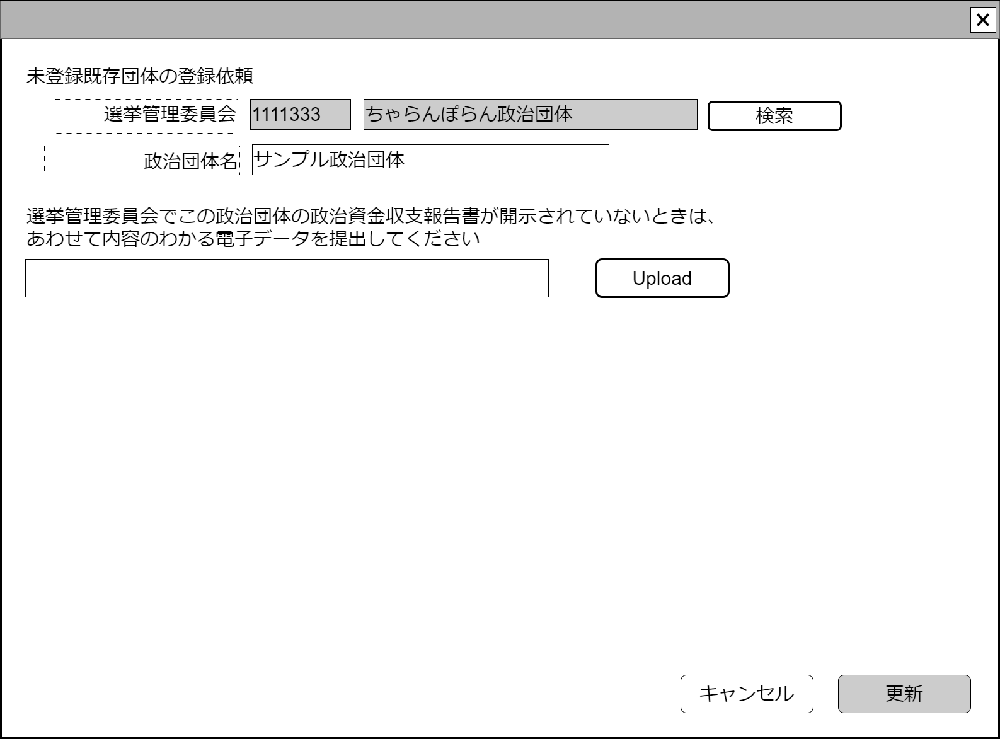

# 未登録政治団体登録申請【表示画面】設計書

## 状態：Mockデータによる仮実装

## 1.目的

このシステムに未登録の政治団体を登録するよう申請する

## 2. 構成コンポーネント

1. [選挙管理委員会検索](./#)コンポーネント
2. [一般ファイルアップロード](./#)コンポーネント
3. 独自フィールド

### 2.1 繰り返し項目

なし

## 3. 画面イメージ

### 3.1 画面イメージ

### 3.2 画面イメージ(項番)

## 4. フィールド要素一覧

| 番号 |            論理名            |       タイプ       | 活性／表示 |                          内容                          |
| ---- | ---------------------------- | ------------------ | ---------- | ------------------------------------------------------ |
| 1    | 選挙管理委員会同一識別コード | インプットテキスト | 非活性     | 選挙管理委員会同一識別コードを表示すること             |
| 1    | 選挙管理委員会名称           | インプットテキスト | 非活性     | 選挙管理委員会名称を表示すること。                     |
| 1    | 選挙管理委員会検索           | ボタン             | 活性       | 押下時：選挙管理委員会検索コンポーネントを表示すること |
| 1    | 政治団体名称                 | インプットテキスト | 活性       | 政治団体名称を表示すること                             |
| 1    | 一般ファイルアップロード     | コンポーネント     | 表示       | 一般ファイルアップロードコンポーネントを表示すること   |

## 5.アクション一覧

| 番号 |       論理名       | タイプ | 活性／表示 |                          内容                          |
| ---- | ------------------ | ------ | ---------- | ------------------------------------------------------ |
| 1    | キャンセル         | ボタン | 活性       | 押下時：入力内容を破棄すること                         |
| 1    | 更新               | ボタン | 活性       | 押下時：入力内容を保存すること                         |
| 1    | 選挙管理委員会検索 | ボタン | 活性       | 押下時：選挙管理委員会検索コンポーネントを表示すること |

## 6. 未登録団体登録申請インターフェイス

NotRegistOrganizaionInterface

 |          論理名          |           論理名           |                型                |        説明(例)        |
 | ------------------------ | -------------------------- | -------------------------------- | ---------------------- |
 | 選挙管理委員会最小限情報 | electionCommissionLeastDto | ElectionCommissionLeastInterface | 申請選挙管理委員会情報 |
 | 書証情報                 | saveStorageResultDto       | SaveStorageResultInterface       | 保存済書証情報         |
 | 政治団体名称             | politiclOrganizationName   | String                           | 登録申請する政治団体名 |

## 7. 連携

TODO 選挙管理委員会検索コンポーネントとの連携記述
TODO ファイルアップロードコンポーネントとの連携記述
