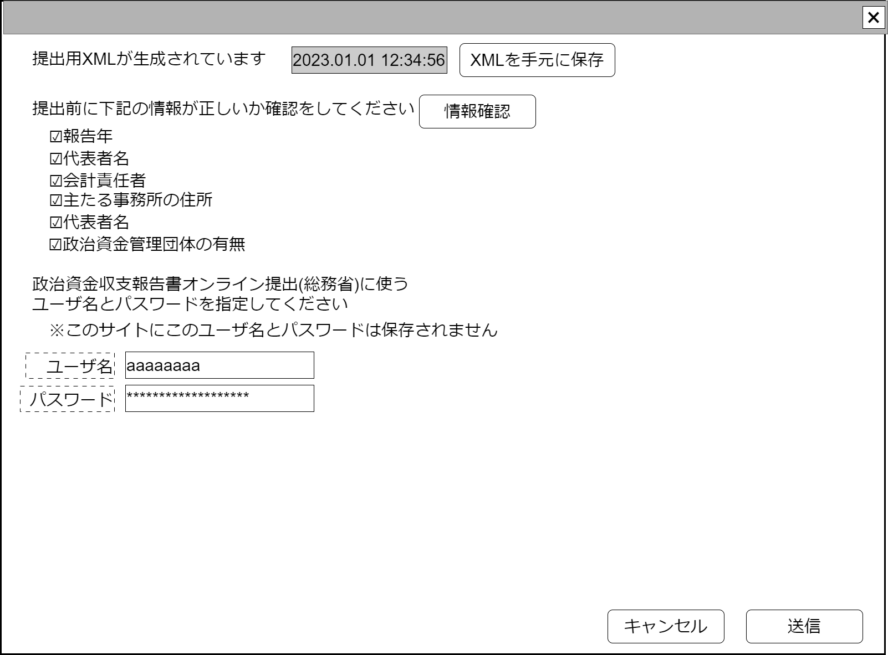

# 発行政治資金収支報告書データ提出(総務省)【表示画面】設計書

## 状態：フィールド要素はほぼ確定(実装しながら修正)

※データ受信側との折衝が必要

## 1.目的

発行した政治資金収支報告書XMLを総務省データ受付APIへ送信する

## 2. 構成コンポーネント

1. 独自フィールド

## 3. 画面イメージ

### 3.1 画面イメージ

### 3.2 画面イメージ(項番)

## 4. フィールド要素一覧

| 番号 |             論理名             |       タイプ       | 活性／表示 |                                             内容                                             |
| ---- | ------------------------------ | ------------------ | ---------- | -------------------------------------------------------------------------------------------- |
| 1    | 収支発行時刻                   | インプットテキスト | 非活性     | 発行タイムスタンプを表示すること。                                                           |
| 1    | XMLダウンロード                | ボタン             | 活性       | アクションリスト参照。                                                                       |
| 1    | 情報確認                       | ボタン             | 活性       | アクションリスト参照                                                                         |
| 1    | 送信前確認・報告年             | チェックボックス   | 活性       | 送信前に報告年が正しいことを確認した入力を受け付けること。：初期表示は`0:無`                 |
| 1    | 送信前確認・代表者名           | チェックボックス   | 活性       | 送信前に代表者名が正しいことを確認した入力を受け付けること。：初期表示は`0:無`               |
| 1    | 送信前確認・会計責任者名       | チェックボックス   | 活性       | 送信前に会計責任者名が正しいことを確認した入力を受け付けること。：初期表示は`0:無`           |
| 1    | 送信前確認・主たる事務所の住所 | チェックボックス   | 活性       | 送信前に主たる事務所の住所が正しいことを確認した入力を受け付けること。：初期表示は`0:無`     |
| 1    | 送信前確認・政治団体区分       | チェックボックス   | 活性       | 送信前に政治団体区分が正しいことを確認した入力を受け付けること。：初期表示は`0:無`           |
| 1    | 送信前確認・政治資金団体の有無 | チェックボックス   | 活性       | 送信前に政治資金管理団体の有無が正しいことを確認した入力を受け付けること。：初期表示は`0:無` |
| 1    | オンライン提出ユーザ名         | インプットテキスト | 活性       | 電子データ報告を行う、総務省サイトの登録ユーザ名                                             |
| 1    | オンライン提出パスワード       | インプットテキスト | 活性       | 電子データ報告を行う、総務省サイトの登録パスワード名                                         |

## 5.アクション一覧

| 番号 |     論理名      | タイプ | 活性／表示 |                                  内容                                   |
| ---- | --------------- | ------ | ---------- | ----------------------------------------------------------------------- |
| 1    | キャンセル      | ボタン | 活性       | 押下時：入力内容を破棄すること。                                        |
| 1    | 送信            | ボタン | 活性       | 押下時：入力内容を送信すること。                                        |
| 1    | XMLダウンロード | ボタン | 活性       | 押下時：送信予定の収支報告書XMLをダウンロードして手元に保存できること。 |
| 1    | 情報確認        | ボタン | 活性       | 押下時：団体情報収支報告書用編集に遷移すること。                        |

## 6. 総務省電子データアップロードインターフェイス

CheckSendBalancesheetInterface

 |             論理名             |           物理名            |    型     |            説明(例)             |
 | ------------------------------ | --------------------------- | --------- | ------------------------------- |
 | 政治団体Id                     | politicianOrganizationId    | Long      | 政治団体を識別する一意のId      |
 | 報告年                         | submisshonYear              | Integer   | 報告年                          |
 | 収支発行時刻                   | publishTimestamp            | Timestamp | 例示「2022/06/01 12:34:56 333」 |
 | 送信前確認・報告年             | isConfirmYear               | boolean   | 0/1の2項値                      |
 | 送信前確認・代表者名           | isConfirmYear               | boolean   | 0/1の2項値                      |
 | 送信前確認・会計責任者名       | isConfirmAccountOfiicerName | boolean   | 0/1の2項値                      |
 | 送信前確認・主たる事務所の住所 | isConfirmOfficeAddress      | boolean   | 0/1の2項値                      |
 | 送信前確認・政治団体区分       | isConfirmRepresentName      | boolean   | 0/1の2項値                      |
 | 送信前確認・政治資金団体の有無 | isConfirmHasOtherOrg        | boolean   | 0/1の2項値                      |
 | オンライン提出ユーザ名         | userNameSubmissionOrg       | String    | 例示省略                        |
 | オンライン提出パスワード       | userPasswordSubmissionOrg   | String    | 例示省略                        |

## 7. 連携

1. 子画面がないため親子通信は存在しない
2. 外部サイト接続が必要なため外部サイト所有者との交渉が必要
