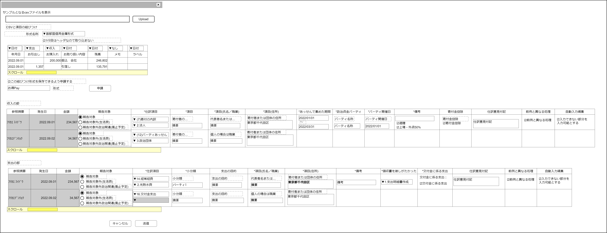

# 各種金融機関(個人用銀行独自フォーマット／Pay系含む)【表示画面】設計書

## 状態：フィールド要素はほぼ確定(実装しながら修正)

## 1.目的

各種金融機関サイトからダウンロードしたcsvをもとに収支／収入データを作成し登録する

## 2. 構成コンポーネント

1. csvアップロード後変換コンポーネント
2. 独自フィールド

### 2.1 繰り返し項目

コンポーネントはなし

## 3. 画面イメージ

### 3.1 画面イメージ

### 3.2 画面イメージ(項番)

## 4. フィールド要素一覧

| 番号 |          論理名           |       タイプ       | 活性／表示 |                             内容                              |
| ---- | ------------------------- | ------------------ | ---------- | ------------------------------------------------------------- |
| 1    | csv読取りテンプレート指定 | セレクトボックス   | 活性       | 押下時：csvの列をどの項目に読ませるかの設定を指定できること。 |
| 1    | 読み取り列指定            | セレクトボックス   | 活性       | 指定の列をどの項目で読み取るかかの入力を受け付けること。      |
| 1    | csvセル                   | インプットテキスト | 非活性     | 指定の行／列のcsvデータを表示すること。                       |

## 4.1 csv読み取り列指定セレクトボックス

|      論理名      |                         値                         |       表示       |
| ---------------- | -------------------------------------------------- | ---------------- |
| 指定なし         | 指定なしを表す定数値`0`                            | (空白)           |
| 取引金額支出     | 支出取引金額が入っていることを表す定数値`1`        | 取引金額支出     |
| 取引金額収入     | 収入取引金額が入っていることを表す定数値`2`        | 取引金額収入     |
| 取引金額増減兼用 | 取引金額増減兼用が入っていることを表す定数値`3`    | 取引金額増減兼用 |
| 発生日           | 発生日が入っていることを表す定数値`15`             | 発生日           |
| 摘要             | 摘要が入っていることを表す定数値`16`               | 摘要             |
| 取引相手名称     | 取引の相手方データが入っていることを表す定数値`17` | 取引相手名称     |

## 5.アクション一覧

| 番号 |   論理名   | タイプ | 活性／表示 |               内容               |
| ---- | ---------- | ------ | ---------- | -------------------------------- |
| 1    | キャンセル | ボタン | 活性       | 押下時：入力内容を破棄すること。 |
| 1    | 保存       | ボタン | 活性       | 押下時：入力内容を保存すること。 |

## 6. インターフェイス

 |          論理名           |       物理名        |            型             |                          説明(例)                          |
 | ------------------------- | ------------------- | ------------------------- | ---------------------------------------------------------- |
 | 取引金融機関Id            | 物理名              | Long                      | 全銀フォーマットを使用しない取引金融期間を一意に識別するId |
 | 取引金融機関名称          | 物理名              | String                    | 取引金融機関名称                                           |
 | 金融取引基礎情報Dtoリスト | listTradingCoreInfo | FinancialTradingCoreDto[] | 取引情報を表すDtoの配列                                    |

## 7. 連携

TODO 子コンポーネントでの変更内容を受信する記述
