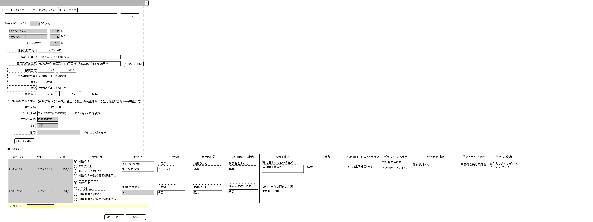

# 各種レシート／領収書読み取り入力【表示画面】設計書

## 状態：仕様未確定(実装不可)

## 1.目的

各種レシート／領収書データを証票を保存しながらデータの登録を行う

## 2. 構成コンポーネント

1. ファイルアップロード／ストレージ保存コンポーネント
2. 独自フィールド
3. レシート／領収書細目テーブル

### 2.1 繰り返し項目

なし

## 3. 画面イメージ

### 3.1 画面イメージ

### 3.2 画面イメージ(項番)

## 4. フィールド要素一覧

| 番号 |               論理名               |        タイプ        |  活性／表示  |                                                              内容                                                              |
| ---- | ---------------------------------- | -------------------- | ------------ | ------------------------------------------------------------------------------------------------------------------------------ |
| 1    | 読取り情報編集チェック             | チェックボックス     | 活性         | 画像のデータ変換などで誤りがあり、修正が必要な場合、押下し有効にすると変換データが読み取り可能になること。アクションリスト参照 |
| 1    | 発行日                             | インプットカレンダー | 活性／非活性 | レシート／領収書の発行年月日の表示と修正を受け付けること                                                                       |
| 1    | 発行者名                           | インプットテキスト   | 活性／非活性 | レシート／領収書の発行者の表示と修正を受け付けること                                                                           |
| 1    | 発行者住所                         | インプットテキスト   | 非活性       | レシート／領収書の発行者住所の各入力を総合して表示すること                                                                     |
| 1    | 発行者住所郵便番号1                | インプットテキスト   | 活性／非活性 | 発行者住所の郵便番号1の修正を受け付けること                                                                                    |
| 1    | 発行者住所郵便番号2                | インプットテキスト   | 活性／非活性 | 発行者住所の郵便番号2の修正を受け付けること                                                                                    |
| 1    | 発行者住所郵便番号検索まで         | インプットテキスト   | 活性／非活性 | 発行者住所の郵便番号検索で自動入手できる部分までの表記の修正を受け付けること                                                   |
| 1    | 発行者住所ブロック                 | インプットテキスト   | 活性／非活性 | 発行者住所の番地号数表記の修正を受け付けること                                                                                 |
| 1    | 発行者住所建物                     | インプットテキスト   | 活性／非活性 | 発行者住所の建物表記の修正を受け付けること                                                                                     |
| 1    | 発行者電話番号市外局番             | インプットテキスト   | 活性／非活性 | 発行者電話番号市外局番の修正を受け付けること                                                                                   |
| 1    | 発行者電話番号局番                 | インプットテキスト   | 活性／非活性 | 発行者電話番号局番の修正を受け付けること                                                                                       |
| 1    | 発行者電話番号番号                 | インプットテキスト   | 活性／非活性 | 発行者電話番号番号の修正を受け付けること                                                                                       |
| 1    | 証票全体報告選択ラジオボタン       | ラジオボタン         | 活性         | 押下時：このレシート・領収書を収支報告書の記載対象にするかどうかを指定できること                                               |
| 1    | 取引金額                           | インプット金額       | 活性／非活性 | 証書全体の合計金額を表示と修正を受け付けること                                                                                 |
| 1    | 支出側大分類選択ボタン             | セレクトボタン       | 活性         | 支出大分類項目を選択できること                                                                                                 |
| 1    | 支出側小分類選択ボタン             | セレクトボタン       | 活性         | 支出小分類項目を選択できること                                                                                                 |
| 1    | 支出目的                           | インプットテキスト   | 活性／非表示 | 支出の目的の入力を受け付けること                                                                                               |
| 1    | 支出摘要                           | インプットテキスト   | 活性／非表示 | 支出の摘要の入力を受け付けること                                                                                               |
| 1    | 備考                               | インプットテキスト   | 活性         | 備考の入力を受け付けること                                                                                                     |
| 1    | 交付金に係る支出であることのフラグ | チェックボックス     | 活性         | 交付金に係る支出である場合にはチェックされる入力を受け付けること                                                               |
| 1    | 細目別に判断選択ボタン             | ラジオボタン         | 活性         | 細目別に支出項目を設定するかどうかの決定を受け付けること                                                                       |

## 5.アクション一覧

| 番号 |         論理名         |     タイプ     | 活性／表示 |                 内容                 |
| ---- | ---------------------- | -------------- | ---------- | ------------------------------------ |
| 1    | キャンセル             | ボタン         | 活性       | 押下時：入力内容を破棄すること       |
| 1    | 送信                   | ボタン         | 活性       | 押下時：入力内容を保存すること       |
| 1    | 読取り情報編集チェック | チェックボタン | 活性       | 下記参照                             |
| 1    | 細目別に判断選択ボタン | ラジオボタン   | 活性       | レシート細目テーブルを表示／表示する |

## 5.1 読取り情報編集チェック

- `true:有`選択時
  - 発行日を活性とすること
  - 発行者名を活性とすること
  - 発行者住所を活性とすること

- `false:無`選択時
  - 発行日を非活性とし、読取り時のデータに復元すること
  - 発行者名を非活性とし、読取り時のデータに復元すること
  - 発行者住所を非活性とし、読取り時のデータに復元すること

## 6. 各種インターフェイス

### 6.1 支出相手インターフェイス

 |     論理名     | 物理名 |   型   |                    説明(例)                     |
 | -------------- | ------ | ------ | ----------------------------------------------- |
 | 取引発生日     | 物理名 | Long   | 例示：「2022/12/03」                            |
 | 証票発行者Id   | 物理名 | Long   | 取引相手を一意に識別するId                      |
 | 証票発行者名称 | 物理名 | String | 例示：「一般ショップ次郎が経営」                |
 | 証票発行者住所 | 物理名 | String | 例示：「東京都千代田区霞が関999番地zzzabcビル」 |
 | 郵便番号       | 物理名 | String | 例示：「123456z」                               |
 | 電話番号       | 物理名 | String | 例示：「08012345xx」                            |

### 6.2 支出情報インターフェイス

[支出情報インターフェイス](../edit_outcome/edit_outcome.md)のリスト(配列)

## 7. 連携

ストレージに保存した証票の証票のIdを受信すること
細目別に仕訳を行う場合のみ、細目テーブルからの支出情報を受信すること
