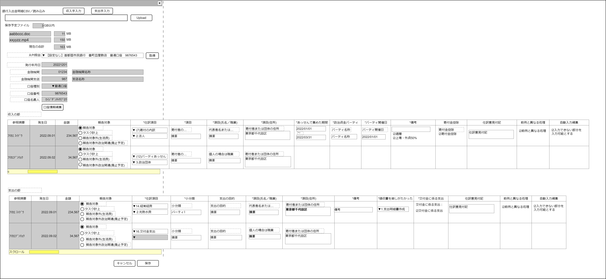

# 全銀フォーマットcsv読取り【表示画面】設計書

## 状態：仕様未確定(実装不可)

## 1.目的

主に事業系口座で使用される全銀フォーマット・入出金明細から収入／支出データを作成する

## 2. 構成コンポーネント

1. 全銀フォーマット入出金明細データ変換コンポーネント
2. 独自フィールド
3. 全銀フォーマット入出金明細入力テーブル

### 2.1 繰り返し項目

なし

## 3. 画面イメージ

### 3.1 画面イメージ

### 3.2 画面イメージ(項番)

## 4. フィールド要素一覧

| 番号 |       論理名       |        タイプ        |  活性／表示   |                                内容                                |
| ---- | ------------------ | -------------------- | ------------- | ------------------------------------------------------------------ |
| 1    | 収入手入力         | ボタン               | 活性          | アクション一覧参照。                                               |
| 1    | 支出手入力         | ボタン               | 活性          | アクション一覧参照。                                               |
| 1    | 照会口座           | セレクトボタン       | 活性          | 登録済で入出金明細を取得したい口座を表示すること。                 |
| 1    | 取得ボタン         | ボタン               | 非活性／活性  | 照会口座が選択されているときに活性であること。アクションは一覧参照 |
| 1    | 発行年月日         | インプットカレンダー | 非活性 ／活性 | 明細を取得した年月日を表示すること。                               |
| 1    | 金融機関コード     | インプットテキスト   | 非活性／活性  | 金融機関コードを表示すること。                                     |
| 1    | 金融機関名称       | インプットテキスト   | 非活性／活性  | 金融機関名称を表示すること。                                       |
| 1    | 金融機関支店コード | インプットテキスト   | 非活性／活性  | 金融機関コードを表示すること。                                     |
| 1    | 金融機関支店名称   | インプットテキスト   | 非活性／活性  | 金融機関名称を表示すること。                                       |
| 1    | 口座種別区分       | セレクトボタン       | 非活性／活性  | 口座種別を表示すること。                                           |
| 1    | 口座番号           | インプットテキスト   | 非活性／活性  | 口座番号を表示すること。                                           |
| 1    | 口座名義人         | インプットテキスト   | 非活性／活性  | 口座名義人を表示すること。                                         |
| 1    | 口座編集           | ボタン               | 活性          | アクション一覧参照。                                               |

## 4.1 口座種別

全銀フォーマットに準ずる固定値

 |    論理名    | 値  |
 | ------------ | --- |
 | 普通預金     | 1   |
 | 当座預金     | 2   |
 | 納税準備預金 | 3   |
 | 貯蓄預金     | 4   |
 | 通知預金     | 5   |
 | 定期預金     | 6   |
 | 積立定期預金 | 7   |
 | 定期積金     | 8   |
 | その他       | 9   |

## 5.アクション一覧

| 番号 |      論理名       | タイプ | 活性／表示 |                   内容                   |
| ---- | ----------------- | ------ | ---------- | ---------------------------------------- |
| 1    | キャンセル        | ボタン | 活性       | 押下時：入力内容を破棄すること。         |
| 1    | 保存              | ボタン | 活性       | 押下時：入力内容を保存すること。         |
| 1    | 収入手入力        | ボタン | 活性       | 押下時：支出編集に遷移すること。         |
| 1    | 支出手入力        | ボタン | 活性       | 押下時：収入編集に遷移すること。         |
| 1    | 入手金明細API取得 | ボタン | 活性       | 押下時：入出金明細を取得すること。       |
| 1    | 口座編集          | ボタン | 活性       | 押下時：独自フィールドを活性にすること。 |

**TODO** 1.××のサブスクリションサービスを利用 2.利用が一定量に満たなかったので返金、などの場合は金額に-をつけると仕訳テーブルを反対側に移動できような機能実装を予定している(変更するのは極めて正当な理由だが、読み取り情報変更としてマークされる)

## 6. インターフェイス

### 6.1 自分の取引口座情報

全銀フォーマット入出金明細ヘッダ`TradingZenginFormatTransactionDetailHeaderRecordDto`の部分拡張

**TODO** インターフェイス名未決定

 |      論理名      | 物理名 |      型      |                                            説明(例)                                            |
 | ---------------- | ------ | ------------ | ---------------------------------------------------------------------------------------------- |
 | 金融機関口座Id   | 物理名 | Long         | 例示：「111」                                                                                  |
 | 金融機関Id       | 物理名 | String／null | 例示：「0003」                                                                                 |
 | 金融機関名称     | 物理名 | String／null | 例示：「首都圏市民銀行」                                                                       |
 | 金融機関支店Id   | 物理名 | String／null | 例示：「014」                                                                                  |
 | 金融機関支店名称 | 物理名 | String／null | 例示：「番町皿屋敷支店」                                                                       |
 | 口座種別区分     | 物理名 | String／null | 例示：「1:普通預金」                                                                           |
 | 口座番号         | 物理名 | String／null | 例示：「003344」                                                                               |
 | 口座名義人       | 物理名 | String／null | 例示：「ｾｲｼﾞﾀﾞﾝﾀｲ ｻﾌﾞﾛｳ」                                                                      |
 | 口座情報編集有無 | 物理名 | boolean      | 口座編集ボタンが押された場合、読取り元情報から編集されているか確認して、編集されていれば`true` |
 | 取得勘定日(自)   | 物理名 | LocalDate    | 例示：「2022/03/03」                                                                           |
 | 取得勘定日(至)   | 物理名 | LocalDate    | 例示：「2022/05/05」                                                                           |

### 6.2 銀行口座取引情報インターフェイス

全銀フォーマット入出金明細ヘッダ`TradingZenginFormatTransactionDetailData1RecordDto`の部分拡張

### 6.3 収支報告対象区分定数

 |            論理名            | 区分(様式) |
 | ---------------------------- | ---------- |
 | 報告対象                     | 1          |
 | 報告対象外(生活費)           | 20         |
 | 報告対象外政治関連(廃止予定) | 11         |
 | タスク計上                   | 50         |

※最新値は4項目。画面イメージでその他の項目数は誤り

## 7. 連携

全銀フォーマット入金明細読み取りコンポーネントから読み取り情報を受信すること
全銀フォーマット入出金明細(収入側)から編集情報を受信すること
全銀フォーマット入出金明細(支出側)から編集情報を受信すること
