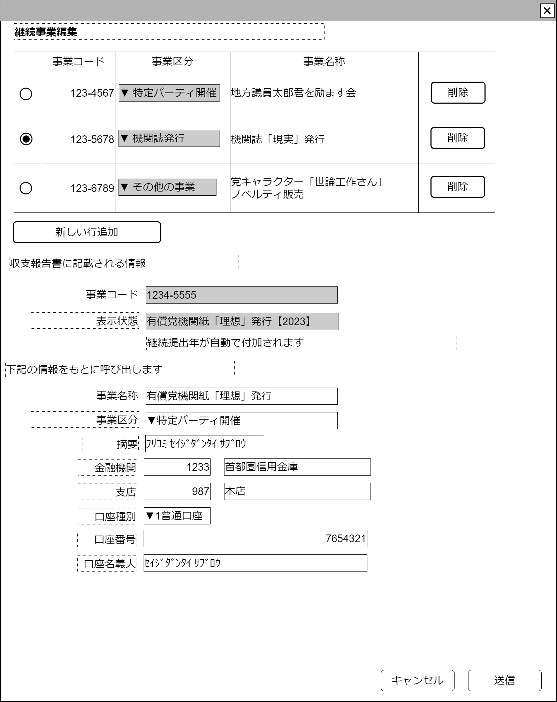

# 継続事業登録【表示画面】設計書

## 状態：仕様未確定(実装不可)

## 1.目的

毎年行われている事業を省力して指定するためのマスタ登録

## 2. 構成コンポーネント

1. [継続事業一覧テーブルコンポーネント](../../common/front/table_continue_buisiness/table_continue_buisiness.md)
2. 独自フィールド
3. [項目呼び出し金融情報コンポーネント](../../common/front/table_continue_buisiness/table_continue_buisiness.md)

### 2.1 繰り返し項目

なし

## 3. 画面イメージ

### 3.1 画面イメージ

### 3.2 画面イメージ(項番)

## 4. フィールド要素一覧

| 番号 |               論理名               |       タイプ       | 活性／表示 |                       内容                       |
| ---- | ---------------------------------- | ------------------ | ---------- | ------------------------------------------------ |
| 1    | 継続事業一覧コンポーネント         | コンポーネント     | 表示       | 継続事業一覧コンポーネントを表示すること         |
| 1    | 新規行追加ボタン                   | ボタン             | 活性       | 下記アクションリスト参照                         |
| 1    | 編集_事業コード                    | インプットテキスト | 非活性     | 事業識別コードを表示すること                     |
| 1    | 編集_事業表示状態                  | インプットテキスト | 非活性     | 事業名称+【当日の西暦年】を表示すること          |
| 1    | 編集_事業名称                      | インプットテキスト | 活性       | 事業名称の入力を受け付けること                   |
| 1    | 編集_事業区分                      | セレクトボックス   | 活性       | 事業区分コードの入力を受け付けること             |
| 1    | 項目呼び出し金融情報コンポーネント | コンポーネント     | 表示       | 項目呼び出し金融情報コンポーネントを表示すること |

## 5.アクション一覧

| 番号 |   論理名   | タイプ | 活性／表示 |              内容              |
| ---- | ---------- | ------ | ---------- | ------------------------------ |
| 1    | キャンセル | ボタン | 活性       | 押下時：入力内容を破棄すること |
| 1    | 保存       | ボタン | 活性       | 押下時：入力内容を保存すること |

## 6. 継続事業インターフェイス

ContinueBuissinessInterface

FinacialTradingInfoForCallingItemInterfaceを継承すること

 |             論理名             |           論理名            |   型    |                                                                  説明(例)                                                                  |
 | ------------------------------ | --------------------------- | ------- | ------------------------------------------------------------------------------------------------------------------------------------------ |
 | 継続事業Id                     | continueBuissinessId        | String  | 継続事業を識別する一意のId。                                                                                                               |
 | 継続事業同一識別コード         | continueBuissinessCode      | String  | 継続事業の変更に対応するための同一識別コード                                                                                               |
 | 継続事業名称                   | continueBuissinessName      | String  | 共通事業名称                                                                                                                               |
 | 継続事業区分                   | continueBuissinessKbn       | Integer | `1:特定パーティ開催`、`2:機関誌発行`、`3:その他`                                                                                           |
 | 項目呼び出し条件摘要           | callingItemFinancialDigest  | String  | 取引内容などを記した汎用の摘要。例示：「ﾌﾘｺﾐ ｾｲｼﾞﾀﾞﾝﾀｲ ｻﾌﾞﾛｳ」                                                                             |
 | 項目呼び出し条件各種PayId      | callingItemFinancialPayId   | Long    | このシステムで固有に割り当てられた全銀金融機関以外の金融機関を識別するId。例示：「123456」                                                 |
 | 項目呼び出し条件各種Payコード  | callingItemFinancialPayCode | Integer | このシステムで固有に割り当てられた全銀金融機関以外の金融機関を、変更にかかわらず同一としきべつする、同一識別コード。例示：「1234」         |
 | 項目呼び出し条件各種Pay名称    | callingItemFinancialPayName | String  | このシステムで固有に割り当てられた全銀金融機関以外の金融機関名称。例示：「2次元コード専用Pay」                                             |
 | 項目呼び出し条件金融機関コード | callingItemFinancialOrgCode | String  | 全銀加盟金融機関統一コード。例示：「0002」※TODO 金融機関コードから名称を取得出来るAPIが利用できれば取得する(該当フィールド非活性)         |
 | 項目呼び出し条件金融機関名称   | callingItemFinancialOrgName | String  | 全銀加盟金融機関名称。例示：「首都圏市民銀行」※TODO 金融機関コードから名称を取得出来るAPIが利用できれば取得する(該当フィールド非活性)     |
 | 項目呼び出し条件支店コード     | callingItemBranchCode       | String  | 全銀加盟金融機関支店コード。例示：「123」                                                                                                  |
 | 項目呼び出し条件支店名称       | callingItemBranchName       | String  | 全銀加盟金融機関支店名称。例示：「番町皿屋敷支店」※TODO 金融機関コードから名称を取得出来るAPIが利用できれば取得する(該当フィールド非活性) |
 | 項目呼び出し条件口座種別区分   | callingItemAccountType      | String  | 全銀統一使用口座区分。下記参照                                                                                                             |
 | 項目呼び出し条件口座番号       | callingItemAccountNo        | String  | 口座番号。例示：「1233」                                                                                                                   |
 | 項目呼び出し条件口座名義人     | callingItemAccountHas       | String  | 口座名義人。例示：「ｾｲｼﾞﾀﾞﾝﾀｲ ｻﾌﾞﾛｳ」                                                                                                      |

## 7. 連携

TODO 入力内容が変更された都度、入力チェックを行い親画面に変更内容を通知する`emit[sendSampleTemplateInterface(data,errorInfo)]`
