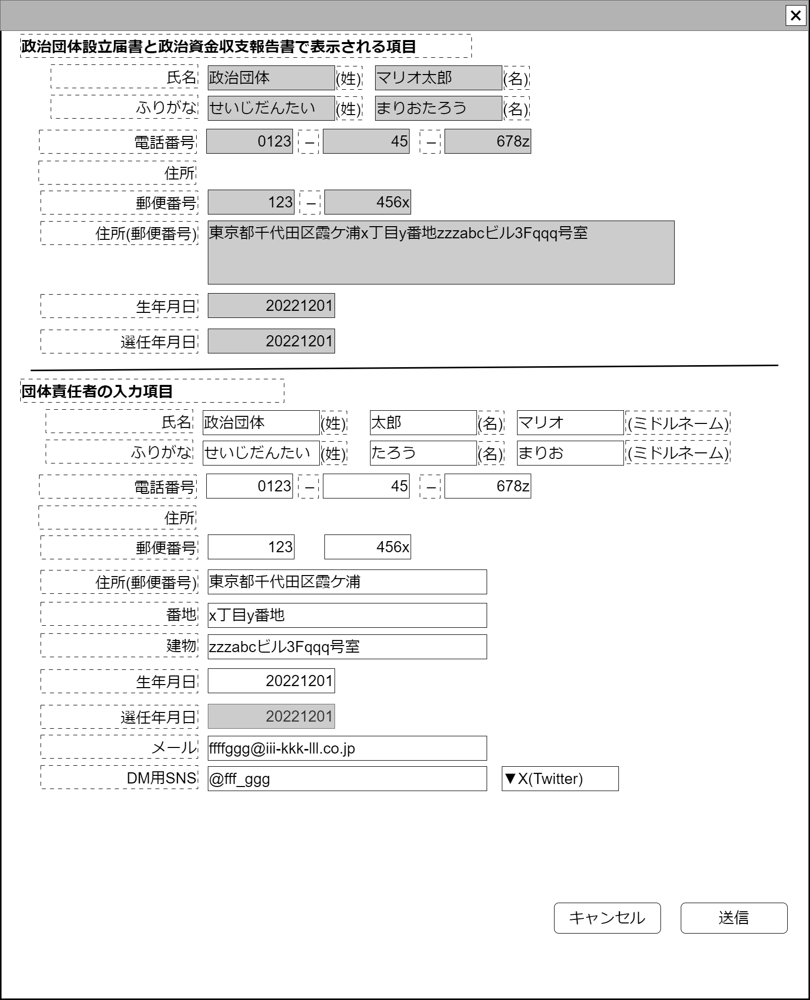

# 団体責任者登録編集【表示画面】設計書

## 状態：フィールド要素はほぼ確定(実装しながら修正)

## 1.目的

団体責任者の詳細項目を設定する

## 2. 構成コンポーネント

1. 責任者コンポーネント
2. 作業者コンポーネント

### 2.1 繰り返し項目

なし

## 3. 画面イメージ

### 3.1 画面イメージ

### 3.2 画面イメージ(項番)

## 4. フィールド要素一覧

| 番号 |   論理名   | タイプ | 活性／表示 |         内容         |
| ---- | ---------- | ------ | ---------- | -------------------- |
| 1    | キャンセル | ボタン | 活性       | アクションリスト参照 |
| 1    | 保存       | ボタン | 活性       | アクションリスト参照 |

### 1.責任者コンポーネント

[責任者コンポーネント](../../common/front/person_manager/person_manager.md)を参照

### 2.作業者コンポーネント

[作業者コンポーネント](../../common/front/user_organization/user_organization.md)を参照

## 5.アクション一覧

| 番号 |   論理名   | タイプ | 活性／表示 |              内容              |
| ---- | ---------- | ------ | ---------- | ------------------------------ |
| 1    | キャンセル | ボタン | 活性       | 押下時：入力内容を破棄すること |
| 1    | 保存       | ボタン | 活性       | 押下時：入力内容を保存すること |

## 6. 組織内作業者インターフェイス

[責任者コンポーネント](../../common/front/person_manager/person_manager.md)のインターフェイス

[作業者コンポーネント](../../common/front/user_organization/user_organization.md)のインターフェイス

## 7. 連携

責任者コンポーネントより`recievePersonManagerInterface(data,errorInfo)`で入力内容を受信する
作業者コンポーネントより`recieveUserOfOrganizationInterface(data,errorInfo)`で入力内容を受信する
