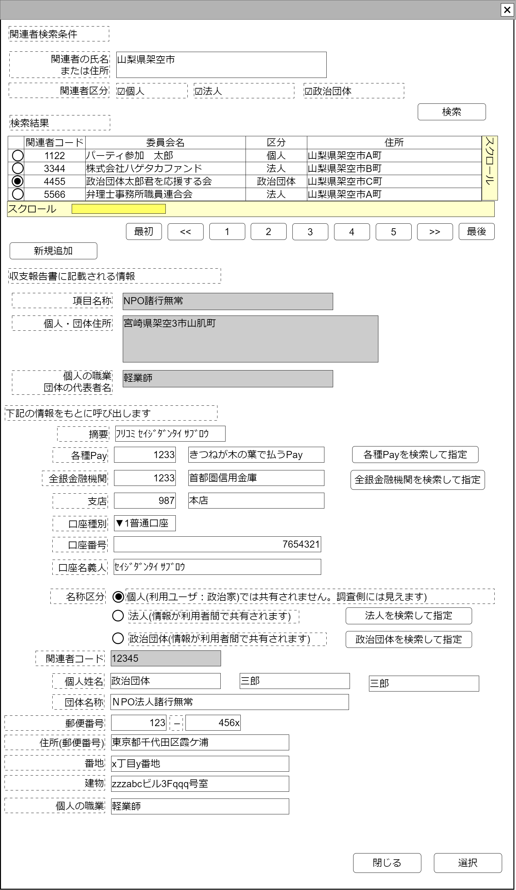

# 関係者編集【表示画面】設計書

## 状態：仕様未確定(実装不可)

## 1.目的

政治資金収支報告書に記載する関係者情報の編集を行う

## 2. 構成コンポーネント

1. [関連者検索コンポーネント](../../common/front/search_relation_person/search_relation_person.md)
2. 独自フィールド
3. [項目呼び出し金融情報コンポーネント](../../common/front/table_continue_buisiness/table_continue_buisiness.md)
4. 法人検索コンポーネント
5. [政治団体検索コンポーネント](../../common/front/)

### 2.1 繰り返し項目

なし

## 3. 画面イメージ

### 3.1 画面イメージ

### 3.2 画面イメージ(項番)

## 4. フィールド要素一覧

| 番号 |               論理名               |       タイプ       | 活性／表示 |                                                          内容                                                          |
| ---- | ---------------------------------- | ------------------ | ---------- | ---------------------------------------------------------------------------------------------------------------------- |
| 1    | 報告書記載名称                     | インプットテキスト | 非活性     | 報告書に記載する名称を表示すること。下記検索条件入力欄と同じであること                                                 |
| 1    | 報告書記載住所                     | テキストエリア     | 非活性     | 報告書に記載する住所を表示すること。下記検索条件入力欄(住所郵便番号、住所番地、住所肩書を結合したもの)と同じであること |
| 1    | 報告書記載職業または代表者         | インプットテキスト | 非活性     | 報告書に記載する名称を表示すること。下記検索条件入力欄と同じであること                                                 |
| 1    | 名称区分(個人)                     | ラジオボタン       | 活性       | 名称が個人であることの入力を受け付けること                                                                             |
| 1    | 名称区分(法人)                     | ラジオボタン       | 活性       | 名称が団体であることの入力を受け付けること                                                                             |
| 1    | 名称区分(政治団体)                 | ラジオボタン       | 活性       | 名称が団体であることの入力を受け付けること                                                                             |
| 1    | 法人検索ボタン                 | ボタン             | 活性       | 法人検索コンポーネントを表示すること                                                                               |
| 1    | 政治団体検索ボタン                 | ボタン             | 活性       | 政治団体検索コンポーネントを表示すること                                                                               |
| 1    | 検索条件名称                       | インプットテキスト | 活性       | 該当報告記載データの呼び出しに使用する名称の入力を受け付けること                                                       |
| 1    | 項目呼び出し金融情報コンポーネント | コンポーネント     | 表示       | 項目呼び出し金融情報コンポーネントを表示すること                                                                       |
| 1    | 項目呼び出し条件電話番号市外局番   | インプットテキスト | 活性       | 該当報告記載データの呼び出しに使用する電話番号のうち市外局番の入力を受け付けること                                     |
| 1    | 項目呼び出し条件電話番号局番       | インプットテキスト | 活性       | 該当報告記載データの呼び出しに使用する電話番号のうち局番の入力を受け付けること                                         |
| 1    | 項目呼び出し条件電話番号番号       | インプットテキスト | 活性       | 該当報告記載データの呼び出しに使用する電話番号のうち番号の入力を受け付けること                                         |
| 1    | 項目呼び出し条件郵便番号・前       | インプットテキスト | 活性       | 該当報告記載データの呼び出しに使用する郵便番号のうち前3桁の入力を受け付けること                                        |
| 1    | 項目呼び出し条件郵便番号・後       | インプットテキスト | 活性       | 該当報告記載データの呼び出しに使用する郵便番号のうち後4桁の入力を受け付けること                                        |
| 1    | 項目呼び出し条件住所               | インプットテキスト | 活性       | 該当報告記載データの呼び出しに使用する住所のうち郵便番号で呼び出せる範囲の入力を受け付けること                         |
| 1    | 項目呼び出し条件住所番地           | インプットテキスト | 活性       | 該当報告記載データの呼び出しに使用する住所のうち郵便番号で呼び出せない番地の入力を受け付けること                       |
| 1    | 項目呼び出し条件住所建物           | インプットテキスト | 活性       | 該当報告記載データの呼び出しに使用する住所建物の入力を受け付けること                                                   |

## 4.1 口座種別

全銀フォーマットに準ずる固定値

 |    論理名    | 値  |
 | ------------ | --- |
 | 普通預金     | 1   |
 | 当座預金     | 2   |
 | 納税準備預金 | 3   |
 | 貯蓄預金     | 4   |
 | 通知預金     | 5   |
 | 定期預金     | 6   |
 | 積立定期預金 | 7   |
 | 定期積金     | 8   |
 | その他       | 9   |

## 5.アクション一覧

| 番号 |   論理名   | タイプ | 活性／表示 |               内容               |
| ---- | ---------- | ------ | ---------- | -------------------------------- |
| 1    | キャンセル | ボタン | 活性       | 押下時：入力内容を破棄すること。 |
| 1    | 保存       | ボタン | 活性       | 押下時：入力内容を保存すること。 |

## 6. 関連者インターフェイス

RelationPersonInterface

FinacialTradingInfoForCallingItemInterfaceを継承すること

 |               論理名               |           物理名            |    型    |                                                     説明(例)                                                     |
 | ---------------------------------- | --------------------------- | -------- | ---------------------------------------------------------------------------------------------------------------- |
 | 報告書記載名称                     | publishItemName                 | String   | 例示：「政治団体　三郎」                                                                                         |
 | 報告書記載住所                     | publishAddress              | String   | 例示：「東京都千代田区霞が関10番地100号成金ビル 401号室」                                                        |
 | 報告書記載職業または代表者氏名                     | publishAddress              | String   | 例示：「東京都千代田区霞が関10番地100号成金ビル 401号室」                                                        |
 | 名称区分                     | relationPersonKbn            | Integer   |例示：「 1:個人」                                                                                                           |
 | 項目呼び出し条件名称               | callingItemName             | String   | 例示：「政治団体　三郎」                                                                                         |
 | 項目呼び出し条件摘要               | callingItemDigest           | String   | 例示：「ﾌﾘｺﾐ ｾｲｼﾞﾀﾞﾝﾀｲ ｻﾌﾞﾛｳ」                                                                                   |
 | 項目呼び出し条件各種PayId      | callingItemFinancialPayCode | Long   | 例示：「政治団体　三郎」                                                                                         |
 | 項目呼び出し条件各種Payコード      | callingItemFinancialPayCode | Integer   | 例示：「政治団体　三郎」                                                                                         |
 | 項目呼び出し条件各種Pay名称        | callingItemFinancialPayName | String   | 例示：「2次元コード専用Pay」                                                                                     |
 | 項目呼び出し条件金融機関コード     | callingItemFinancialOrgCode | String   | 例示：「0002」                                                                                                   |
 | 項目呼び出し条件金融機関名称       | callingItemFinancialOrgName | String   | 例示：「首都圏市民銀行」※TODO 金融機関コードから名称を取得出来るAPIが利用できれば取得する(該当フィールド非活性) |
 | 項目呼び出し条件支店コード         | callingItemBranchCode       | String   | 例示：「123」                                                                                                    |
 | 項目呼び出し条件支店名称           | callingItemBranchName       | String   | 例示：「番町皿屋敷支店」※TODO 金融機関コードから名称を取得出来るAPIが利用できれば取得する(該当フィールド非活性) |
 | 項目呼び出し条件口座種別区分       | callingItemAccountType      | String   | 口座区分。下記参照                                                                                               |
 | 項目呼び出し条件口座番号           | callingItemAccountNo        | String   | 例示：「1233」                                                                                                   |
 | 項目呼び出し条件口座名義人         | callingItemAccountHas       | String   | 例示：「ｾｲｼﾞﾀﾞﾝﾀｲ ｻﾌﾞﾛｳ」                                                                                        |
 | 項目呼び出し条件電話番号・市外局番 | callingItemTel1             | Integer  | 例示：「123」                                                                                                    |
 | 項目呼び出し条件電話番号・局番     | callingItemTel2             | Integer  | 例示：「4567」                                                                                                   |
 | 項目呼び出し条件電話番号・番号     | callingItemTel3             | Integer  | 例示：「080」                                                                                                    |
 | 項目呼び出し条件郵便番号・前       | callingItemPostal1          | Integerl | 例示：「123」                                                                                                    |
 | 項目呼び出し条件郵便番号・後       | callingItemPostal2          | Integer  | 例示：「456x」                                                                                                   |
 | 項目呼び出し条件住所               | callingItemAddressPost      | String   | 例示：「東京都千代田区霞が関」                                                                                   |
 | 項目呼び出し条件住所番地           | callingItemAddressBlock     | String   | 例示：「10番地100号」                                                                                            |
 | 項目呼び出し条件住所建物           | callingItemAddressBuiding   | Stringl  | 例示：「成金ビル 401号室」                                                                                       |

## 7. 連携

TODO 連携記載する
