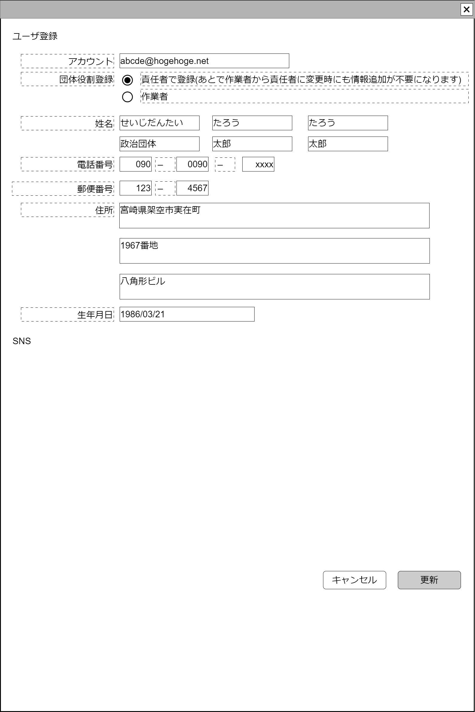

# ユーザ情報編集【表示画面】設計書

## 状態：Mockによる仮実装とは別に仕様未確定(実装不可)

## 1.目的

ユーザ情報を編集する

## 2. 構成コンポーネント

1. 独自フィールド
2. [責任者](../../common/front/person_manager/person_manager.md)コンポーネント
3. [作業者](../../common/front/person_worker/person_worker.md)コンポーネント

### 2.1 繰り返し項目

なし

## 3. 画面イメージ

### 3.1 画面イメージ

### 3.2 画面イメージ(項番)

## 4. フィールド要素一覧

| 番号 |           論理名           |      タイプ      | 活性／表示 |                       内容                       |
| ---- | -------------------------- | ---------------- | ---------- | ------------------------------------------------ |
| 1    | サンプル                   | ボタン           | 活性       | 押下時：サンプルコンポーネントを表示すること。   |
| 1    | メールアドレス             | インプットメール | 非活性     | アカウントIdを表示すること                       |
| 1    | 団体役割選択ボタン(責任者) | ラジオボタン     | 活性       | `選択`の場合、責任者コンポーネントを表示すること |
| 1    | 団体役割選択ボタン(作業者) | ラジオボタン     | 活性       | `選択`の場合、作業者コンポーネントを表示すること |

TODO その他ユーザ情報を追加する・最低限SNS情報は必ず追加する

## 5.アクション一覧

| 番号 |           論理名           |    タイプ    | 活性／表示 |                       内容                       |
| ---- | -------------------------- | ------------ | ---------- | ------------------------------------------------ |
| 1    | 更新                       | ボタン       | 活性       | 押下時：入力内容を保存すること                   |
| 1    | キャンセル                 | ボタン       | 活性       | 押下時：入力内容を破棄すること                   |
| 1    | 団体役割選択ボタン(責任者) | ラジオボタン | 活性       | `選択`の場合、責任者コンポーネントを表示すること |
| 1    | 団体役割選択ボタン(作業者) | ラジオボタン | 活性       | `選択`の場合、作業者コンポーネントを表示すること |

## 6. サンプルテンプレートインターフェイス

SampleTemplateInterface

 |  論理名  |  論理名  |  型  |         説明(例)         |
 | -------- | -------- | ---- | ------------------------ |
 | サンプル | sampleId | Long | 政治家を識別する一意のId |

## 7. 連携

TODO 責任者コンポーネント連携記述
TODO 作業者コンポーネント連携記述
