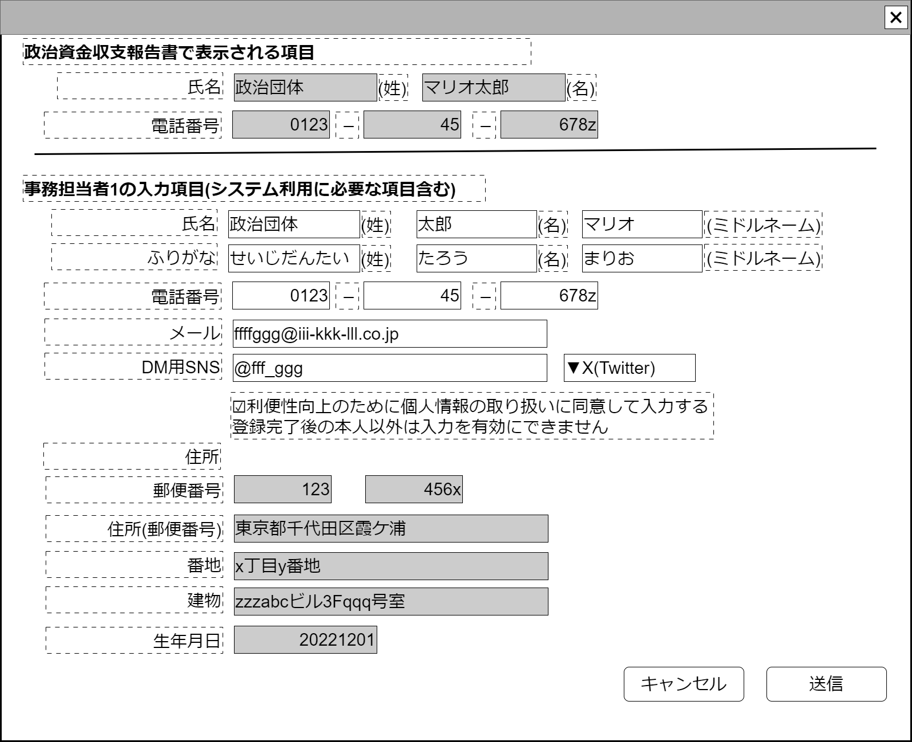

# 事務担当者登録【表示画面】設計書

## 状態：ビジネス要素はほぼ確定(実装しながら修正)

※TODO システム利用ユーザとの関係が未決定、団体におけるユーザがシステムユーザと決定した場合にはログイン情報が追加される

## 1.目的

事務担当者を登録する

## 2. 構成コンポーネント

1. 事務担当者コンポーネント
2. 独自フィールド(団体ユーザコンポーネント前半)
3. 独自フィールド
4. 独自フィールド(団体ユーザコンポーネント後半)

### 2.1 繰り返し項目

なし

## 3. 画面イメージ

### 3.1 画面イメージ

### 3.2 画面イメージ(項番)

## 4. フィールド要素一覧

| 番号 |           論理名           |        タイプ        |  活性／表示  |                                                      内容                                                      |
| ---- | -------------------------- | -------------------- | ------------ | -------------------------------------------------------------------------------------------------------------- |
| 1    | 氏名の姓                   | インプットテキスト   | 活性         | 姓名の姓を入力の受け付けること。                                                                               |
| 2    | 氏名の名                   | インプットテキスト   | 活性         | 姓名の名を入力の受け付けること。                                                                               |
| 2    | 氏名のミドルネーム         | インプットテキスト   | 活性         | 姓名のミドルネームの入力を受け付けること。                                                                     |
| 1    | 氏名の姓ふりがな           | インプットテキスト   | 活性         | 姓名の姓ふりがなの入力を受け付けること。                                                                       |
| 2    | 氏名の名ふりがな           | インプットテキスト   | 活性         | 姓名の名ふりがなの入力を受け付けること。                                                                       |
| 2    | 氏名のミドルネームふりがな | インプットテキスト   | 活性         | 姓名のミドルネームふりがなの入力を受け付けること。                                                             |
| 2    | 電話番号の市外局番         | インプットテキスト   | 活性         | 電話番号の市外局番を入力を受け付けること。                                                                     |
| 2    | 電話番号の局番             | インプットテキスト   | 活性         | 電話番号の局番の入力を受け付けること。                                                                         |
| 2    | 電話番号の番号             | インプットテキスト   | 活性         | 電話番号の番号の入力を受け付けること。                                                                         |
| 2    | メールアドレス             | インプットメール形式 | 活性         | 利用するメールアドレスの入力を受け付けること。                                                                 |
| 2    | 指定SNSアカウント          | インプット英数字記号 | 活性         | 利用するSNSのアカウントの入力を受け付けること。                                                                |
| 2    | 連絡用SNSサービス          | セレクトボタン       | 活性         | 利用するメールアドレスの入力を受け付けること。                                                                 |
| 2    | 個人情報許諾有無           | チェックボックス     | 活性／非活性 | 拡大された個人情報の許諾をしていることの入力を受け付けること。画面表示者が表示ユーザと一致している場合のみ活性 |
| 2    | 郵便番号の前半             | インプットテキスト   | 活性／非活性 | 郵便番号の前半部分の入力を受け付けること。                                                                     |
| 2    | 郵便番号の後半             | インプットテキスト   | 活性／非活性 | 郵便番号の後半部分の入力の受け付けること。                                                                     |
| 2    | 住所の郵便番号自動入力部分 | インプットテキスト   | 活性／非活性 | 住所で郵便番号で自動入力できる部分の入力の受け付けること。                                                     |
| 2    | 住所の番地                 | インプットテキスト   | 活性／非活性 | 住所で郵便番号で自動入力できない番地の入力の受け付けること。                                                   |
| 2    | 住所の建物                 | インプットテキスト   | 活性／非活性 | 住所で郵便番号で建物に関する入力の受け付けること。                                                             |
| 2    | 生年月日                   | インプットカレンダー | 活性／非活性 | 生年月日の入力の受け付けること。                                                                               |

## 4.2 連絡用SNSサービス

連絡用SNSサービス登録テーブルよりオプション項目を取得すること

## 5.アクション一覧

| 番号 |      論理名      |      タイプ      |  活性／表示  |                       内容                        |
| ---- | ---------------- | ---------------- | ------------ | ------------------------------------------------- |
| 1    | キャンセル       | ボタン           | 活性         | 押下時：入力内容が破棄されること。                |
| 1    | 保存             | ボタン           | 活性         | 押下時：入力内容を保存すること。                  |
| 1    | SNSの申請        | ボタン           | 活性         | 押下時：SNS利用申請ページに別タブで遷移すること。 |
| 1    | 個人情報許諾有無 | チェックボックス | 活性／非活性 | 下記参照                                          |

## 5.1 個人情報許諾有無

- trueの場合
  - 住所の郵便番号自動入力部分を活性とすること
  - 住所の番地部分を活性とすること
  - 住所の建物部分を活性とすること
  - 生年月日入力部分を活性とすること

- falseの場合
  - 住所の郵便番号自動入力部分を非活性とすること
  - 住所の番地部分を非活性とすること
  - 住所の建物部分を非活性とすること
  - 生年月日入力部分を非活性とすること

## 6. 組織内ユーザインターフェイス

[事務担当者コンポーネント](../../common/front/person_worker/person_worker.md)のインターフェイス

[作業者コンポーネント](../../common/front/user_organization/user_organization.md)のインターフェイス。フィールドの配置順が異なるため、フィールドをこの画面に記載しているが登録すべき情報としては変更はない

## 7. 連携

事務担当者コンポーネントより`recievePersonWorkerInterface(data,errorInfo)`で入力内容を受信する
