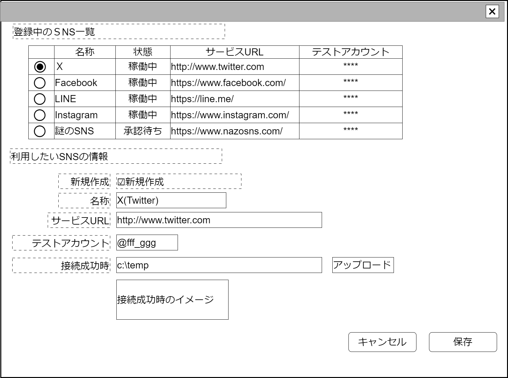

# SNS利用申請【表示画面】設計書

## 状態：仕様未確定(実装不可)

## 1.目的

連絡先にSNSを使用したい場合に調査側(この収支報告書作成機能のメンテナンス機能を持つ)に通知する

## 2. 構成コンポーネント

なし

### 2.1 繰り返し項目

なし

## 3. 画面イメージ

### 3.1 画面イメージ

### 3.2 画面イメージ(項番)

## 4. フィールド要素一覧

| 番号 |              論理名              |         タイプ         | 活性／表示 |                                                     内容                                                      |
| ---- | -------------------------------- | ---------------------- | ---------- | ------------------------------------------------------------------------------------------------------------- |
| 1    | 登録済SNSテーブル                | テーブル               | 活性       | 1.登録済SNSを一覧する2.編集申請したい場合は必要なサービスを選択すること                                       |
| 1    | 新規作成チェック                 | チェックボタン         | 活性       | データ編集をするときに登録済テーブルでサービスが選択された時にチェックを`0:無` にすること。初期状態は`1:有`。 |
| 1    | SNSサービス名称                  | インプットテキスト     | 活性       | SNSサービスの正式名称または通称の入力を受け付けること                                                         |
| 1    | SNSサービスURL                   | インプット半角英数記号 | 活性       | SNSサービスで、アカウント文字をURLに付加した時にアクセスできるURLの入力を受け付けること                       |
| 1    | テストアカウント                 | インプット半角英数記号 | 活性       | 調査(管理)側機能で、アクセス確認を行うときに利用していい申請者のアカウント                                    |
| 1    | テスト接続時成功画像アップロード | インプットファイル     | 活性       | アクセスが成功した時のイメージ                                                                                |
| 1    | アップロードイメージ表示         | イメージ               | (非活性)   | アップロードされた画像を表示する                                                                              |

### 4.1 登録済SNS一覧テーブル

| 番号 |           論理名            |    タイプ    | 活性／表示 |                                                                       内容                                                                        |
| ---- | --------------------------- | ------------ | ---------- | ------------------------------------------------------------------------------------------------------------------------------------------------- |
| 1    | SNSサービス選択ラジオボタン | ラジオボタン | 非活性     | 編集したいSNSサービスを選択すること                                                                                                               |
| 1    | SNSサービス名称             | ラベル       | (非活性)   | 登録済またはのSNSサービスの名称を表示すること                                                                                                     |
| 1    | 利用状況                    | ラベル       | (非活性)   | 登録済SNSサービスの利用状況(利用中、承認待ち)を表示すること                                                                                       |
| 1    | SNSサービスURL              | ラベル       | (非活性)   | SNSサービスのURLを表示すること                                                                                                                    |
| 1    | テストアカウント            | ラベル       | (非活性)   | アクセス確認を行うときに利用していい申請者のアカウントデータベースには入力を保存するが、一覧処理用に取得するときは`***`に入れ替えてマスク処理する |

## 5.アクション一覧

| 番号 |      論理名      | タイプ | 活性／表示 |                                                                      内容                                                                      |
| ---- | ---------------- | ------ | ---------- | ---------------------------------------------------------------------------------------------------------------------------------------------- |
| 1    | キャンセル       | ボタン | 活性       | 押下時：入力内容を破棄すること                                                                                                                 |
| 1    | 保存             | ボタン | 活性       | 押下時：入力内容を保存すること                                                                                                                 |
| 1    | 新規作成チェック | ボタン | 活性       | チェック有押下時：登録テーブルの選択ボタンを無選択状態にすること 登録テーブルの選択ボタン押下時：チェックを無選択(新規作成でない)とすること |

## 6. 利用登録SNSインターフェイス

AvailableSnsInterface

 |          論理名           |     物理名     |   型    |                 説明(例)                 |
 | ------------------------- | -------------- | ------- | ---------------------------------------- |
 | 登録SNSのId               | snsId          | Long    | SNSを識別する一意のId                    |
 | 登録SNS同一識別コード     | snsCode        | Long    | 変更履歴を管理するための同一識別コード   |
 | 登録SNS名称               | snsName        | String  | SNS名称                                  |
 | 登録SNSのURL              | snsUrl         | String  | SNSサービスURL                           |
 | 登録SNSテスト用アカウント | snsTestAccount | String  | 接続確認に使える(申請者自身)のアカウント |
 | 登録SNS利用状況区分       | snsStatusKbn   | Integer | サービスが申請中かどうかを表す区分       |

### 6.1 SNS利用区分

**TODO** 決定次第修正する

|     論理名     | 値  |                                    説明                                    |
| -------------- | --- | -------------------------------------------------------------------------- |
| 稼働中         | 0   | -                                                                          |
| DM実装編集不可 | 1   | 自動でダイレクトメッセージを送信する実装を行ったため一切の編集を許可しない |
| 申請中         | 11  | 新規登録直後から接続テストを行って判断が出るまで                           |
| 接続不可却下   | 21   | 入力が間違っていたなどで登録を許可しない                                   |
| 再調査検討     | 22   | その他の不許可状態                                                         |

## 7. 連携

子コンポーネントが存在しないので連携は存在しない
