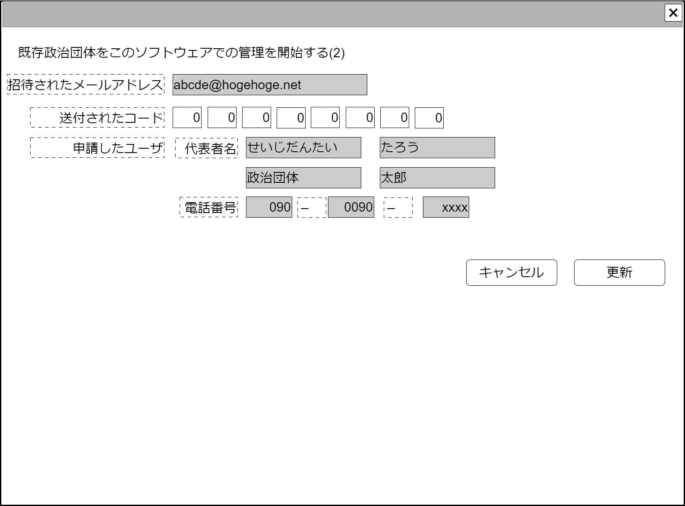

# ユーザ団体招待受け入れ【表示画面】設計書

## 状態：仕様未確定(実装不可)

## 1.目的

仮想集団への招待を受け入れる

## 2. 構成コンポーネント

1. 独自フィールド
2. [作業者](../../common/front/person_worker/person_worker.md)コンポーネント

### 2.1 繰り返し項目

なし

## 3. 画面イメージ

### 3.1 画面イメージ

### 3.2 画面イメージ(項番)

## 4. フィールド要素一覧

| 番号 |         論理名         |       タイプ       | 活性／表示 |                             内容                              |
| ---- | ---------------------- | ------------------ | ---------- | ------------------------------------------------------------- |
| 1    | 同一集団招待認識コード | URLクエリ          | 非表示     | 同一集団への招待を一意に識別するIdを設定すること              |
| 1    | メールアドレス         | インプットメール   | 活性       | メールアドレス(アカウント)の入力を受け付けること              |
| 1    | 送信コード1            | インプットテキスト | 活性       | 電話番号に送信されたコードの1番目の文字列入力を受け付けること |
| 1    | 送信コード2            | インプットテキスト | 活性       | 電話番号に送信されたコードの2番目の文字列入力を受け付けること |
| 1    | 送信コード3            | インプットテキスト | 活性       | 電話番号に送信されたコードの3番目の文字列入力を受け付けること |
| 1    | 送信コード4            | インプットテキスト | 活性       | 電話番号に送信されたコードの4番目の文字列入力を受け付けること |
| 1    | 送信コード5            | インプットテキスト | 活性       | 電話番号に送信されたコードの5番目の文字列入力を受け付けること |
| 1    | 送信コード6            | インプットテキスト | 活性       | 電話番号に送信されたコードの6番目の文字列入力を受け付けること |
| 1    | 送信コード7            | インプットテキスト | 活性       | 電話番号に送信されたコードの7番目の文字列入力を受け付けること |
| 1    | 送信コード8            | インプットテキスト | 活性       | 電話番号に送信されたコードの8番目の文字列入力を受け付けること |
| 1    | 作業者                 | コンポーネント     | 表示       | 招待したユーザ情報を表示すること                              |

## 5.アクション一覧

| 番号 |   論理名   | タイプ | 活性／表示 |              内容              |
| ---- | ---------- | ------ | ---------- | ------------------------------ |
| 1    | 更新       | ボタン | 活性       | 押下時：入力内容を保存すること |
| 1    | キャンセル | ボタン | 活性       | 押下時：入力内容を破棄すること |

## 6. ユーザアカウントインターフェイス

UserAccountInterface

 |       論理名        |          論理名          |               型               |                      説明(例)                       |
 | ------------------- | ------------------------ | ------------------------------ | --------------------------------------------------- |
 | メールアドレス      | loginUserMailAddress     | String                         | ログインユーザのメールアドレス                      |
 | パスワード          | loginUserPassword        | String                         | パスワード                                          |
 | 電話番号1           | loginUserTel1            | String                         | 電話番号市外局番                                    |
 | 電話番号2           | loginUserTel2            | String                         | 電話番号局番                                        |
 | 電話番号3           | loginUserTel3            | String                         | 電話番号番号                                        |
 | 電話識別用コードDto | recognizeTelephonCodeDto | RecognizeTelephonCodeInterface | 電話番号識別をコードを用いて行う場合の場合の情報Dto |

RecognizeTelephonCodeInterface

 |    論理名    |     論理名     |   型   |                             説明(例)                             |
 | ------------ | -------------- | ------ | ---------------------------------------------------------------- |
 | 識別用コード | recoginzedCode | String | 電話番号識別をコードを用いて行う場合の場合の一意に識別するコード |
 | 送信コード1  | codeChar1      | String | 電話番号に送られた識別用のコード1文字目                          |
 | 送信コード2  | codeChar2      | String | 電話番号に送られた識別用のコード2文字目                          |
 | 送信コード3  | codeChar3      | String | 電話番号に送られた識別用のコード3文字目                          |
 | 送信コード4  | codeChar4      | String | 電話番号に送られた識別用のコード4文字目                          |
 | 送信コード5  | codeChar5      | String | 電話番号に送られた識別用のコード5文字目                          |
 | 送信コード6  | codeChar6      | String | 電話番号に送られた識別用のコード6文字目                          |
 | 送信コード7  | codeChar7      | String | 電話番号に送られた識別用のコード7文字目                          |
 | 送信コード8  | codeChar8      | String | 電話番号に送られた識別用のコード8文字目                          |

## 7. 連携

TODO 作業者コンポーネントとの連携記述
