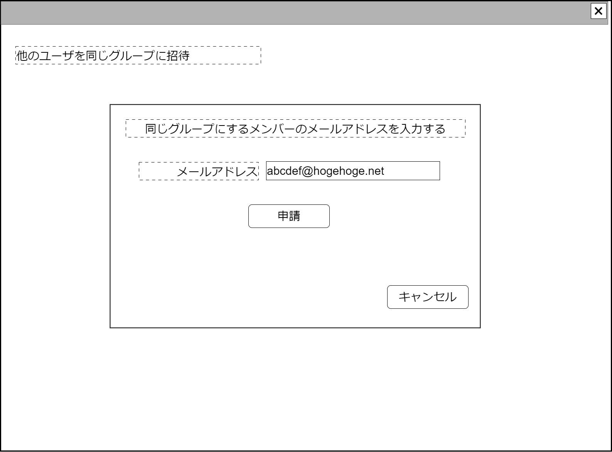

# ユーザ同一集団招待【表示画面】設計書

## 状態：Mockデータによる仮実装

## 1.目的

あるユーザの属する集団に別のユーザを招待して、政治団体に移行するための仮想集団を形成する

**重要**
既存ユーザ検索機能を実装しようとしないこと。実装した場合、自団体と無関係のユーザ情報が閲覧可能になる。
ex.仮に代表者　太郎が会計責任者　正夫を自団体に加える場合、ユーザ検索から登録を行うと仮定した場合の検索条件が設定できない。
例えば検索条件が「どの団体にも未所属」である場合、同時期に団体未所属のユーザが(すべて)見えてしまう。
姓名、メールアドレスの一部などの条件などを加えても確率が低くなるだけで、閲覧の可能性は残り続ける。
これを防ぐには「自団体に所属済みのユーザ」が検索条件となるが、まさにそれをこれから登録しようとしており、循環論法に陥るため

## 2. 構成コンポーネント

1. 独自フィールド

### 2.1 繰り返し項目

なし

## 3. 画面イメージ

### 3.1 画面イメージ

### 3.2 画面イメージ(項番)

## 4. フィールド要素一覧

| 番号 |     論理名     |      タイプ      | 活性／表示 |                 内容                 |
| ---- | -------------- | ---------------- | ---------- | ------------------------------------ |
| 1    | メールアドレス | インプットメール | 活性       | メールアドレスの入力を受け付けること |

## 5.アクション一覧

| 番号 |   論理名   | タイプ | 活性／表示 |              内容              |
| ---- | ---------- | ------ | ---------- | ------------------------------ |
| 1    | 申請       | ボタン | 活性       | 押下時：入力内容を保存すること |
| 1    | キャンセル | ボタン | 活性       | 押下時：入力内容を破棄すること |

## 6. ユーザアカウントインターフェイス

UserAccountInterface

 |       論理名        |          論理名          |               型               |                      説明(例)                       |
 | ------------------- | ------------------------ | ------------------------------ | --------------------------------------------------- |
 | メールアドレス      | loginUserMailAddress     | String                         | ログインユーザのメールアドレス                      |
 | パスワード          | loginUserPassword        | String                         | パスワード                                          |
 | 電話番号1           | loginUserTel1            | String                         | 電話番号市外局番                                    |
 | 電話番号2           | loginUserTel2            | String                         | 電話番号局番                                        |
 | 電話番号3           | loginUserTel3            | String                         | 電話番号番号                                        |
 | 電話識別用コードDto | recognizeTelephonCodeDto | RecognizeTelephonCodeInterface | 電話番号識別をコードを用いて行う場合の場合の情報Dto |

RecognizeTelephonCodeInterface

 |    論理名    |     論理名     |   型   |                             説明(例)                             |
 | ------------ | -------------- | ------ | ---------------------------------------------------------------- |
 | 識別用コード | recoginzedCode | String | 電話番号識別をコードを用いて行う場合の場合の一意に識別するコード |
 | 送信コード1  | codeChar1      | String | 電話番号に送られた識別用のコード1文字目                          |
 | 送信コード2  | codeChar2      | String | 電話番号に送られた識別用のコード2文字目                          |
 | 送信コード3  | codeChar3      | String | 電話番号に送られた識別用のコード3文字目                          |
 | 送信コード4  | codeChar4      | String | 電話番号に送られた識別用のコード4文字目                          |
 | 送信コード5  | codeChar5      | String | 電話番号に送られた識別用のコード5文字目                          |
 | 送信コード6  | codeChar6      | String | 電話番号に送られた識別用のコード6文字目                          |
 | 送信コード7  | codeChar7      | String | 電話番号に送られた識別用のコード7文字目                          |
 | 送信コード8  | codeChar8      | String | 電話番号に送られた識別用のコード8文字目                          |

## 7. 連携

なし
