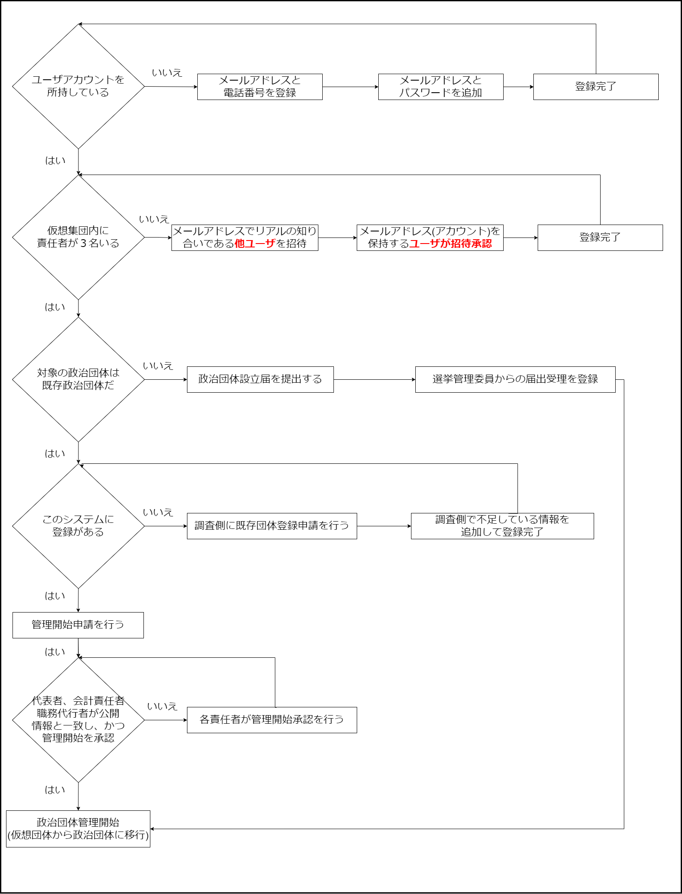
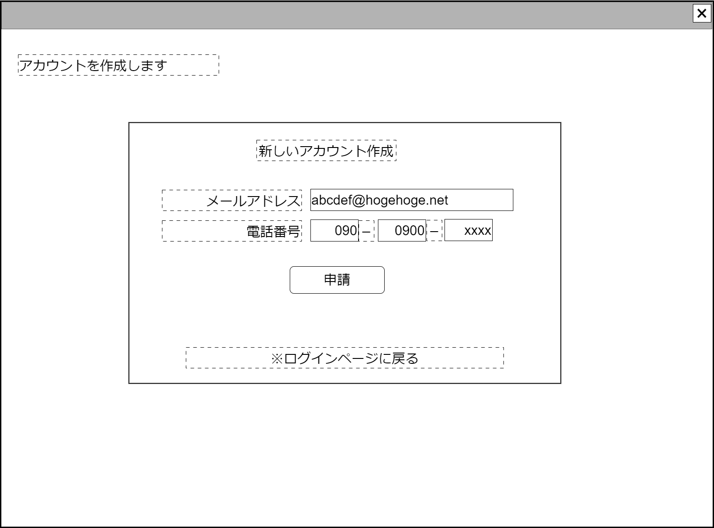
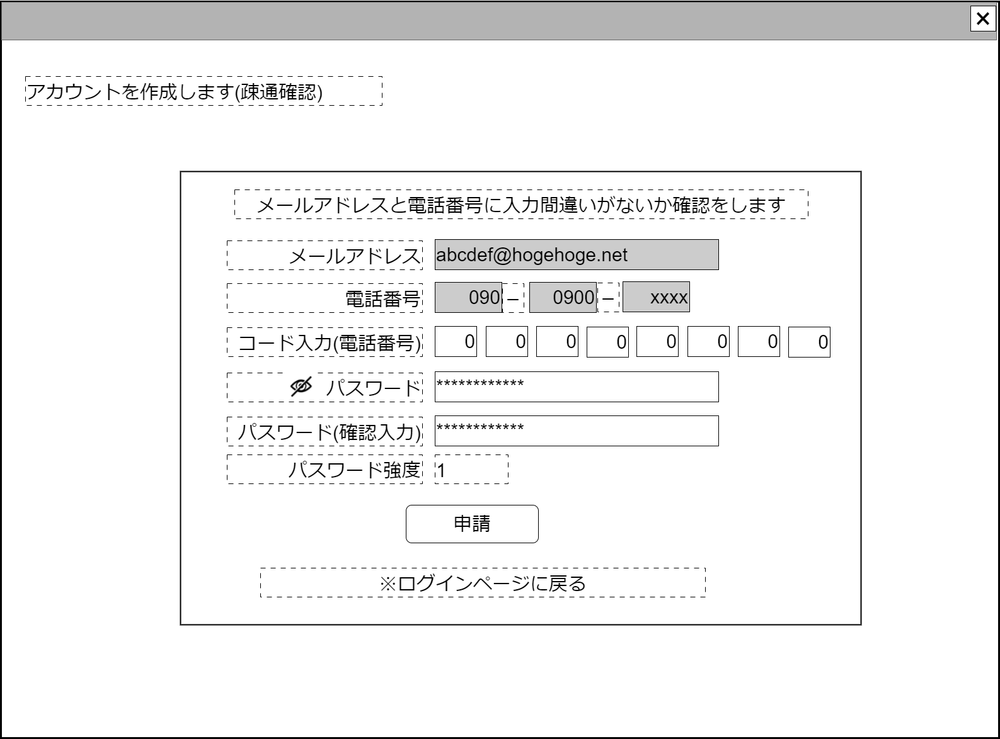
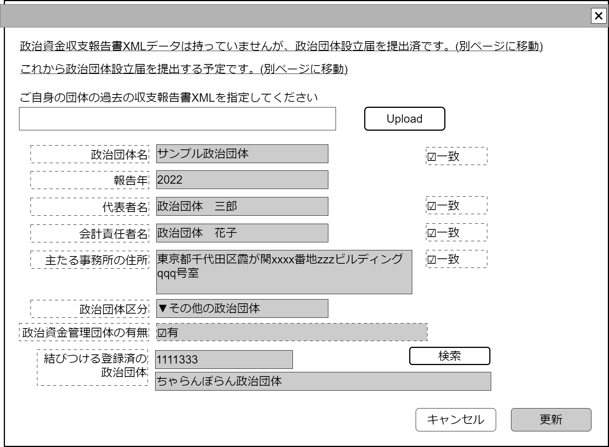
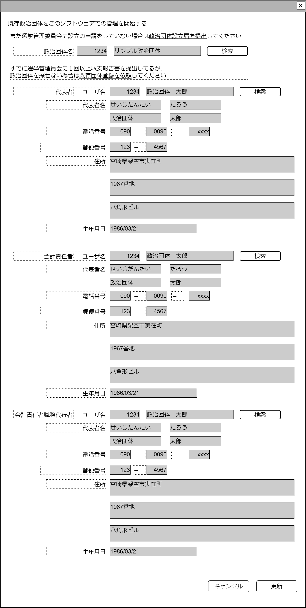
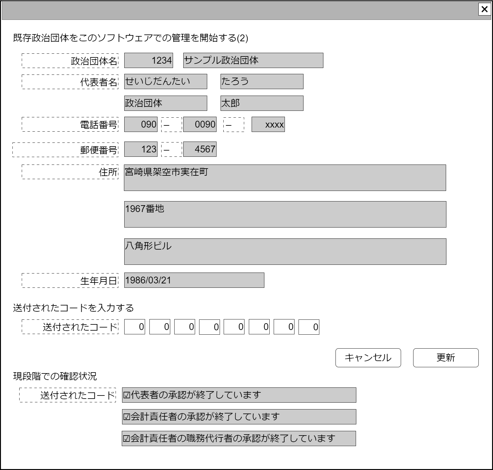

# (簡易版)スタートアップガイド

## 0. 全体フローチャート

## 1.1 ユーザアカウント登録

- メールアドレス疎通確認
- 電番号の疎通確認

### 1.1.1 利用するメールアドレスと電話番号を保存する

### 1.1.2 メールに記載されたURLから直接アクセスし、電話番号からのコードを入力する

## 1.2 ユーザ情報登録

- 政治資金収支報告書の報告に法律上必要な情報を入力する
- 普段の活動に必要な情報を入力する

### 1.2.1 住所・利用するSNSその他の情報を入力する

- 政治資金収支報告書の書式上、何らかの形で姓名が記載される場合、姓名(・電話番号)が必要となるが、実際にはすべてのユーザが必要
- 政治資金収支報告書の書式上、役割が責任者のものは郵便番号、住所が必要となる
- 政治団体設立届の書式上、役割が責任者のものは姓名ふりがなが必要となる

### 1.2.2 政治団体に移行するための仮想団体を設定する

- 役割が責任者のユーザが他のユーザを『招待』すると自動で仮想グループを設定する
- 政治団体設立届の書式上、役割が責任者のユーザが3名必要

## 2 利用開始方法

- 政治団体を新設する→政治団体設立届を提出する

- システムに登録済の既存団体の管理を行う→責任者一名が管理したい団体を申告し、他の２名の承認を得る

- 既存団体であるが、システム登録がない場合→既存団体の登録を申請する。あとは2,の手続きを行う

### 2.1 新規政治団体を設立する

1. 政治団体設立届を提出する

### 2.2 登録済政治団体の管理を行う

1. 既存団体の管理を仮想団体責任者３名で始めることを申告する
2. それぞれのユーザが承認したら管理を開始

### 2.3 既存だが登録済でない政治団体の管理を行う

1. これから管理したい未登録団体を申告する
2. 調査側が未登録であることを確認し登録する
3. 既存団体の管理を仮想団体責任者３名で始めることを申告する
4. それぞれのユーザが承認したら管理を開始
